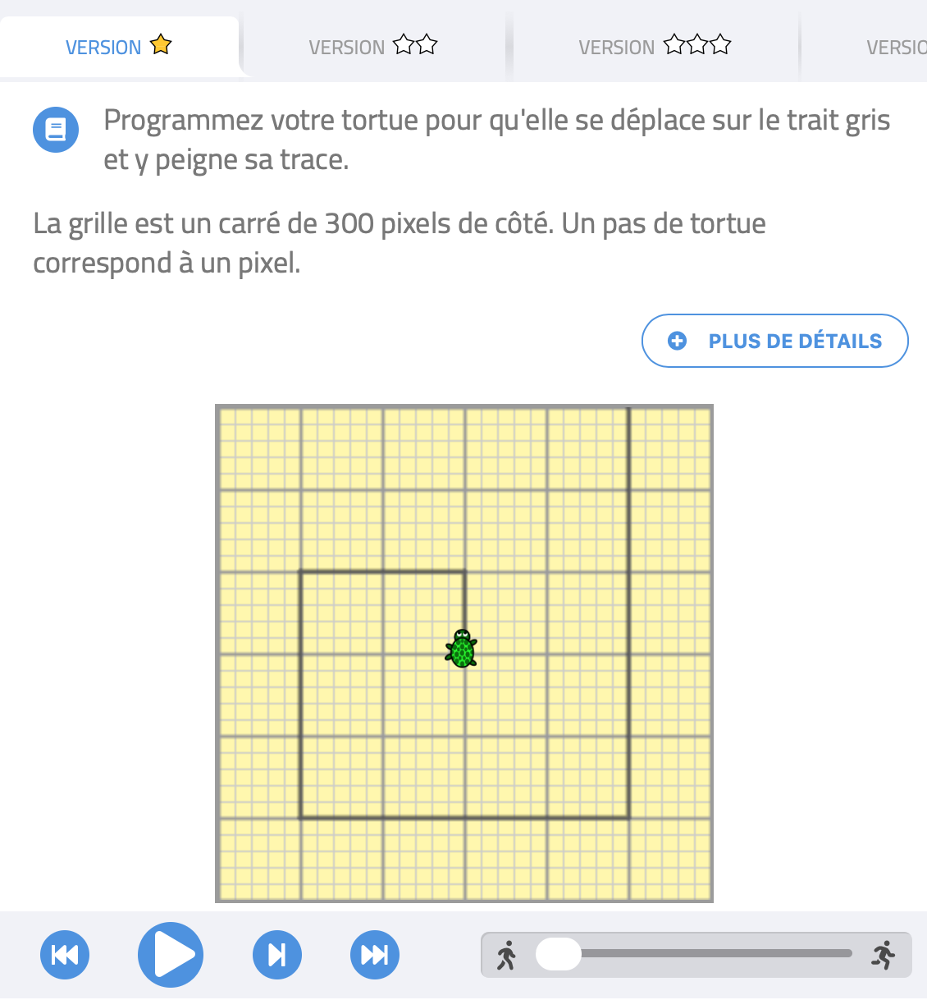

# Débuter avec Turtle en SNT

## 1. Utiliser le parcours Algoréa
Le site [Algoréa](https://parcours.algorea.org/contents/4707-4702-1352246428241737349/) comporte un ensemble de parcours SNT destinés à être utilisés en cours par enseignants et élèves. Certains parcours sont finalisés, d'autres sont en cours de développement. Le site est réalisé par une équipe de [France IOI](http://www.france-ioi.org)  et  s'appuie en partie sur les vidéos du [MOOC SNT](https://www.fun-mooc.fr/fr/cours/sinitier-a-lenseignement-en-sciences-numeriques-et-technologie/) et les exercices du [Castor informatique](https://castor-informatique.fr/home.php).


L’un des parcours propose une [initiation à Python](https://parcours.algorea.org/contents/4707-4702-1352246428241737349-314613032161178344-310572474623192846/) grâce à une bibliothèque graphique intitulée Turtle. On code les déplacements d'une tortue qui laisse une trace de son passage. Dans ces parcours, la tortue doit réaliser des motifs imposés.

La programmation se fait en ligne dans une interface qui évalue le code produit par les élèves. L'objectif est de proposer aux élèves un contexte d'apprentissage leur permettant de s'approprier les premières notions de Python, de façon progressive, avec une évaluation rapide de leurs productions pour pouvoir réagir face aux erreurs et les corriger.


L'accès est possible sans connexion pour  enseignants et élèves. Mais si l'enseignant se crée un compte sur le site, il peut administrer un groupe, que les élèves rejoignent avec un code.  En demandant aux élèves de se créer un pseudo identifiable par l'enseignant, celui-ci a alors une visibilité sur le travail des élèves, et les élèves conservent leur travail.

La sélection suivante propose quelques exercices que l'on peut proposer à tous les élèves.


Rejoindre le [parcours.algorea > SNT > Quelques bases en programmation > En python](https://parcours.algorea.org/contents/4707-4702-1352246428241737349-314613032161178344-310572474623192846/)

??? Abstract "Instructions du module Turtle utilisées dans ces parcours"

    Le programme doit commencer par la ligne :

    ```python
    from turtle import *
    ```
    pour importer les fonctions liées aux déplacements de la tortue.

    Les fonctions disponibles pour contrôler la tortue sont :

    - `forward()` : la tortue avance du nombre de pas indiqué en paramètre.   
    Exemple : `forward(50)`
    - `backward()`: la tortue recule du nombre de pas indiqué en paramètre.   
    Exemple : `backward(50)`
    - `left()`: la tortue tourne vers la gauche du nombre de degrés indiqué en paramètre.   
    Exemple : `left(90)`
    - `right()`: la tortue tourne vers la droite du nombre de degrés indiqué en paramètre.   
    Exemple : `right(90)`


    **Boucle bornée** :
    Exemple :
    ```python
    for loop in range(4):
        forward(200)
        left(90)
    ```
    Cette boucle permet de répéter 4 fois :
    "avancer de 200 pas et tourner de 90° à gauche".  

    L'indentation (décalage à droite de 4 espaces) permet de délimiter le bloc de contenu de la boucle : ce qui est indenté sera répété 4 fois.  
    Attention au double point en fin de ligne pour débuter un bloc indenté.

    **Affectation d'une valeur à une variable :**
    ```python
    nom_variable = valeur_variable
    ```
    exemple : `longueur = 50`  

    **Ajout d'une valeur à une variable :**
    ```python
    nom_variable = nom_variable + valeur_ajoutee
    ```   
    exemple : `longueur = longueur + 10`

### [Parcours *boucles bornées*](https://parcours.algorea.org/contents/4707-4702-1352246428241737349-314613032161178344-310572474623192846-4080996542681828/)
!!! note "Parcours boucles bornées, exercices :star: et :star::star:"

    {width=300}    {width=300}

??? Abstract "Aide pour la version :star:"
    Copier-coller le code suivant pour l'exercice :star:.  Il ne s'agit pas de la solution, mais ce code en est proche.
    ```python
    from turtle import *
    for loop in range(4) :
        forward(100)
        left(90)
    ```
    Exécuter ce code, constater le problème et apporter les corrections nécessaires.

### [Parcours *boucles imbriquées*](https://parcours.algorea.org/contents/4707-4702-1352246428241737349-314613032161178344-310572474623192846-483796795377763255/)

!!! note "Parcours boucles imbriquées, exercice :star: "
    {width=300}

??? Abstract "Aide pour la version :star:"
    Copier-coller le code suivant pour l'exercice :star:.  Il ne s'agit pas de la solution, mais ce code en est proche.
    ```python
    from turtle import *
    for loop1 in range(2):
        for loop2 in range(4):
            forward(100)
            left(90)
        left(165)
    ```
    Exécuter ce code, constater le problème et apporter les corrections nécessaires.

### [Parcours *variables*](https://parcours.algorea.org/contents/4707-4702-1352246428241737349-314613032161178344-310572474623192846-162741549493056700/)
!!! note "Parcours variables, exercices :star: et :star::star:"
    {width=300}    {width=300}

??? Abstract "Aide pour la version :star:"
    Copier-coller le code suivant pour l'exercice :star:.  Il ne s'agit pas de la solution, mais ce code en est proche.
    ```python
    from turtle import *
    longueur = 50
    for nb_segment in range(4):
        forward(longueur)
        left(90)
        longueur = longueur + 5
    ```
    Exécuter ce code, constater le problème et apporter les corrections nécessaires.

## 2. Utiliser Turtle dans Basthon
L'interface de programmation de [Basthon.fr](https://basthon.fr) (ou Capytale - code  de l'activité 9953-374398) permet de réaliser ses propres programmes en utilisant le module Turtle.

Le programme doit commencer par l’instruction :
```
from turtle import *
```
et finir par l’instruction :
```
done()
```

Les instructions spécifiques à Turtle sont mises à disposition dans les deux documents ci-dessous :

[Mémo de transition Scratch :cat: - Python :snake: (pdf)](tableau_AlgoScratch3Python.pdf){ .md-button target='_blank' }
[Mémo Turtle :turtle: (notebook)](https://notebook.basthon.fr/?from=https://raw.githubusercontent.com/nweibel/jupyter/master/memo_turtle.ipynb){ .md-button target='_blank'}

### Une fonction dans un tracé

#### Fonction sans paramètre

Voici le code d’un tracé utilisant une fonction.

```python
from turtle import *
pencolor("green")
shape("triangle")

def figure():
    for cote in range(4) :
        forward(100)
        left(90)

for etape in range(5) :
    figure()
    right(72)

done()
```  

Le bloc
```python
def figure():
    for cote in range(4) :
        forward(100)
        left(90)
```  
définit une fonction, intitulée `figure`, et qui comporte 3 lignes d’instructions.  

!!! exo "Question"
    Cette fonction contient les instructions pour tracer une figure. Laquelle ?

Mais si on exécute ce code seul, aucun tracé ne se produit... Cependant,  à tout endroit du programme, l’instruction `figure()` déclenchera l’exécution de toutes les instructions de la fonction `figure()`. On parle d’*appel* de la fonction.

!!! exo "Question"
    Reproduire le code complet dans Basthon.fr et observer le résultat produit.

    Combien de fois la fonction `figure()` est-elle exécutée ?

#### Fonction avec paramètre

La figure produite ci-dessus a toujours les mêmes caractéristiques.  
On peut choisir de donner à la fonction des paramètres qui auront une influence sur la figure tracée.

!!! exo "Question"
    Modifier ainsi le code de la fonction `figure()`:
    ```python
    def figure(longueur):
        for cote in range(4) :
            forward(longueur)
            left(90)
    ```
!!! exo "Question"
    Désormais, la fonction `figure()` dépend du paramètre `longueur`. Quelle est l’influence de ce paramètre sur le tracé ?

Pour appeler la fonction, il faut désormais donner une valeur à ce paramètre : `figure(100)` signifie qu’on appelle la fonction `figure()` en donnant à `longueur`  la valeur 100.

!!! exo "Question"
    Modifier le code du reste du programme pour obtenir le même tracé que précédemment, avec la fonction modifiée.

!!! exo "Question"  
    Modifier le code du reste du programme pour obtenir un tracé deux fois plus petit que précédemment, avec la fonction modifiée.

!!! exo "Question"
    Remplacer les 4 dernières lignes du programme par celles-ci :
    ```python  
    for etape in range(5) :
        figure(100)
        figure(50)
        right(72)
    done()
    ```

!!! exo "Question"  
    Combien de fois la fonction `figure()` est-elle appelée au cours de l’exécution de ce programme ?

!!! exo "Question"  
    Modifier le code de la fonction `figure()` pour obtenir le résultat suivant, sans changer les autres lignes du programme :  
    {width=200}

!!! exo "Question"
    Que réalise le code suivant ?
    ```python
    from turtle import *
    shape("triangle")

    def figure(longueur):
        for etape in range(3) :
            forward(longueur)
            left(120)

    for etape in range(10) :
        if etape % 2 == 0:
            pencolor("red")
            figure(100)   
        else :       
            pencolor("blue")       
            figure(50)   
        right(36)
    done()
    ```
