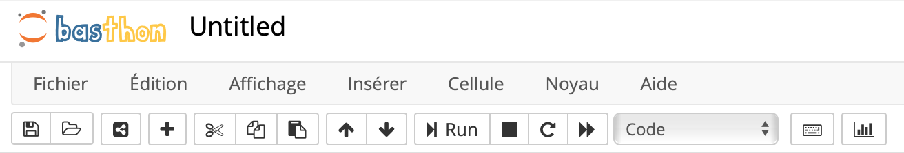
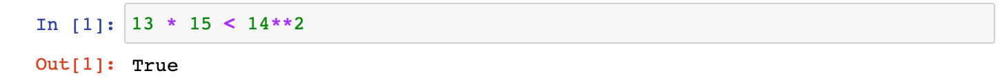
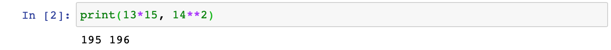
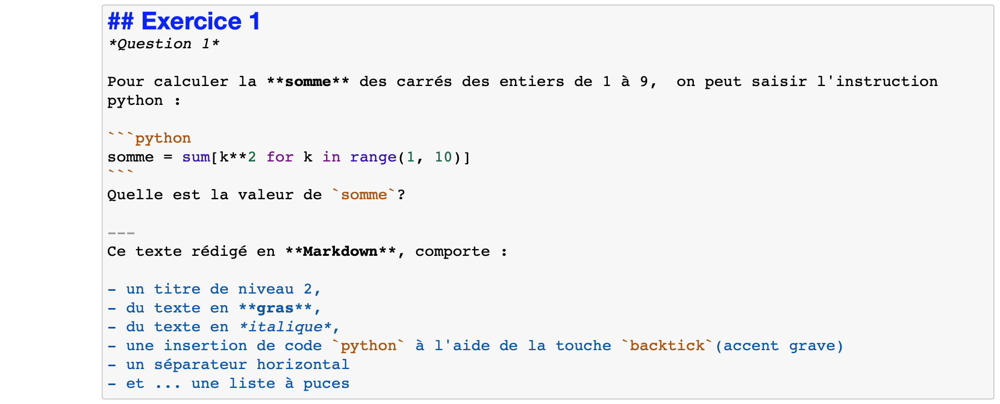
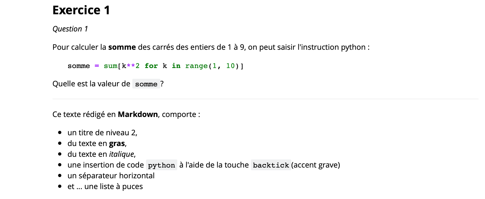

{align=left}
# Les notebooks Jupyter

*Jupyter Notebook* est un environnement de programmation interactif basé sur le web permettant de créer des document intitulés "notebooks". Il s'agit de documents se présentant sous la forme d'une succession de cellules. Celles-ci peuvent contenir du code, du texte, des formules mathématiques, des graphiques et des médias interactifs. Les notebooks possèdent généralement l'extension `.ipynb`.

Voici par exemple la barre d'outils proposée par l'interface de [basthon.fr](https://basthon.fr/):

{width=600}

## :material-language-python: Cellules de code Python

Par défaut les cellules sont des cellules de code Python. Elles sont précédées de **In[ ]**.

Pour exécuter le code contenu dans une cellule, on peut taper au clavier ++shift+enter++ ou cliquer sur le bouton :material-play:Run.

Si le code demande l'évaluation d'une expression, une nouvelle ligne est créée, précédée de **Out[ ]** et la valeur est affichée.

Si le code demande l'affichage d'une valeur, celui-ci est réalisé sans faire précéder la ligne de **Out[ ]**.

## :octicons-markdown-16: Cellules de texte Markdown

On change le type d'une cellule à l'aide du menu déroulant de la barre d'outils : choisir Markdown pour un contenu autre que du code.  
En utilisant la [syntaxe markdown](memomd.md), on peut mettre en forme du texte, insérer des liens, des tableaux, des images ou des formules mathématiques.
Les balises `html` et le code $\LaTeX$ sont également utilisables dans les cellules Markdown.

Les cellules Markdown mettent en forme leur contenu lorsqu'on tape au clavier ++shift+enter++ ou lorsqu'on clique sur le bouton :material-play:Run.

Voici un exemple avec une même cellule Markdown lors de l'édition puis après mise en forme de l'affichage :

