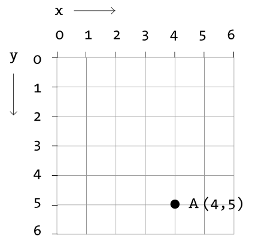

# { width='32' } p5 : présentation
[Basthon](https://basthon.fr) propose la bibliothèque **p5**, qui permet de réaliser rapidement des [constructions graphiques et des animations](https://notebook.basthon.fr/?from=examples/p5.ipynb).
La bibliothèque propose l'essentiel des fonctions de [p5.js](https://p5js.org), avec la syntaxe de python. En particulier, il ne s'agit pas de la bibliothèque [p5](https://p5.readthedocs.io/en/latest/) disponible dans d'autres IDE.

## Structure du programme
### Les fonctions `setup()`, `draw()` et `run()`

Le programme doit contenir deux fonctions, `setup()` et `draw()`, et l'exécution est lancée à l'aide de l'instruction `run()`.

Lorsque l'on exécute l'instruction `run()`, la fonction `setup()` est exécutée une fois :
```python
def setup():
    createCanvas(800,600)
    # instructions de paramétrage de l'affichage
```
Cette fonction permet de définir les dimensions de la fenêtre de tracé, et quelques paramètres initiaux.
Les valeurs données aux paramètres de la fonction `createCanvas` sont affectées automatiquement à deux variables systèmes :  `width`  pour le premier paramètre et `height` pour le second.

Puis la fonction `draw()` est ensuite exécutée en boucle, après l'exécution de `setup()`:
```python
def draw():
    # instructions de dessin
```
Elle contient des instructions qui seront exécutées avec une fréquence réglable, permettant de modifier le contenu de la fenêtre et de créer des contenus statiques ou des animations.

L'instruction `stop()` met fin à l'exécution du programme :
```python
stop()
```
??? Info "Complément : la fonction `preload`"
    Il est possible de charger des données avant l'exécution de `setup()`. On peut par exemple charger une image dans la fonction `preload` puis l'afficher depuis la fonction `setup()`. Dans ce cas, l'appel de la fonction `run` doit préciser d'exécuter la fonction `preload`.


    Exemple :
    ```python
    def preload():
      global background_img
      background_img = loadImage(url)   

    def setup():
      createCanvas(700,700)
      background(background_img)

    def draw():
      pass

    run(preload=preload)
    ```


###  Variables système

|variable|description|
| :-- | :-- |
|windowWidth,  windowHeight |Dimensions de la fenêtre|  
|width, height |Dimensions de la zone de dessin. Les valeurs de `width` et `height` sont définies par les paramètres de la fonction `createCanvas()`.|

Voir également les paragraphes [Touches du clavier](#touches-du-clavier) et
[Souris](#souris).

### Rafraîchissement
|syntaxe|description|
| :-- | :-- |
|frameCount|Nombre d'images affichées depuis le démarrage du programme. |
|frameRate() <br> getFrameRate()|Renvoie le nombre d'images affichées chaque seconde.|
|frameRate(valeur) <br> setFrameRate(valeur)|Spécifie le nombre d'images à afficher chaque seconde.|
|noLoop()|Si cette instruction est présente dans la fonction `setup` la fonction `draw` sera exécutée une seule fois. Si cette instruction est présente dans la fonction `draw`, les instructions de la fonction `draw` en cours sont exécutées (il n'y a pas d'interruption) mais celle-ci ne sera pas appelée à nouveau.|
|loop()| Relance l'exécution en boucle de draw().|

## Couleurs
### Désigner une couleur
|syntaxe|description|
| :-- | :-- |
|'red' | nom de couleur |
|120 | niveau de gris : 0 - 255|
|(100, 125, 255) |  couleur r, v, b (décimal) : 0 - 255|
|'#2aff95'|  couleur r, v, b (hexadécimal) : 00 - ff|
|(255, 0, 0, 50)|  couleur r, v, b, alpha|
|color(0, 0, 255)|  objet p5.Color|

On peut égaler déterminer une couleur à l'aide de la fonction d'interpolation linéaire `lerpColor`:  
`lerpColor(couleur1, couleur2, coefficient)`  détermine une couleur intermédiaire entre `couleur1` et `couleur2`. `coefficient`  est un nombre entre 0 et 1. Plus `coefficient` est proche de 0, plus la couleur obtenue est proche de `couleur1`, et plus `coefficient` est proche de 1, plus la couleur obtenue est proche de `couleur2`.

### Dessiner en couleur
|syntaxe|description|
| :-- | :-- |
|background(couleur)| Définit la couleur d'arrière-plan de la zone de dessin (255 par défaut).|
|fill(couleur)|Définit la couleur de remplissage des formes (255 par défaut).|
|noFill()|Désactive la couleur de remplissage.|
|stroke(couleur) |Définit la couleur de tracé des formes (0 par défaut).|
|noStroke()|Désactive le tracé du contour des figures.  |

Si `noFill()` et `noStroke()` sont exécutées en même temps, rien n'est tracé dans la zone de dessin.

### Analyser une couleur
|syntaxe|description|
| :-- | :-- |
|alpha(couleur)|renvoie le niveau de transparence de `couleur` sur une échelle de 0 (transparence totale) à 255 (opaque) |
|blue(couleur)|renvoie le niveau de bleu de `couleur` sur une échelle de 0 à 255.|
|green(couleur)|renvoie le niveau de vert de `couleur` sur une échelle de 0 à 255.|
|red(couleur)|renvoie le niveau de rouge de `couleur` sur une échelle de 0 à 255.|

## Formes
### Primitives 2d

L'origine du repère est située en haut à gauche.
Les abscisses augmentent de gauche à droite, les ordonnées augmentent de haut en bas.

{width=200}

|syntaxe|description|
| :-- | :-- |
|point(x, y)|Trace un point de coordonnées (x, y).|
|line(x1, y1, x2, y2)| Trace un segment reliant les deux points de coordonnées (x1, y1) et (x2, y2).|
|circle(x, y, diametre)|Tracer un cercle dont le centre a pour coordonnées (x, y) et dont le diamètre prend la valeur fixée.|
|ellipse(x, y, largeur, hauteur)| Tracer une ellipse dont le centre a pour coordonnées (x, y) et dont la largeur et la hauteur prennent les valeurs fixées.|
|arc(x, y, largeur, hauteur, angleDebut, angleFin)|Trace un arc de l'ellipse définie par `ellipse(x, y, largeur, hauteur)` entre les points repérés par les angles `angleDébut` et `angleFin` (en radians).|
|square(x, y, cote)|Trace un carré dont le sommet en haut à gauche a pour coordonnées (x, y) et dont le côté prend la valeur fixée.|
|rect(x, y, largeur, hauteur) |Trace un rectangle dont le sommet en haut à gauche a pour coordonnées (x, y), et dont la largeur et la hauteur prennent les valeurs fixées.|
|triangle(x1, y1, x2, y2, x3, y3)| Trace un triangle dont les trois sommets ont pour coordonnées (x1, y1), (x2, y2), et (x3, y3).|
|quad(x1, y1, x2, y2, x3, y3, x4, y4)| Trace un quadrilatère dont les quatre sommets ont pour coordonnées (x1, y1), (x2, y2), (x3, y3) et (x4, y4).|


### Tracés

|syntaxe|description|
| :-- | :-- |
|strokeWeight(epaisseur)|Définit l'épaisseur du tracé en pixels (par défaut : 1 pixel).|
|noStroke() |Désactive le tracé du contour des figures.|
|strokeCap(style)|Définit le style de rendu des extrémités de ligne. Ces extrémités sont soit arrondies, carrées ou étendues, chacune spécifiée avec les paramètres correspondants: ROUND, SQUARE et PROJECT (par défaut : ROUND).|

## Textes

|syntaxe|description|
| :-- | :-- |
|text(chaine, x, y)| Affiche la chaine à la position (x, y)|
|text(chaine, x, y, largeur, hauteur)| Affiche la chaine à la position (x, y) dans une boite de dimensions largeur x hauteur|
|textAlign(alignement_horizontal) <br> textAlign(alignement_horizontal, alignement_vertical) |Spécifie l'alignement horizontal parmi LEFT, CENTER, et RIGHT et l'alignement vertical parmi TOP, BOTTOM, CENTER, et BASELINE|
|textFont(police) <br> textFont(police, taille)|Spécifie la police de caractères et éventuellement sa taille|
|textLeading(interligne)|Spécifie la taille en pixels de l'espace entre deux lignes de texte|
|textSize(taille)|Spécifie la taille de la police de caractères|
|textStyle(style)|Spécifie le style parmi NORMAL, ITALIC, BOLD et BOLDITALIC|
|textAscent(chaine)|Valeur maximale en pixels de la hauteur des caractères de chaine, au-dessus de la ligne de base|
|textDescent(chaine)|Valeur maximale en pixels de la hauteur des caractères de chaine, en-dessous de la ligne de base|
|textWidth(chaine)|Largeur en pixels de l'affichage de chaine, dans la police et taille actuelles|

Voir aussi `loadFont` sur [p5.js](https://p5js.org/reference/#group-Typography)


##  Événements

### Touches du clavier
|syntaxe|description|
| :-- | :-- |
|key|Nom de la dernière touche appuyée.|
|keyCode|Code de la dernière touche appuyée.|
|keyIsPressed <br>isKeyPressed |Vaut `True` lorsqu'une touche du clavier est appuyée et `False` sinon.|
|keyIsDown(code)  <br> keyIsDown(touche) |Vaut `True` si la touche concernée est appuyée et `False` sinon.|

### Souris
|syntaxe|description|
| :-- | :-- |
|mouseX, mouseY |Coordonnées du pointeur de la souris|
|pmouseX, pmouseY |Précédentes coordonnées du pointeur de la souris|
|mouseIsPressed |Vaut `True`si la souris est cliquée, et `False` sinon.|
|movedX|Mouvement horizontal du pointeur de la souris depuis la dernière exécution de `draw()`|
|movedY|Mouvement vertical du pointeur de la souris depuis la dernière exécution de `draw()`|

## Mathématiques

### Angles
|syntaxe|description|
| :-- | :-- |
|angleMode(mode)|Définit l'unité de mesure des angles. `mode` peut prendre la valeur `RADIANS` ou la valeur  `DEGREES`. La valeur par défaut est `RADIANS`.|
|cos(), sin(), tan() |Fonctions trigonométriques usuelles|
|degrees(mesure)<br> radians(mesure)|Convertit une mesure d'angle en degrés ou en radians|
|HALF_PI, PI, QUARTER_PI, TWO_PI|Constantes permettant respectivement d'approcher les valeurs de $\frac \pi 2$, $\pi$, $\frac \pi 4$, $2\pi$|

## Images

### Charger une image
|syntaxe|description|
| :-- | :-- |
|loadImage(chemin)|Charge une image à partir d'un chemin et crée un objet de classe p5.Image. Si nécessaire, l'image peut être préchargée en plaçant l'appel à la fonction `loadImage` dans la fonction `preload`.|

### Afficher  une image
|syntaxe|description|
| :-- | :-- |
|background(p5.Image)|Affiche une p5.Image en fond d'écran|
|image(p5.Image, x, y)|Affiche une p5.Image en plaçant le pixel en haut à gauche au point de coordonnées (x, y) dans la zone de dessin.|

### Créer une image
|syntaxe|description|
| :-- | :-- |
|createImage(largeur, hauteur)|Crée un objet de type p5.Image|

### Modifier une image
|syntaxe|description|
| :-- | :-- |
|img.loadPixels()|Méthode qui crée le tableau des pixels de img.|
|img.get(x, y)|Méthode qui permet de lire la couleur du pixel de coordonnées (x, y) de img.|
|img.set(x, y, couleur)|Méthode qui permet de spécifier la couleur du pixel de coordonnées (x, y) de img.|
|img.updatePixels()|Méthode qui met à jour le tableau des pixels de img.|
