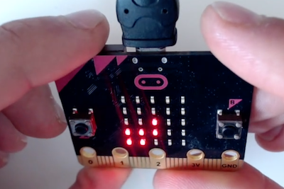
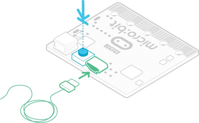

#La carte micro:bit

## Qu'est-ce qu'une carte micro:bit ?
La carte BBC micro:bit est une carte micro-contrôleur de 5 cm sur 4 cm, qui a été conçue &mdash; notamment par la BBC &mdash; dans un objectif pédagogique. Elle se programme à l'aide de différentes interfaces et différents langages, permettant à des élèves de tous niveaux d’aborder la robotique et d'interagir avec le monde réel.

")

## Description des composants

Elle comporte à l'avant:  

* 25 LEDs rouges, programmables pour afficher du texte qui défile ou des images ; elles sont aussi des capteurs de lumière
* deux boutons poussoirs A et B programmables,
* des broches de connexion.

Et à l'arrière :  
")

1. une antenne [radio](https://www.youtube.com/watch?v=rvymAr6WqrQ) et bluetooth,
* un [micro-processeur](https://www.youtube.com/watch?v=Y9tk07CzTAA) et capteur de température, 
* un [magnétomètre (boussole)](https://www.youtube.com/watch?v=a3P6LWwPBqM) permettant de mesurer des champs magnétiques,
* un [accéléromètre](https://www.youtube.com/watch?v=UT35ODxvmS0) permettant de capter des mouvements en trois dimensions. Il détermine le tangage, le roulis et le lacet.
* des [broches de connexion](https://www.youtube.com/watch?v=EDgdHb0R96I) pour contrôler des composants externes
* un [port micro-USB](https://www.youtube.com/watch?v=ke04WnxxT5c) permettant d'alimenter la carte et de transférer des programmes,
* une led qui sert de témoin lumineux pour l'alimentation de la carte ou le téléchargement de programme,
* un bouton de réinitialisation,
* un connecteur d'alimentation (2 piles AAA - 3V),
* une puce d'interface USB.

La version 2, distribuée à partir de fin 2020, comporte également un micro et un haut-parleur.

L'alimentation se fait par le port micro-USB lorsqu'il est connecté à un ordinateur ou à l'aide de piles.  

## Calibrer la boussole
Lors de l'usage de certaines fonctionnalités de la carte comme la boussole, un calibrage est nécessaire. Le message *TILT TO FILL SCREEN* défile à l'écran et le pixel central clignote. En inclinant la carte, ce pixel semble se déplacer comme sous l'effet de la pesanteur, en allumant toutes les leds rencontrées sur son chemin. Incliner la micro:bit dans tous les sens jusqu’à ce que les leds du panneau d'affichage soient toutes allumées.  
  
[Démonstration en vidéo](https://support.microbit.org/helpdesk/attachments/19031012156)

## Programmer la carte micro:bit

Plusieurs interfaces permettent de programmer la carte, dans différents langages, dans un navigateur ou à l'aide d'un logiciel installé. Les programmes se transfèrent dans la carte depuis un ordinateur à l'aide d'un câble USB connecté au port micro-USB ou sans fil par Bluetooth. 

Ce site propose des exemples :  
- de programmation par blocs avec [MakeCode](../makecode/)  
- de programmation par blocs avec [Scratch](../scratch/)  
- de programmation Python avec [l'éditeur Python en ligne ou Mu](../python/)  

## Mettre à jour le firmware de la carte micro:bit

Le firmware est un logiciel qui est physiquement stocké dans la puce de la carte micro:bit mais qui n'est pas modifié lors de l'écriture de programmes ou lorsque la carte micro:bit est éteinte.  
Il est possible de  mettre à jour le firmware pour utiliser de nouvelles fonctionnalités telles que WebUSB.  

### Connaître la version du firmware installé

Pour connaître la version du firmware installé sur une carte micro:bit, connecter la carte à l'aide du câble USB à un ordianateur : elle apparaît dans le gestionnaire de fichiers sous le nom MICROBIT. Ouvrir le fichier DETAILS.TXT du lecteur MICROBIT et rechercher le numéro sur la ligne qui commence par « Interface Version ».

### Comment mettre à jour le firmware ?  
1. Déconnecter le câble USB et la batterie de la carte micro:bit.  
2. Maintenir le bouton de réinitialisation à l'arrière la carte tout en connectant la carte à un ordinateur à l'aide du câble USB. Un lecteur devrait apparaître dans le gestionnaire de fichiers appelé MAINTENANCE (au lieu de MICROBIT).  

3. Télécharger le fichier `.hex` de [cette page](https://microbit.org/get-started/user-guide/firmware/) sur votre ordinateur.  
4. Faire glisser et déposer le nouveau fichier `.hex` du firmware  sur le lecteur MAINTENANCE et attendre que le voyant orange à l'arrière de la carte cesse de clignoter. Lorsque la mise à niveau est terminée, la carte micro:bit se réinitialise, s’éjecte de l’ordinateur et réapparaît sous le nom MICROBIT habituel.  
5. En consultant le fichier DETAILS.TXT qui se trouve sur le lecteur MICROBIT on peut s'assurer que le firmware a le même numéro de version que celle qui a été téléchargée.

## Utiliser la fonctionnalité WebUSB
Le transfert de programme se fait généralement en téléchargeant le fichier `.hex` du programme, puis en le copiant sur la carte.

Avec un navigateur Web récent, on peut envoyer ses programmes directement à la carte micro:bit à partir des éditeurs MakeCode et Python sans avoir à télécharger, faire glisser et déposer des fichiers `.hex`.  
Le téléchargement direct fait gagner du temps et simplifie la mise à jour du code sur la carte. Il utilise un processus appelé WebUSB, qui établit une connexion entre le navigateur ou l'application et la carte micro:bit via le câble USB.

Pour utiliser cette fonctionnalité, utiliser un navigateur basé sur Chrome, et une carte micro:bit dont la version de firmware est au moins 243 (si besoin, mettre à jour le firmware de la carte).
Lorsque cette fonctionnalité est disponible, le navigateur vous proposer de connecter (ou appairer) la carte. Une fois la connexion établie, le téléchargement direct en un clic est possible.

## Références

!!! info "Références"
    - le site de la fondation [micro:bit](https://microbit.org)  
    - le site de [documentation technique de la carte](https://tech.microbit.org/hardware/)  
    - l'article [micro:bit sur wikipedia](https://fr.wikipedia.org/wiki/Micro:bit)  
    - la page dédiée à [micro:bit sur le site de la C2ITice](https://tice.univ-irem.fr/?page_id=906)
