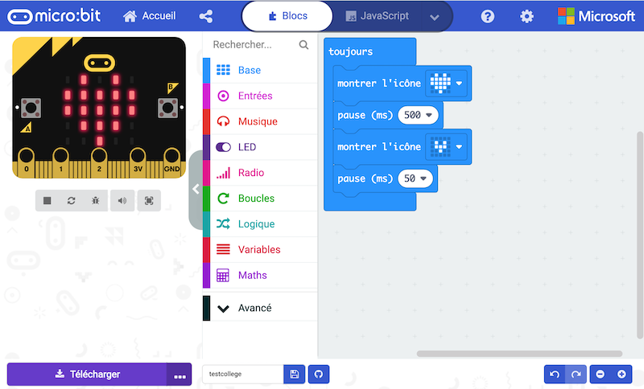
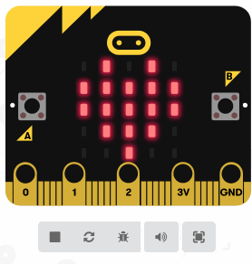
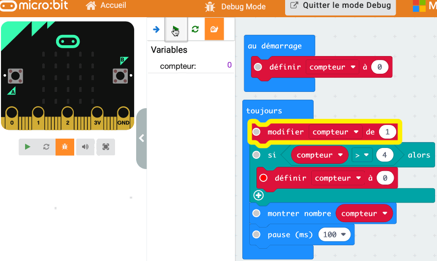
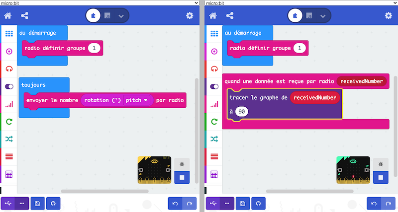
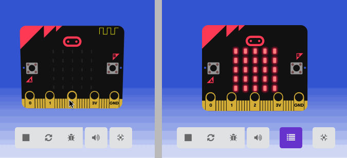

# Programmer la carte avec l'éditeur Blocs de MakeCode pour micro:bit

## Interface de programmation par blocs
 
Cette [interface](https://makecode.microbit.org/#), développée par MakeCode en partenariat avec micro:bit, se trouve en ligne et s'utilise directement dans un navigateur.
Elle est sans doute idéale pour débuter : aucun pré-requis n'est nécessaire, et on peut paramétrer l'affichage en français.  

  
L'utilisateur manipule et emboite des blocs pour créer son programme. Le simulateur affiche le fonctionnement du programme.  

## Le simulateur

L'interface MakeCode dispose d'un simulateur de la carte micro:bit qui permet d'observer le fonctionnement du programme et d'effectuer les premières corrections. Les données des capteurs peuvent être simulées également, avec des curseurs manipulables à la souris, et on peut simuler le fait de secouer la carte.

##Sauvegarder son programme
Le navigateur conserve par défaut les données des programmes réalisés et une ouverture ultérieure de l'éditeur affiche le dernier programme par défaut.

### Méthode classique
Le programme réalisé est à télécharger pour être copié dans la carte micro:bit. Lui donner un nom puis cliquer sur *Télécharger*.  
Le format du fichier téléchargé est `.hex`: c'est à la fois le fichier à copier dans la carte pour qu'elle l'exécute et celui à sauvegarder dans ses documents personnels pour ouvrir ultérieurement le programme dans l'éditeur. 

Lorsque la carte est connectée à l'ordinateur par port USB elle apparaît sous le nom MICROBIT. Aucun pilote n'est nécessaire. Copier-coller le programme `.hex` téléchargé sur la carte : une led orange clignote pendant le chargement.
Après le transfert, la carte micro:bit s’éjecte de l’ordinateur puis se reconnecte. Le fichier téléchargé n'apparait pas sur la carte dans le gestionnaire de fichiers comme sur une clé USB, mais le programme doit s'exécuter directement sur la carte après le transfert. 

### Méthode WebUSB
Depuis la version 243 du [firmware](../decouvrir_microbit/#mettre-a-jour-le-firmware-de-la-carte-microbit), les navigateurs basés sur Chrome (versions 65 et +) proposent d'*appairer* la carte, permettant le téléchargement du programme en un clic, en utilisant la norme [WebUSB](../decouvrir_microbit/#utiliser-la-fonctionnalite-webusb).

## Le mode Debug

Ce mode s'active en cliquant sur l'icône . 
Il permet :  
- d'exécuter le programme pas à pas ou au ralenti, en mettant en évidence l'instruction exécutée  
- de placer des points d'arrêt dans le programme : lorsqu'une instruction marquée d'un point est sur le point d'être exécutée, le programme s'interrompt  
-d'afficher les valeurs des variables.  

Il est très utile pour déceler les bugs d'un programme ou pour expliquer le fonctionnement d'un programme correct.

## Le mode Multi

Ce [mode](https://makecode.microbit.org/---multi#) permet l'affichage de deux interfaces de programmation : il est très utile pour connecter et programmer deux cartes avec des programmes différents. Par exemple, si une carte doit émettre un signal radio et une autre le réceptionner. 

Lors de l'appairage des cartes, les identifiants complets des cartes sont affichés pour les différencier. 

## Références
Cliquer sur les logos pour accéder à la documentation micro:bit sur chaque type de blocs.  

|Type de blocs|Exemple de blocs|
| :----: | :---- |
| | `montrer nombre`, `montrer LEDs`, `montrer l'icône`, `afficher texte`, `effacer l'écran`, `toujours`, `au démarrage`, `pause`, `montrer la flèche`. |
| | `lorsque le bouton A est pressé`, `lorsque secouer`, `lorsque la broche P0 est activée`, `bouton A pressé`, `accélération`, `niveau d'intensité lumineuse`, `direction de la boussole` , `température`, etc. |
| | `jouer la mélodie`, `jouer ton`, `buzz`, etc.  |
| | `allumer x y`, `activer/désactiver x y`,  `éteindre`,`tracer le graphe`, etc. |
| | `définir radio groupe`, `envoyer le nombre  par radio`, `envoyer la chaine par radio`, `envoyer la valeur par radio`, `quand une donnée est reçue par radio`, etc. |
| | `répéter n fois`, `tant que`, `pour index variant de 0 à 4`, `pour l'élément valeur de list`, etc. |
| | `si … alors … `, `si … alors … sinon`, comparaisons, `et`, `ou`, `non`, etc. |
| | `créer une variable`, etc. |
| | `+`, `—`, `x`, `÷`, `reste`, `min`, `max`, `choisir au hasard`, etc. |

