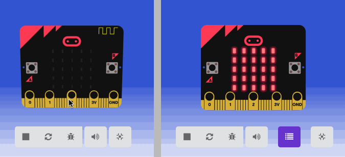

# Un parcours pour découvrir la fonctionnalité radio

## Le mode Multi

Ce [mode](https://makecode.microbit.org/---multi#) permet l'affichage de deux interfaces de programmation : il est très utile pour connecter et programmer deux cartes avec des programmes différents. Par exemple, si une carte doit émettre un signal radio et une autre le réceptionner. 

