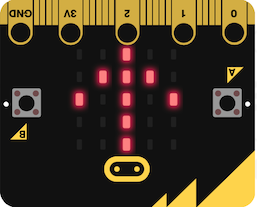

# L'accéléromètre

 <iframe width="560" height="315" src="https://www.youtube.com/embed/UT35ODxvmS0" frameborder="0" allow="accelerometer; autoplay; clipboard-write; encrypted-media; gyroscope; picture-in-picture" allowfullscreen></iframe>

## L'accéleromètre
La carte micro:bit comporte un accéléromètre, désigné par `accelerometer`.  
Il permet de connaître l'orientation de la carte selon 3 axes :  

- `x`, l’inclinaison de gauche à droite (roulis),
- `y`, l’inclinaison d’avant en arrière (tangage),
- `z`, le mouvement haut et bas.

|Instructions|Effet|
| :--- | :--- |
|`accelerometer.get_x()`|renvoie une valeur d'inclinaison gauche - droite|
|`accelerometer.get_y()`|renvoie une valeur d'inclinaison avant - arrière|
|`accelerometer.get_z()`|renvoie la mesure de l'accélération selon l'axe `z`|
|`accelerometer.get_values()`|affiche un triplet (*tuple*) des 3 mesures selon `x`, `y`, et `z`.|


## Les gestes

Grâce à l'accéléromètre, la carte micro:bit reconnaît les mouvements qu'elle subit ainsi que son orientation.  
Elle peut détecter les gestes suivants : `up, down, left, right, face up, face down, freefall, 3g, 6g, 8g, shake`


|Instructions|Effet|
| :--- | :--- |
|`accelerometer.current_gesture()`|Renvoie le nom du geste actuel|
|`accelerometer.is_gesture(nom)`|Vaut `True` si `nom` correspond au geste actuel|
|`accelerometer.was_gesture(nom)`|Vaut `True` si le geste `nom` a été activé depuis le dernier appel|
|`accelerometer.get_gestures()`|Renvoie un p-uplet (*tuple*) contenant l'historique des gestes activés depuis le dernier appel|


## Exemple

{width=250px}  

```python
from microbit import *

while True:
    if(accelerometer.current_gesture() == 'up'):
        display.show(Image.ARROW_N)
    elif(accelerometer.current_gesture() == 'down'):
        display.show(Image.ARROW_S)
    elif(accelerometer.current_gesture() == 'left'):
        display.show(Image.ARROW_E)
    elif(accelerometer.current_gesture() == 'right'):
        display.show(Image.ARROW_W)
    else:
        display.clear()
    sleep(100)
```
Lorsqu'on exécute ce programme, une flèche désigne le côté de la carte tourné vers le haut. Si la carte est posée "à plat" aucun affichage n'est réalisé.

## Références
[Gestes](https://microbit-micropython.readthedocs.io/fr/latest/tutorials/gestures.html)  
[La classe Accelerometer](https://microbit-micropython.readthedocs.io/en/latest/accelerometer.html)
