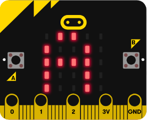

# Les boutons

<iframe width="560" height="315" src="https://www.youtube.com/embed/hnT0qHM3_hQ" frameborder="0" allow="accelerometer; autoplay; clipboard-write; encrypted-media; gyroscope; picture-in-picture" allowfullscreen></iframe>

## Les boutons
{width=250px}  


La carte micro:bit comporte deux boutons, nommés `button_a` et `button_b`.


## Détecter l'appui sur un bouton

La méthode `is_pressed()` permet de savoir si un bouton est pressé au moment où la méthode est invoquée.

|Instructions|Effet|
| :--- | :--- |
|`button_a.is_pressed()`|Vaut `True` si le bouton A est appuyé, `False` sinon|


## Détecter si un bouton a été appuyé
Il est utile d'avoir recours à la méthode `was_pressed()` pour savoir si un bouton a été actionné pendant que le programme était occupé à une autre tâche.

|Instructions|Effet|
| :--- | :--- |
|`button_a.was_pressed()`|Vaut `True` si le bouton A a été appuyé, `False` sinon|

## Compter les appuis

|Instructions|Effet|
| :--- | :--- |
|`button_a.get_presses()`|Renvoie le nombre d'appuis sur le bouton A et remet à zéro le compteur d'appuis|

## Exemple

  

```python
from microbit import *

while True:
    if button_a.is_pressed():
        display.show(Image.YES)
    elif button_b.is_pressed():
        display.show(Image.NO)
    else:
        display.clear()
```
Lorsqu'on exécute ce programme :  

- l'image `YES` s'affiche lorsque l'on appuie sur le bouton A mais disparaît si on le relâche
- l'image `NO` s'affiche lorsque l'on appuie sur le bouton B mais disparaît si on le relâche
- les pixels sont tous éteints si l'on n'appuie sur aucun bouton.

## Références
[La classe Button](https://microbit-micropython.readthedocs.io/fr/latest/button.html)
