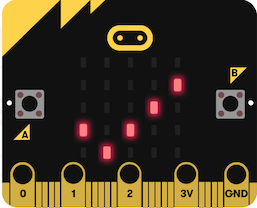

# Parcours de découverte : atteindre le niveau !

[<span class="item led">led</span>](../python_leds5x5)
[<span class="item accelerometer">accéléromètre</span>](../python_accelerometre)  


{width=250px}

## :material-target: Objectif
 Ce parcours combine des instructions d'affichage d'images, de mesure du niveau de lumière, de détection de mouvements. L'objectif est de découvrir différents capteurs de la carte et de comprendre et modifier des programmes permettant de détecter une valeur ou un seuil fixé pour l'information mesurée.

## :octicons-checklist-24:   Matériel nécessaire :
- une carte micro:bit, une lampe (par exemple celle d'un smartphone), le boitier de piles à connecter à la carte, un élastique  
- en option : capteur de lumière du kit Grove

## :octicons-milestone-24: De la lumière !
### :octicons-image-24:  1 Afficher une image prédéfinie
{width=250px}

Voici un premier programme :
```python
from microbit import *
display.show(Image.YES)
```

- Saisir ce programme et le flasher sur une carte connectée à l'ordinateur.  
Que constate-t-on ?  
- Remplacer dans le programme le mot YES par l'un des mots suivants :  
CHESSBOARD - DIAMOND - HAPPY - HEART - NO - SAD - SQUARE
- Choisir l'une des images et la reproduire sur une feuille à l'aide d'un quadrillage de 5 carreaux sur 5.


### :octicons-paintbrush-16:  2 Afficher une image personnalisée
- Saisir ce programme et le flasher sur la carte.  
Que constate-t-on ? À quoi correspondent les 0 et les 9 ?
```python
from microbit import *
mon_image = Image("90909:"
                  "09990:"
                  "99999:"
                  "09990:"
                  "90909")
display.show(Image.mon_image)
```

- Dessiner sur une feuille à l'aide d'un quadrillage de 5 carreaux sur 5 une image personnelle et modifier le programme précédent pour la faire apparaître sur la carte micro:bit.


### :octicons-light-bulb-24:  3 Détecter l'intensité lumineuse

Les LED de la carte peuvent détecter le niveau de lumière ambiante : la fonction `display.read_light_level()` renvoie une valeur comprise entre 0 et 255 : plus la valeur est élevée, plus l'environnement est lumineux.

```python
from microbit import *
while True:
    niveau = display.read_light_level()
    if niveau > 220:
        display.show(Image.YES)
    else :
        display.show(Image.NO)
    sleep(200)
```

- Saisir ce programme et le flasher sur une carte connectée à l'ordinateur.  
Que faut-il faire pour que l'image Image.YES s'affiche ?  
- Modifier ce programme pour que la carte affiche un carré en luminosité "normale" et un diamant dans la pénombre.

### :octicons-plus-circle-24:  4 Option : avec un détecteur de lumière Grove

<!-- 
-->
Placer la carte micro-bit sur le shield Grove et connecter le détecteur de lumière sur la broche P0-P14.  
Ce capteur renvoie sur la broche sur laquelle il est connecté une tension proportionnelle à l'intensité lumineuse.  
Par exemple, si le capteur est connecté sur la broche P0, la fonction `pin0.read_analog()` renvoie une valeur entière d'autant plus élevée que l'environnement est lumineux.

Saisir et flasher le programme suivant :
```python
from microbit import *
while True:
    mesure = pin0.read_analog()
    if mesure > 600:
        display.show(Image.YES)
    else :
        display.show(Image.NO)
    sleep(100)
```

- Que peut-on faire pour que l'image Image.NO s'affiche sur la carte micro:bit ?  
- Emballer le capteur (connecté à la carte) dans une feuille de papier.  Modifier le programme pour que la carte affiche l'image Image.YES tant que le capteur reste emballé et l'image Image.NO dès que l'emballage est ouvert.


## :octicons-milestone-24: Du mouvement !
### :octicons-zap-24: 1 Détecter une secousse

Grâce à un accéléromètre, la carte micro:bit est capable de détecter des gestes, et notamment lorsqu'on la secoue.
L'expression `accelerometer.is_gesture('shake')` vaut `True` (vrai) lorsque la carte est secouée et `False` (faux) sinon.

- Lire le programme suivant et décrire le comportement que devrait avoir la carte après l'exécution de ce programme.

```python
from microbit import *
while True:
    secoue = accelerometer.is_gesture('shake')
    if secoue:
        display.show(Image.YES)
        sleep(50)
        display.clear()
```


- Saisir le programme et le flasher sur une carte connectée à l'ordinateur. Vérifier si le comportement anticipé est conforme à celui observé.

- En utilisant les gestes `face up` et `face down` détectés par l'accéléromètre, modifier le programme précédent pour que la carte affiche l'image Image.YES lorsqu'elle est tournée vers le plafond,  l'image Image.NO lorsqu'elle est tournée vers le sol, et rien dans les autres cas.


### :material-angle-acute: 2 Détecter l'inclinaison de la carte  

On souhaite déplacer un pixel sur l'écran en fonction des valeurs des inclinaisons gauche-droite et avant-arrière de la carte, comme une bille qui se déplacerait sur un plan incliné.

On utilise la valeur détectée pour `accelerometer.get_x()` (inclinaison gauche-droite) et `accelerometer.get_y()` (inclinaison avant-arrière) et selon leur valeur, on donne à l'abscisse `x` et à l'ordonnée `y` d'un pixel allumé la valeur 0, 1, 2, 3 ou 4.  
Par exemple, voici la valeur donnée à `x` selon la valeur de `accelerometer.get_x()` :


- Compléter le programme suivant pour qu'il respecte les indications précédentes pour déterminer la valeur de `x`.
```python
from microbit import *

x = 2
y = 2

while True:
    display.set_pixel(x,y,0)
    acc_x = accelerometer.get_x()
    if acc_x > ...:
        x = 4
    elif acc_x > 200:
        x = ...
    elif acc_x < -400:
        x = ...
    elif acc_x < ...:
        x = 1
    else:
        x = ...
    display.set_pixel(x,y,9)
    sleep(100)
```
- Saisir le programme et le flasher sur une carte connectée à l'ordinateur. Vérifier si le comportement anticipé est conforme à celui observé.  
- Compléter le programme en procédant de façon analogue pour déterminer la valeur que doit en prendre l'ordonnée du pixel `y` selon les valeurs de `accelerometer.get_y()`
