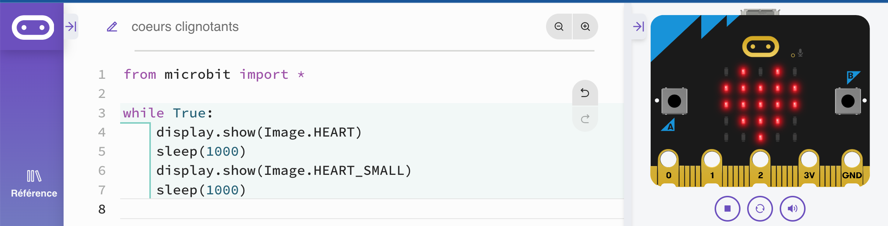
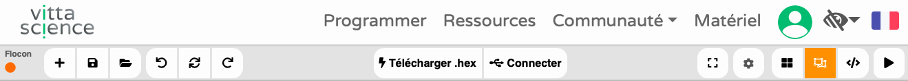
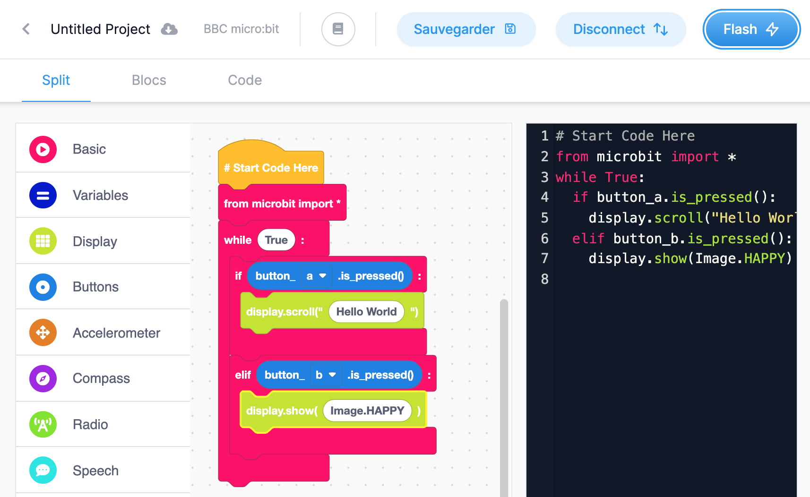

# Quel éditeur ?

## MicroPython
La carte micro:bit peut être programmée en Python. La version de Python qui s'exécute sur la carte micro:bit s'appelle [MicroPython](http://micropython.org/). C'est une implémentation légère et efficace du langage de programmation Python 3 qui comprend un sous-ensemble de la bibliothèque standard Python et qui est optimisée pour s'exécuter sur des microcontrôleurs.

Le site [microbit-micropython.readthedocs.io](https://microbit-micropython.readthedocs.io/en/v2-docs/index.html) présente les instructions de référence et propose quelques projets.  

## Quel éditeur Python utiliser ?

Pour écrire des programmes et les télécharger sur la carte micro:bit, plusieurs éditeurs existent.

!!! warning "Attention"
    Le code python obtenu via les différentes interfaces n'est pas interchangeable car les modules importés peuvent différer.  
Voici une sélection parmi les interfaces disponibles :  

### - L'éditeur Python en ligne du site `microbit.org`  

L'[éditeur Python en ligne](https://python.microbit.org/v/2) ne nécessite pas d'installation, mais ne dispose ni de l'auto-complétion ni de version en français.

### - le logiciel `Mu`

  

[Mu](https://codewith.mu/) est un éditeur de code simple, multiplateforme. Cette interface dispose de l'auto-complétion et d'une indentation automatique, ainsi que d'une version en français.
Mu propose différents modes dont l'un est destiné à la carte micro:bit. Ce mode propose l'affichage graphique des données envoyées sur le port série et une console interactive REPL (read, evaluate, print, loop).

### - l'éditeur en ligne `Vittascience`  

  

L' éditeur français [Vittascience](https://fr.vittascience.com/microbit/?mode=mixed) propose l'écriture de programmes à l'aide de blocs de programmation en français, ou de code en python. Un mode hybride permet une transition de l'un vers l'autre en affichant les 2 simultanément.
Cet éditeur dispose de plus d'un simulateur de carte, permettant de tester son programme, même en l'absence de connexion à une carte micro:bit. On trouve aussi l'affichage graphique des données envoyées sur le port série et l'export des données. Enfin, les instructions nécessaires au fonctionnement des capteurs et actionneurs du kit Grove sont présents.
Il est possible de se créer un compte et de sauvegarder ses programmes en ligne, de les partager, etc.

### - l'éditeur en ligne `Edublocks`

L'éditeur [Edublocks](https://app.edublocks.org/#Python) est un projet développé par Joshua Lowe, jeune britannique. L’interface permet de programmer en Python en sélectionnant et imbriquant des blocs. La version textuelle apparaît en parallèle et le contenu est identique dans les 2 cas. Des extensions sont disponibles pour quelques kits, mais pas pour le kit Grove.  
Il est possible de se créer un compte et de sauvegarder ses programmes en ligne, de les partager, de les intégrer, etc.

### - l'éditeur en ligne `Create with code`

L'interface [create with code](https://create.withcode.uk) propose un éditeur en ligne de scripts en python et comporte un simulateur de carte micro:bit.
Il suffit d’ajouter l’instruction `from microbit import *` en début de script et de l’exécuter pour voir apparaître une fenêtre simulant la carte et ses différents capteurs et actionneurs.
Il est possible de se créer un compte et de sauvegarder ses programmes en ligne, de les partager, de les intégrer, etc.

## Synthèse (janvier 2021)

|éditeur|micro:bit|Mu|Vittascience|Edublocks|Create with code|
| ---| :---: | :---: | :---: | :---: | :---: |
|En ligne|:octicons-check-24:|:octicons-x-24:|:octicons-check-24:|:octicons-check-24:|:octicons-check-24:|
|Auto-complétion|:octicons-x-24:|:octicons-check-24:|:octicons-x-24:|:octicons-x-24:|:octicons-x-24:|
|version française|:octicons-x-24:|:octicons-check-24:|:octicons-check-24:|:octicons-x-24:|:octicons-x-24::|
|transfert rapide sur la carte (WebUSB, flash)|:octicons-check-24:|:octicons-check-24:|:octicons-check-24:|:octicons-x-24:|:octicons-x-24:|
|Affichage de graphiques|:octicons-x-24:|:octicons-check-24:|:octicons-check-24:|:octicons-x-24:|:octicons-x-24:|
|Simulateur|:octicons-x-24:|:octicons-x-24:|:octicons-check-24:|:octicons-x-24:|:octicons-check-24:|
