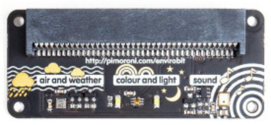

# La carte Enviro:bit

{width=250px}


La carte Enviro:bit permet la mesure de plusieurs données :
 température, humidité, pression, lumière, couleur et son.

Pour une utilisation avec mu-Editor, il faut télécharger trois librairies sur la page github de Pimoroni : https://github.com/pimoroni/micropython-envirobit/tree/master/library

Ces bibliothèques sont à placer dans les fichiers disponibles sur la carte, en les copiant au préalable dans le dossier mu_code (`C:\Users\YourUserName\mu_code`  sur Windows ou `/Users/YourUserName/mu_code` sur macOS).

## Capteur de température, pression et humidité

Ce capteur nécessite de télécharger la bibliothèque bme280.

```python
import bme280
bme = bme280.bme280
```

L'instance de classe `bme` dispose des méthodes suivantes :

|Instructions|Effet|
| --- | ---|
| bme.temperature()|renvoie la température en degrés Celsius|
| bme.pressure()| renvoie la pression en hectoPascal|
| bme.humidity() | renvoie l'humidité relative en %|
| bme.altitude()| renvoie l'altitude en pied, calculée par rapport à la valeur QNH (pression atmosphérique au niveau de la mer)|
| bme.set_qnh(value)| définit la valeur QNH pour la calcul de l'altitude|

## Microphone

Ce capteur nécessite de télécharger la bibliothèque  `sound`.

```python
import sound
sound = sound.sound()
```

L'instance de classe `sound` dispose des méthodes suivantes :

|Instructions|Effet|
| --- | ---|
| sound.read()|renvoie la valeur du niveau sonore|
| sound.wait_for_double_clap()| détecte un niveau sonore élevé deux fois par seconde, renvoie True s'il est détecté|
| sound.wait_for_clap()| détecte un niveau sonore élevé une fois par seconde, renvoie True s'il est détecté|

## Capteur de couleurs

Ce capteur nécessite de télécharger la bibliothèque  `tcs3472`.

```python
import tcs3472
light_sensor = tcs3472.tcs3472()
```

L'instance de classe `light_sensor` dispose des méthodes suivantes :

|Instructions|Effet|
| --- | ---|
| light_sensor.rgb()|renvoie les valeurs des composantes RGB|
| light_sensor.scaled()| envoie les quantités de rouge, de vert et de bleu sur une échelle de 0 à 1|
| light_sensor.light()| renvoie une lecture brute du niveau de lumière sur une échelle de 0 à 65535|
| light_sensor.set_leds() | allumer et éteindre les leds avec 0 ou 1|

Exemples issus de https://github.com/pimoroni/micropython-envirobit/tree/master/examples

```python
import tcs3472
import microbit

tcs3472 = tcs3472.tcs3472()

#flash lights twice, read on third flash
while True:
    tcs3472.set_leds(1)
    microbit.sleep(300)
    tcs3472.set_leds(0)
    microbit.sleep(300)
    tcs3472.set_leds(1)
    microbit.sleep(300)
    tcs3472.set_leds(0)
    microbit.sleep(300)
    tcs3472.set_leds(1)
    microbit.sleep(300)
    reading = tcs3472.rgb()
    microbit.display.scroll(str(reading))
    tcs3472.set_leds(0)
    microbit.sleep(3000)
```

```python
from microbit import *
import tcs3472

tcs3472 = tcs3472.tcs3472()

trigger = 400

while True:
    light_level = tcs3472.light()
    if light_level < trigger :
        display.show(Image.SURPRISED)
    else:
        display.show(Image.HAPPY)
```  

```python
from microbit import sleep
import tcs3472

light_sensor = tcs3472.tcs3472()

while True:
    light_sensor.set_leds(1)
    sleep(1000)
    light_sensor.set_leds(0)
    sleep(1000)
```

```python
import tcs3472
import microbit

tcs3472 = tcs3472.tcs3472()

def light_level():
    max_level = 0
    for i in range(0, 10):
        light_level = tcs3472.brightness() / 100
        if light_level > max_level:
            max_level = light_level
    return max_level

def bargraph(a):
    microbit.display.clear()
    for y in range (0, 5):
        if a > y:
            for x in range (0, 5):
                microbit.display.set_pixel(x, 4-y, 9)

while True:
    bargraph(light_level())
    microbit.sleep(10)
```
