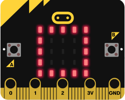
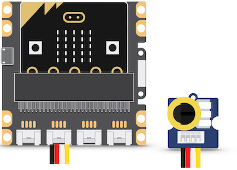

# Exercices

## 1. Afficher une image


### 1.1 Afficher une image prédéfinie  

[<span class="item led">led</span>](../python_leds5x5)


Voici un premier programme :
```python
from microbit import *
display.show(Image.YES)
```

- Saisir ce programme et le flasher sur une carte connectée à l'ordinateur.  
Que constate-t-on ?  
- Remplacer dans le programme le mot YES par l'un des mots suivants :  
CHESSBOARD - DIAMOND - HAPPY - HEART - NO - SAD - SQUARE
- Choisir l'une des images et la reproduire sur une feuille à l'aide d'un quadrillage de 5 carreaux sur 5.

### 1.2 Afficher une image personnalisée

[<span class="item led">led</span>](../python_leds5x5)

- Saisir le programme suivant et le flasher sur la carte.  
Que constate-t-on ? À quoi correspondent les 0 et les 9 ?

```python
from microbit import *
mon_image = Image("90909:"
                  "09990:"
                  "99999:"
                  "09990:"
                  "90909")
display.show(mon_image)
```

- Dessiner sur une feuille à l'aide d'un quadrillage de 5 carreaux sur 5 une image personnelle et modifier le programme précédent pour la faire apparaître sur la carte micro:bit.


### 1.3 Faire alterner deux images

[<span class="item led">led</span>](../python_leds5x5)



Créer une animation affichant successivement et en boucle deux images prédéfinies, par exemple Image.SQUARE et Image.SQUARE_SMALL.

??? Abstract "Aide : une proposition à compléter"
    ```python linenums="1"
    from microbit import *
    mes_images = [Image.SQUARE, Image.SQUARE_SMALL]
    display.show(..., delay=..., loop=...)
    ```

??? Success "Une solution"
    ```python linenums="1"
    from microbit import *
    mes_images = [Image.SQUARE, Image.SQUARE_SMALL]
    display.show(mes_images, delay=500, loop=True)
    ```

## 2. Faire clignoter une LED

### 2.1 Faire clignoter une LED de la carte

[<span class="item led">led</span>](../python_leds5x5)


Choisir l'une des LED de la carte et la faire clignoter.

??? Abstract "Aide : une proposition à compléter"
    ```python linenums="1"
    from microbit import *
    while True:
        # choisir un pixel à allumer
        display.set_pixel(..., ..., 9)
        sleep(500)
        # éteindre le même pixel
        display.set_pixel(..., ..., ...)
        sleep(500)
    ```

??? Success "Une solution"
    ```python linenums="1"
    from microbit import *
    while True:
        display.set_pixel(1, 1, 9)
        sleep(500)
        display.set_pixel(1, 1, 0)
        sleep(500)
    ```

### 2.2 Faire varier le rythme avec un potentiomètre

[<span class="item led">led</span>](../python_leds5x5)
[<span class="item grove_potentiometre">potentiomètre</span>](../python_grove/#capteurs)




Placer la carte micro-bit sur le shield Grove et connecter le potentiomètre sur la broche P0-P14.  
La fonction `pin0.read_analog()` renvoie une valeur qui dépend de l'angle de rotation de l'axe du potentiomètre.

- Modifier le programme précédent en ajoutant au début de la boucle `while` l'intruction : `mesure = pin0.read_analog()` puis en remplaçant les temps durant lesquels la LED est allumée ou éteinte par `mesure`.
- Quel effet observe-t-on sur le clignotement lorsque l'on tourne l'axe du potentiomètre ?

??? Success "Une solution"
    ```python linenums="1"
    from microbit import *
    while True:
        mesure = pin0.read_analog()
        display.set_pixel(1, 1, 9)
        sleep(mesure)
        display.set_pixel(1, 1, 0)
        sleep(mesure)
    ```

### 2.3 Faire clignoter la LED du kit Grove

[<span class="item grove_led">led grove</span>](../python_grove/#actionneurs)
[<span class="item grove_potentiometre">potentiomètre</span>](../python_grove/#capteurs)


Connecter la LED sur le shield Grove sur la broche P1-P15 ( en plus  du potentiomètre déjà connecté sur la broche P0-P14).  
L'instruction `pin1.write_digital(1)` permet d'allumer la LED lorsqu'elle est sur la broche P1, et l'instruction `pin1.write_digital(0)` permet de l'éteindre.

- Modifier le programme précédent pour faire clignoter la LED Grove, au lieu d'une LED de la carte.
- Le potentiomètre conserve-t-il son  effet ?

??? Success "Une solution"
    ```python linenums="1"
    from microbit import *
    while True:
        mesure = pin0.read_analog()
        pin1.write_digital(1)
        sleep(mesure)
        pin1.write_digital(0)
        sleep(mesure)
    ```


## 3. Déplacer un point lumineux


### 3.1 Programmer le déplacement d'un point lumineux sur la carte

[<span class="item led">led</span>](../python_leds5x5)

- Lire le programme suivant et anticiper l'effet produit sur la carte micro:bit :
```python linenums="1"
from microbit import *
while True:
    for x in range(5): # x prend les valeurs 0 à 4
        display.set_pixel(x, 0, 9)
        sleep(300)
    display.clear()
```
- Saisir ce programme et le flasher sur une carte micro:bit. Vérifier si l'effet constaté correspond à celui anticipé.
- Indenter l'instruction `display.clear()` pour qu'elle soit alignée avec le `sleep(300)` de la ligne 5. Quel effet cela a-t-il sur l'affichage produit sur la carte ? Pourquoi ?
- Poursuivre le programme précédent pour que le point lumineux allumé fasse le tour du carré de 25 LED.

??? Abstract "Aide : une proposition à compléter"
    ```python linenums="1"
    from microbit import *
    while True:
        for x in range(5):   # x prend les valeurs 0 à 4
            display.set_pixel(x, 0, 9)
            sleep(300)
            display.clear()
        for y in range(1,5):   # y prend les valeurs 1 à 4
            display.set_pixel(..., y, 9)
            sleep(300)
            display.clear()
        for x in range(3, -1, -1):   # x prend les valeurs 3 à 0
            display.set_pixel(x, ..., 9)
            sleep(300)
            display.clear()
        for y in range(3, -1, -1):   # x prend les valeurs 0 à 4
            display.set_pixel(..., y, 9)
            sleep(300)
            display.clear()
    ```

??? Success "Une solution"
    ```python linenums="1"
    from microbit import *
    while True:
        for x in range(5):   # x prend les valeurs 0 à 4
            display.set_pixel(x, 0, 9)
            sleep(300)
            display.clear()
        for y in range(1, 5):   # y prend les valeurs 1 à 4
            display.set_pixel(4, y, 9)
            sleep(300)
            display.clear()
        for x in range(3, -1, -1):   # x prend les valeurs 3 à 0
            display.set_pixel(x, 4, 9)
            sleep(300)
            display.clear()
        for y in range(3, -1, -1):   # x prend les valeurs 0 à 4
            display.set_pixel(0, y, 9)
            sleep(300)
            display.clear()
    ```

### 3.2 Programmer le déplacement d'un point lumineux sur le ruban NeoPixel

[<span class="item grove_neopixel">neopixel</span>](../python_grove/#autres-actionneurs)


- Placer la carte micro-bit sur le shield Grove et connecter le ruban de led NeoPixel sur le connecteur P0-P14.  
- Lire le programme suivant et anticiper l'effet produit sur le ruban NeoPixel : quels pixels sont allumés, dans quel ordre, de quelle(s) couleurs(s) ?  
```python linenums="1"
from microbit import *
import neopixel
# pour une connexion sur connecteur P0/P14
np = neopixel.NeoPixel(pin0, 30)

while True:
    for x in range(30): # x prend les valeurs 0 à 29
        np[x] = (255, 0, 0)
        sleep(200)
        np.show()
    np.clear()
```

- Saisir ce programme et le flasher sur une carte micro:bit, connectée. Vérifier si l'effet constaté correspond à celui anticipé.
- Indenter l'instruction `np.clear()` pour qu'elle soit alignée avec le `np.show()` de la ligne 10. Quel effet cela a-t-il sur l'affichage produit sur le ruban ? Pourquoi ?
- Modifier une valeur du programme pour augmenter la "vitesse" du point lumineux.  
- Modifier une ou plusieurs valeurs pour que le pixel allumé soit jaune.
- Poursuivre le programme précédent pour que le point lumineux fasse des allers-retours entre les deux extrémités du ruban.


### 3.3 Déplacer un pixel sur la carte avec les boutons

[<span class="item led">led</span>](../python_leds5x5)
[<span class="item buttons">boutons</span>](../python_boutons)

**Fonctionnement attendu** : Une led est allumée au centre de l'écran.
En appuyant sur le bouton A, elle se "déplace" d'un pixel vers la gauche, et en appuyant sur le bouton B, elle se "déplace" d'un pixel vers la droite. Lorsqu'elle atteint un bord (gauche ou droit), l'appui sur le bouton correspondant à ce bord n'a plus d'effet.

??? Abstract "Aide : une proposition à compléter"
    ```python linenums="1"
    from microbit import *
    #positionnement initial au centre
    x = ...
    y = ...

    while True:
        display.set_pixel(x,y,0) # on éteint le pixel
        if button_a.was_pressed():
            if x ...:      # si le pixel n'est pas déjà au bord gauche
                x = x ...  # on le déplace d'une unité vers la gauche
        if button_b.was_pressed():
            if x ...:      # si le pixel n'est pas déjà au bord droit
                 x = x ... # on le déplace d'une unité vers la droite
        display.set_pixel(x,y,9) # on allume le pixel
        sleep(20)
    ```


??? Success "Une solution"
    ```python linenums="1"
    from microbit import *
    x = 2
    y = 2
    while True:
        display.set_pixel(x,y,0)
        if button_a.was_pressed():
            if x > 0:
                x = x - 1
        if button_b.was_pressed():
            if x < 4:
                 x = x + 1
        display.set_pixel(x,y,9)
        sleep(20)
    ```

### 3.4 Déplacer un point lumineux sur un ruban NeoPixel avec les boutons

[<span class="item buttons">boutons</span>](../python_boutons)
[<span class="item grove_neopixel">neopixel</span>](../python_grove/#autres-actionneurs)

**Fonctionnement attendu** : Une led NeoPixel est allumée au début du ruban de led NeoPixel.
En appuyant sur le bouton A, un point lumineux se "déplace" d'un pixel vers la fin du ruban, et en appuyant sur le bouton B, elle revient d'un pixel vers le début du ruban. Lorsque le point lumineux atteint une extrémité, l'appui sur le bouton correspondant à cette extrémité n'a plus d'effet.

??? Abstract "Aide : une proposition à compléter"
    ```python linenums="1"
    from microbit import *
    import neopixel
    # pour une connexion sur connecteur P0/P14
    np = neopixel.NeoPixel(pin0, 30)

    position = 0

    while True:
        np.clear()
        if button_a.was_pressed():
            if position ...:      # si le pixel n'est pas déjà au début du ruban
                position = position ...    # on le déplace d'une unité vers le début
        if button_b.was_pressed():
            if position ...:      # si le pixel n'est pas déjà à la fin du ruban
                 position = position ...    # on le déplace d'une unité vers la fin
        np[position] = (..., 0, 0)    # on allume le pixel en rouge
        np.show()
        sleep(20)
    ```


??? Success "Une solution"
    ```python linenums="1"
    from microbit import *
    import neopixel
    # pour une connexion sur connecteur P0/P14
    np = neopixel.NeoPixel(pin0, 30)

    position = 0

    while True:
        np.clear()
        if button_a.was_pressed():
            if position > 0:      # si le pixel n'est pas déjà au début du ruban
                position = position -1    # on le déplace d'une unité vers le début
        if button_b.was_pressed():
            if position < 29:      # si le pixel n'est pas déjà à la fin du ruban
                 position = position + 1    # on le déplace d'une unité vers la fin
        np[position] = (255, 0, 0)    # on allume le pixel en rouge
        np.show()
        sleep(20)
    ```

### 3.5 Déplacer un point lumineux avec l'inclinaison de la carte

[<span class="item led">led</span>](../python_leds5x5)
[<span class="item accelerometer">accéléromètre</span>](../python_accelerometre)

On souhaite déplacer un point lumineux sur l'écran en fonction des valeurs des inclinaisons gauche-droite et avant-arrière de la carte, comme une bille qui se déplacerait sur un plan incliné.

On utilise la valeur détectée pour `accelerometer.get_x()` (inclinaison gauche-droite) et `accelerometer.get_y()` (inclinaison avant-arrière) et selon leur valeur, on donne à l'abscisse `x` et à l'ordonnée `y` d'un pixel allumé la valeur 0, 1, 2, 3 ou 4.  
Par exemple, voici la valeur que l'on peut donner à `x` selon la valeur de `accelerometer.get_x()` :


- Compléter le programme suivant pour qu'il respecte les indications précédentes pour déterminer la valeur de `x`.

```python
from microbit import *

x = 2
y = 2

while True:
    display.set_pixel(x, y, 0)
    acc_x = accelerometer.get_x()
    if acc_x > ...:
        x = 4
    elif acc_x > 150:
        x = ...
    elif acc_x > -150:
        x = ...
    elif acc_x > -450:
        x = 1
    else:
        x = ...
    display.set_pixel(x, y, 9)
    sleep(100)
```

- Saisir le programme et le flasher sur une carte connectée à l'ordinateur. Vérifier si le comportement anticipé est conforme à celui observé.  
- Compléter le programme en procédant de façon analogue pour déterminer la valeur que doit en prendre l'ordonnée du pixel `y` selon les valeurs de `accelerometer.get_y()`

## 4. Détecter l'intensité lumineuse


### 4.1 Avec les leds de la carte micro:bit

[<span class="item led">led</span>](../python_leds5x5)

Les LED de la carte peuvent détecter le niveau de lumière ambiante : la fonction `display.read_light_level()` renvoie une valeur comprise entre 0 et 255 : plus la valeur est élevée, plus l'environnement est lumineux.

```python
from microbit import *
while True:
    niveau = display.read_light_level()
    if niveau > 220:
        display.show(Image.YES)
    else :
        display.show(Image.NO)
    sleep(200)
```

- Saisir ce programme et le flasher sur une carte connectée à l'ordinateur.  
Que faut-il faire pour que l'image Image.YES s'affiche ?  
- Modifier ce programme pour que la carte affiche un carré en luminosité "normale" et un diamant dans la pénombre.

### 4.2 Avec un capteur de lumière Grove

[<span class="item led">led</span>](../python_leds5x5) [<span class="item grove_light">capteur de lumière</span>](../python_grove/#capteurs)


Placer la carte micro-bit sur le shield Grove et connecter le capteur de lumière sur la broche P0-P14.  
La fonction `pin0.read_analog()` renvoie une valeur entière d'autant plus élevée que l'environnement est lumineux.

Saisir et flasher le programme suivant :
```python
from microbit import *
while True:
    mesure = pin0.read_analog()
    if mesure > 600:
        display.show(Image.YES)
    else :
        display.show(Image.NO)
    sleep(100)
```

- Que peut-on faire pour que l'image Image.NO s'affiche sur la carte micro:bit ?  
- Emballer le capteur (connecté à la carte) dans une feuille de papier.  Modifier le programme pour que la carte affiche l'image Image.YES tant que le capteur reste emballé et l'image Image.NO dès que l'emballage est ouvert.

## 5. Envoyer des messages par radio

### 5.1 Envoyer une valeur
[<span class="item led">led</span>](../python_leds5x5)
[<span class="item buttons">boutons</span>](../python_boutons) [<span class="item radio">radio</span>](../python_radio)

Cet exercice nécessite deux cartes : une carte mesure la température et envoie par radio la valeur mesurée.
Une autre carte reçoit les valeurs et les affiche.

Programme sur la carte émettrice
```python
from microbit import *
import radio
radio.on()
while True:
    t = temperature()
    radio.send(str(t))
    sleep(1000)
```

Programme sur la carte réceptrice
```python
from microbit import *
import radio
radio.on()
while True:
    valeur = radio.receive()
    if valeur:
        display.scroll(valeur)
        sleep(1000)
```

- Modifier le programme de la carte réceptrice pour qu'elle n'affiche plus la température mais affiche (Image.HAPPY) si la température est supérieure à 20°C et (Image.SAD) sinon.

??? Abstract "Aide : une proposition à compléter"

    ```python linenums="1"
    from microbit import *
    import radio
    radio.on()
    while True:
        valeur = radio.receive()
        if valeur:
            if ... > 20:
                display.show(...)   
            ... :
                display.show(...)
            sleep(1000)
    ```


- Compléter le programme de la question précédente pour que la carte réceptrice affiche la température lorsqu'on appuie sur le bouton A.

??? Abstract "Aide : une proposition à compléter"

    ```python linenums="1"
    from microbit import *
    import radio
    radio.on()
    while True:
        valeur = radio.receive()
        if valeur:
            if ... > 20:
                display.show(...)   
            ... :
                display.show(...)
            if button_a.is_pressed():
                ...
            sleep(1000)
    ```
