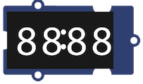

# Le kit Grove pour micro:bit

*Référence* : [Grove Inventor kit](https://wiki.seeedstudio.com/Grove_Inventor_Kit_for_microbit/)
## Le shield


Ce shield est une carte d'interface permettant de raccorder facilement et sans soudure les capteurs et les actionneurs Grove de Seeedstudio sur une carte micro:bit.

Ce shield comporte : 

- 4 connecteurs Grove : I2C,  P0/P14,  P1/P15,  P2/P16
- 8 connecteurs Edge pour pince crocodile ou fiche banane : 3V3, P0, P1, P2, P8, P12, P13, GND
- un port micro-USB permettant une alimentation de la carte micro:bit et des différents capteurs et modules
- une LED verte de mise sous tension.

*Référence* : [Grove Shield](https://www.seeedstudio.com/Grove-Shield-for-micro-bit-v2-0.html)

## Capteurs 
### Capteurs analogiques

Si le capteur est branché sur la broche P0, la mesure analogique réalisée par le capteur est convertie en une valeur numérique entière comprise entre 0 et 1023 que l'on lit avec l'instruction : 
```python
pin0.read_analog()
```

=== "Le potentiomètre"

    
    
    Le capteur d'angle rotatif (ou potentiomètre) produit une sortie analogique variable selon l'angle de rotation. La plage angulaire est de 300 degrés avec un changement linéaire de valeur.
    
    *Référence* : [Grove-Rotary_Angle_Sensor](https://wiki.seeedstudio.com/Grove-Rotary_Angle_Sensor/)
    
=== "Le capteur de lumière" 

    
    
    Le capteur Grove - Light intègre une photo-résistance pour détecter l'intensité de la lumière. Le signal de sortie est une valeur analogique : plus la lumière est brillante, plus la valeur est élevée.
    
    *Référence* : [Grove-Light_Sensor](https://wiki.seeedstudio.com/Grove-Light_Sensor/)

### Autres capteurs

=== "Le télémètre à ultrasons" 

    
    
    

    *Référence* : [Grove-Ultrasonic_Ranger](https://wiki.seeedstudio.com/Grove-Ultrasonic_Ranger/)

=== "Le capteur de mouvements"

    
    
    *Références* : [Grove-Gesture](https://wiki.seeedstudio.com/Grove-Gesture_v1.0/)


## Actionneurs

### Actionneur binaire

Si l'actionneur est branché sur la broche P0, on l'active en écrivant la valeur 1, et on l'éteint en écrivant la valeur 0, à l'aide des instructions : 
```python
# active l'actionneur
pin0.write_digital(1)
# désactive l'actionneur
pin0.write_digital(0)
```

=== "La LED" 

    
    
    La LED Rouge Grove abrite une source de lumière LED. De plus, ce module dispose d'un potentiomètre embarqué pour gérer les besoins en puissance de la LED.  
    *Branchement* : la LED comporte un méplat du côté de la cathode, à connecter au :octicons-no-entry-24:  
    *Référence* : [Grove-Red_LED](https://wiki.seeedstudio.com/Grove-Red_LED/ ) 

### Autres actionneurs

=== "Le haut-parleur"

    

    *Référence* : [Grove-Speaker](https://wiki.seeedstudio.com/Grove-Speaker/)


=== "L'écran d'affichage (4 chiffres)"
    
    
    
    *Références* : [Grove-4-Digit_Display](https://wiki.seeedstudio.com/Grove-4-Digit_Display/)

=== "Le ruban de led NeoPixel"
    
    
    Le ruban de LED comporte 30 NeoPixels et mesure 1 mètre. Il est est "waterproof".  
    Chaque NeoPixel comporte une LED RVB, un circuit électronique intégré (le WS281), 
    des données entrantes et des données sortantes. 
    
    La bibliothèque `neopixel` comporte des méthodes permettant d'utiliser le ruban. 
    Chaque LED est adressable : le 1er NeoPixel a l'adresse 0, le suivant 1 etc.  
    
    |Instructions|Effet|
    | :--- | :--- |
    |`import neopixel`|Importe la bibliothèque NeoPixel|
    |`np = neopixel.NeoPixel(pin0, 30)`|Déclare un ruban nommé `np` de 30 NeoPixels sur la broche P0|
    |`np[i] = (r, v, b)`|Affecte au NeoPixel d'adresse `i` la couleur (r, v, b)|
    |`np.show()`|Allume chaque NeoPixel du ruban `np` avec la couleur qui lui a été affectée |
    |`np.clear()`|Éteint toutes les leds du ruban `np` |


    Exemple de programme : 
    ```python linenums="1"
    from microbit import *
    import neopixel
    np = neopixel.NeoPixel(pin0, 30)
    np.clear()
    for x in range(30):
        np[x] = (240 - 8*x,0, 8*x)
        np.show()    
        sleep(100)
    ```
    
    L'exécution de ce programme provoque l'allumage progressif des 30 LED du ruban. Les premières LED sont rouges, et la couleur évolue au fur et à mesure de l'avancée sur le ruban, les dernières LED étant bleues.
    
    *Références* :  
    
     Un produit proche : [Grove-RGB_LED_Stick](https://wiki.seeedstudio.com/Grove-RGB_LED_Stick-10-WS2813_Mini/)  
     [Le module Neopixel](https://microbit-micropython.readthedocs.io/fr/latest/neopixel.html) dans la documentation microbit-micropython

