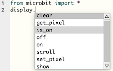
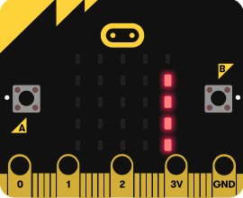
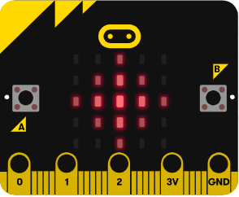
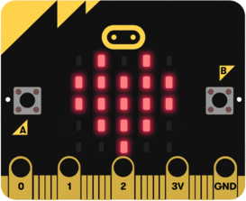

# Les LED

<iframe width="560" height="315" src="https://www.youtube.com/embed/eRhlaXqT-0w" frameborder="0" allow="accelerometer; autoplay; clipboard-write; encrypted-media; gyroscope; picture-in-picture" allowfullscreen></iframe>


## L'objet `display`
{width=250px}


La matrice LED comporte 25 LED. On peut l'utiliser pour afficher des caractères, des images, faire défiler un message, etc.  

!!! Info
    L'écran est un *objet* nommé `display`. On applique à cet objet des *méthodes* selon la syntaxe :

    `display.methode(parametres)`

    où `methode` est à choisir dans la liste suivante :

    - clear
    - show
    - scroll
    - on
    - off
    - is_on
    - set_pixel
    - get_pixel

    La complétion automatique de l'éditeur mu permet d'accéder à cette liste dès que l'on saisit `display.`  
    {width=250px}

## Afficher des caractères, des messages

{width=250px}  

|Instructions|Effet|
| :--- | :--- |
|`display.show(0)`|Affiche `0` sur la matrice LED|
|`display.show('A')`|Affiche A sur la matrice LED|
|`display.show('ABCDE')`|Affiche un par un les caractères A, B, C, D et E sur la matrice LED|


## Faire défiler des messages

  


|Instructions|Effet|
| :--- | :--- |
|`display.scroll('ABCDE')`|Fait défiler de droite à gauche les caractères A, B, C, D et E sur la matrice LED|
|`display.scroll('ABCDE', delay=250, loop=False)`|Fait défiler de droite à gauche les caractères A, B, C, D et E sur la matrice LED|


## Allumer des pixels

"){width=250px}  

!!! Info  
    - Chaque pixel a des coordonnées entières de (0, 0) dans le coin supérieur gauche à (4, 4) dans le coin inférieur droit.  
    - La luminosité de chaque pixel peut être définie, de 0 (le pixel est alors désactivé) à 9 (niveau le plus lumineux).

|Instructions|Effet|
| :--- | :--- |
|`display.set_pixel(x, y, lum)`|Allume le pixel aux coordonnées (x, y) avec un niveau de luminosité `lum` (entier entre 0 et 9)|
|`display.get_pixel(x, y)`|Renvoie le niveau de luminosité  du pixel de coordonnées (x, y)|


## Afficher des images
### Afficher des images pré-définies
{width=250px}  

!!! Info
    Il existe des images prédéfinies que l'on peut afficher en utilisant leur nom et la syntaxe `Image.nom`
    Voici la liste des images prédéfinies, par ordre alphabétique :

    ANGRY - ASLEEP - BUTTERFLY - CHESSBOARD - CONFUSED - COW - DIAMOND - DIAMOND_SMALL - DUCK - FABULOUS - GHOST - GIRAFFE - HAPPY - HEART -
    HEART_SMALL - HOUSE - MEH - MUSIC_CROTCHET - MUSIC_QUAVER - MUSIC_QUAVERS - NO - PACMAN - PITCHFORK - RABBIT - ROLLERSKATE - SAD - SILLY - SKULL - SMILE - SNAKE - SQUARE - SQUARE_SMALL - STICKFIGURE - SURPRISED - SWORD - TARGET - TORTOISE - TRIANGLE - TRIANGLE_LEFT - TSHIRT - UMBRELLA - XMAS - YES

    Il existe également deux séries d'images :  

    - les flèches : ARROW_N, ARROW_NE, ARROW_E, ARROW_SE, ARROW_S, ARROW_SW, ARROW_W, ARROW_NW  
    - les heures : CLOCK12, CLOCK11, CLOCK10, CLOCK9, CLOCK8, CLOCK7, CLOCK6, CLOCK5, CLOCK4, CLOCK3, CLOCK2, CLOCK1

### Définir ses propres images
{width=250px}  

!!! Info
    On peut définir une image en affectant à chaque pixel son niveau de luminosité, soit ligne par ligne:
    ```python
    eclat = Image("00300:"
                  "03630:"
                  "36963:"
                  "03630:"
                  "00300")
    ```
    soit en une seule ligne :
    ```python
    eclat = Image("00300:03630:36963:03630:00300")
    ```


|Instructions|Effet|
| :--- | :--- |
|`display.show(Image.HEART)`|Affiche un cœur sur la matrice LED|
|`display.show(mon_image)`|Affiche l'image définie par la variable mon_image|

!!! Tip "Pour aller plus loin"
    La classe [Image](https://microbit-micropython.readthedocs.io/fr/latest/image.html) contient des méthodes pour créer et manipuler des images.  
    Par exemple,
    ```python
    mon_image = Image()
    mon_image.fill(7)
    ```
    crée une image où tous les pixels ont une luninosité de 7.

### Afficher des pixels aléatoires
{width=250px}  

!!! Info
    Le module `random` contient la fonction `randint(min, max)` qui renvoie un entier entre `min` et `max` compris. On peut l'utiliser pour définir aléatoirement la position d'un pixel ou la luminosité d'un pixel.

    ```python
    from microbit import *
    from random import randint
    for i in range(5):   # numéro de colonne de 0 à 4
        for j in range(5):   # numéro de ligne de 0 à 4
            display.set_pixel(i, j, randint(0, 9))
    ```


## Animer des images

  

!!! Info
    Pour créer une animation affichant successivement plusieurs images, créer une liste contenant toutes les images, puis afficher cette liste.
    ```python
    mes_images = [Image.HEART, Image.HEART_SMALL]
    display.show(mes_images, delay=400, loop=True)
    ```

|Instructions|Effet|
| :--- | :--- |
|`display.show(mes_images, delay=400, loop=True)`|Affiche en boucle les images de la liste `mes_images`, chacune étant affichée pendant 400 ms avant d'être remplacée par la suivante|
|`display.show(mes_images, delay=400, loop=False)`|Affiche une fois chaque image de la liste `mes_images`, chacune étant affichée pendant 400 ms avant d'être remplacée par la suivante|


## Effacer l'écran
|Instructions|Effet|
| :--- | :--- |
|`display.clear()`|Éteint toutes les LED en leur affectant une luminosité à 0|

## Allumer / éteindre l'écran
|Instructions|Effet|
| :--- | :--- |
|`display.on()`|Allume chaque LED avec sa propre valeur de luminosité|
|`display.off()`|Éteint chaque LED mais n'efface pas sa propre valeur de luminosité|
|`display.is_on()`|Renvoie `True` si `display.on()` est activé, `False`sinon.|

## Détecter le niveau de lumière ambiante

!!! Info
    Les LED de l’écran peuvent détecter la quantité de lumière arrivant sur l’écran.

|Instructions|Effet|
| :--- | :--- |
|`display.read_light_level()`|Renvoie un entier compris entre 0 et 255 représentant le niveau de lumière|


## Références
[Le module Display : documentation microbit-micropython](https://microbit-micropython.readthedocs.io/en/latest/display.html#module-microbit.display)  
[La classe Image](https://microbit-micropython.readthedocs.io/fr/latest/image.html)
