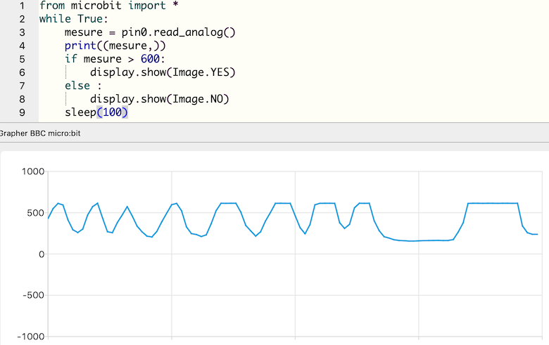

# Utiliser l'éditeur Mu

  

[Mu](https://codewith.mu/) est un éditeur de code simple pour programmeurs débutants. Il est développé en Python et fonctionne sur Windows, MacOS, Linux et Raspberry Pi. Une version portable peut également être exécutée depuis une clé USB sur Windows et MacOS.  
Cette interface dispose de l'auto-complétion et d'une indentation automatique, ainsi que d'une version en français.

## Choisir le mode micro:bit


Mu propose différents modes dont l'un est destiné à la carte micro:bit. On peut également choisir d'autres cartes ou Python 3 standard. ([en savoir plus](https://codewith.mu/en/tutorials/1.0/modes))

## Gérer ses fichiers `.py` 


On peut créer un nouveau fichier `.py`, en charger un depuis l'ordinateur ou en enregistrer un sur l'ordinateur. Un répertoire `mu_code` est créé par défaut mais les programmes peuvent être enregistrés à tout emplacement usuel. 

## Avec une micro:bit connectée


!!! note "Remarque" 
    Ces quatre boutons nécessitent pour fonctionner qu'une carte soit connectée à l'ordinateur (par un câble USB).

### Flasher
  
Le bouton « Flasher » place le code Python présent dans la fenêtre d'édition sur la carte micro:bit connectée. Le processus de flash prend environ 10 secondes, pendant lesquelles une LED orange clignote à l'arrière de la carte.  
Après cette opération, tous les codes et données précédents ont été supprimés. Si le programme utilise une bibliothèque, il est alors nécessaire de la charger à nouveau. (voir Fichiers) 

Si le code contient une erreur, un message défile sur l'écran de la carte, mais il n'est pas toujours aisé de le lire.

!!! Bug "Flasher un programme avec MacOS Catalina"
    Sur les systèmes MacOS à partir de Catalina, il faut disposer des droits suffisants pour que  Mu écrive sur la carte micro:bit. Le moyen le plus simple d'y parvenir est d'exécuter  Mu comme administrateur en tapant les instructions suivantes dans un terminal :
    
    ```bash
    $ cd /Applications
    $ sudo open mu-editor.app
    ```

### Fichiers
  

!!! note "Remarque"
    Cette fonctionnalité nécessite qu'un programme MicroPython ait été flashé sur l'appareil.


Le bouton « Fichiers » de Mu accède à un système de fichiers et facilite l'accès, le placement, l'obtention et la suppression de fichiers sur l'appareil.
Il ouvre deux volets : le volet de gauche répertorie tous les fichiers de la carte micro:bit, le volet de droite répertorie tous les fichiers du répertoire `mu_code` sur l'ordinateur. Faire glisser les fichiers de l'un à l'autre pour les copier. Pour supprimer un fichier sur la carte, cliquer dessus avec le bouton droit de la souris et sélectionner « Supprimer ».  

### REPL
  

Le bouton « REPL » crée un nouveau volet entre l'éditeur de texte et le pied de page de Mu. Il s'agit d'un interpréteur interactif qui se connecte au MicroPython REPL sur la carte micro:bit. Le terme « REPL » est un acronyme qui signifie « Read, Evaluate, Print, Loop » : l'interpréteur lit les lignes de Python, évalue ce que cela peut signifier, affiche tout résultat (dans l'interpréteur ou sur la carte, selon l'instruction), puis revient en boucle pour attendre la prochaine instruction Python.  
L'ouverture du volet REPL interrompt l'exécution du programme en cours : pour le faire re-démarrer on peut soit actionner le bouton à l'arrière de la carte, soit taper <kbd>Ctrl</kbd>+<kbd>D</kbd>.

### Graphique 
  
Enfin, le bouton « Graphique » ouvre le traceur de Mu. Si la carte micro:bit produit des p-uplets (*tuples*) de nombres via la connexion série, le traceur les affichera sous forme graphique.
La sortie est constituée de courbes, avec le temps en abscisses et les valeurs des données en ordonnées.

!!! Attention  
    Le modèle habituel pour émettre des p-uplets est de le faire dans une boucle.
    Il faut inclure une pause dans la boucle pour que le traceur fonctionne correctement. Sinon, il y a un risque que le code inonde le traceur de données, et il ne pourra pas suivre. La meilleure façon d'y parvenir est d'utiliser `time.sleep()` (mesure en secondes) ou `microbit.sleep()` (mesure en millisecondes).

!!! Exemple
      
    
    L'instruction `print((mesure,))` permet au traceur de représenter la valeur de la mesure en fonction du temps. 
    

## Aspect


Les boutons de ce groupe permettent de régler quelques paramètres d'affichage (zoom, mode sombre) et notamment de vidéoprojeter du code dans de bonnes conditions.

## Divers


Ce dernier groupe comporte un bouton de vérification du code, qui détecte plusieurs types d'erreurs (syntaxe, indentation, ... ) ou non-respect des recommandation de la [PEP8](../../python/pep8). Certains messages sont traduits en français, d'autres non.   
Lorsqu'aucune erreur n'est détectée, un message l'indique en bas de la fenêtre.

