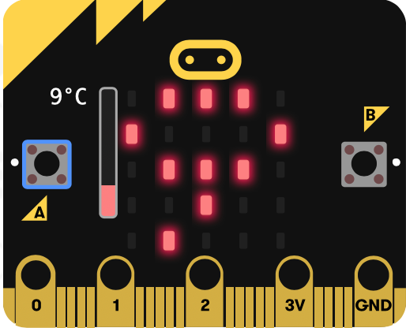

# La température

La carte micro:bit intègre un capteur de température. Il n'est pas très précis dans la mesure où il est soudé sur la carte elle-même, à proximité du processeur ; il est donc perturbé par l'échauffement provoqué par le fonctionnement de la carte.

|Instructions|Effet|
| :--- | :--- |
|`temperature()`|renvoie la valeur de la température|

## Exemple
{width=250px}  

```python
from microbit import *

while True:
    if button_a.was_pressed():
        display.scroll(temperature())
```
