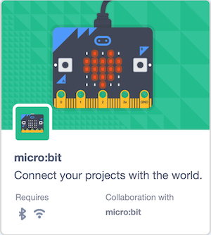
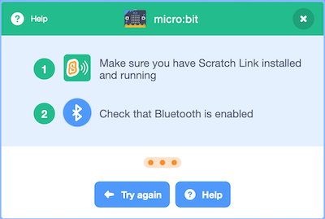
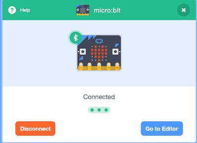
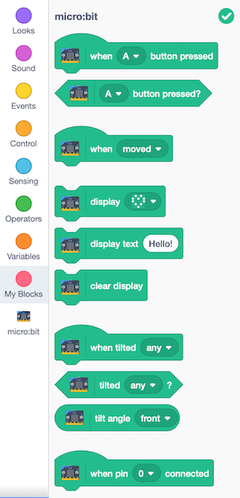
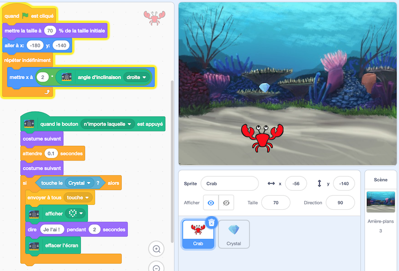
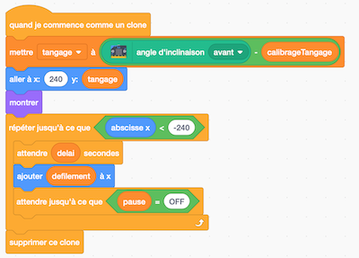
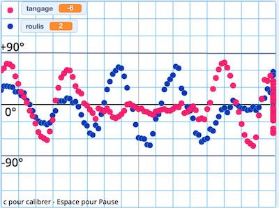
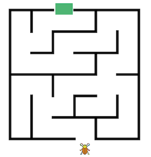

#Utiliser la carte micro:bit avec Scratch

## Programmer la carte avec Scratch

L'[interface de programmation Scratch](https://scratch.mit.edu/projects/editor/) s'appuie sur la version Scratch 3 et s'utilise dans un navigateur, sur ordinateur ou tablette. La connexion avec la carte micro:bit utilise le bluetooth. 

Un seul fichier `.hex` est à télécharger sur la carte au début, et il s'agit toujours du même fichier. Ensuite l'exécution du code se fait comme habituellement dans Scratch : double-clic sur un bloc d'instructions, ou sur le drapeau vert, etc.

1. Sur ordinateur (Windows, macOS), lancer *Scratch Link*, à installer au préalable : [lien de téléchargement et instructions](https://scratch.mit.edu/microbit)
* Connecter la carte à l'aide du câble USB et copier-glisser le fichier `scratch-microbit.hex` sur la carte micro:bit : [lien de téléchargement et instructions](https://scratch.mit.edu/microbit)
* Alimenter la carte micro:bit, à l'aide de piles ou du câble USB. 
* Ouvrir dans un navigateur l'[interface de programmation Scratch](https://scratch.mit.edu/projects/editor/)
* Cliquer sur l'icône d'ajout d'extension et choisir l'extension *micro:bit*. 

Choisir ensuite la carte micro:bit à connecter.  

Dix nouveaux blocs d'instructions apparaissent pour programmer la carte.

La possibilité supplémentaire offerte par Scratch est que la carte peut être utilisée pour interagir avec des lutins classiques de Scratch sur écran. 

## Exemple 1 : crabe et diamants
Par exemple, dans le programme [Crabe et diamants](https://scratch.mit.edu/projects/281329767/) disponible en ligne, le crabe se déplace horizontalement en fonction de l'inclinaison de la carte, et tente d'attraper des diamants lorsqu'on appuie sur les boutons de la carte.  

## Exemple 2 : roulis et tangage
Sur cet autre exemple, [Roulis et tangage](https://scratch.mit.edu/projects/281208861/), les valeurs des inclinaisons de la carte sont utilisées pour une visualisation en temps réel : un nuage de points donne l'angle de tangage (avant-arrière) et l'autre donne l'angle de roulis (gauche-droite).  

## Exemple 3 : labyrinthe
Un lutin se déplace dans un labyrinthe (sans franchir les murs) selon l'inclinaison de la carte micro:bit.  
  
- [version avec blocs dissociés à assembler](https://scratch.mit.edu/projects/355161324/)  
- [version complète](https://scratch.mit.edu/projects/355088101/)

