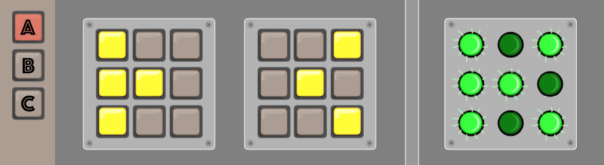
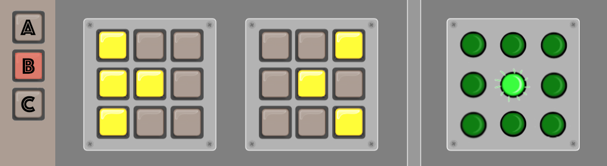
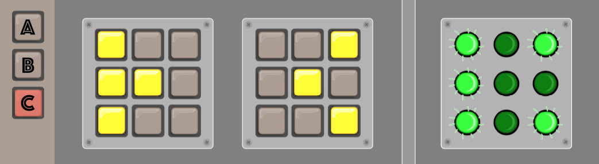
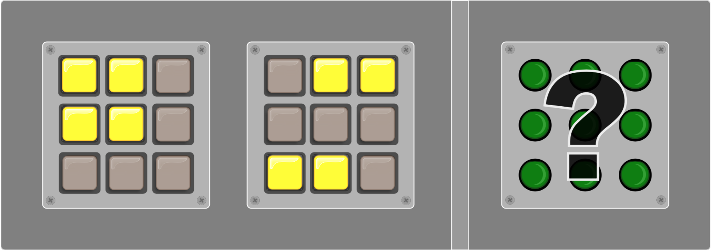
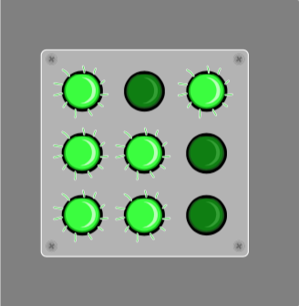
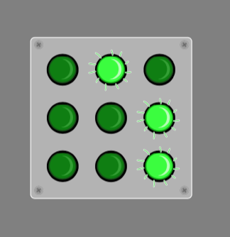
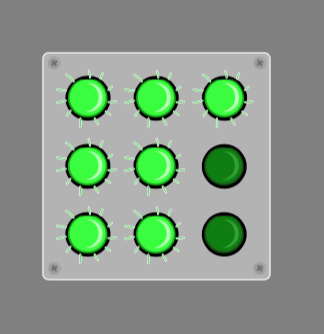
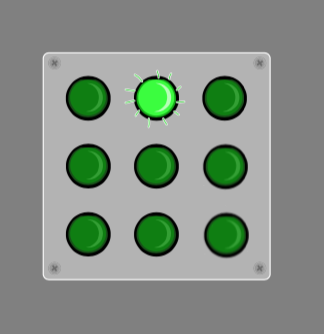

---
hide:
  - toc        # Hide table of contents
---

# Commandes d'éclairage

!!! Info "Énoncé"

    (d'après le concours castor informatique suisse 2016, CC BY-NC-SA)

    Eric a trouvé un vieil appareil électronique. Sur le côté gauche, il y a trois touches A, B et C. Au centre, il y a deux panneaux et chacun dispose de 9 touches sur lesquelles on peut appuyer. Sur le côté droit, il y a un panneau avec 9 lampes. En fonction de la combinaison des touches, les lampes s'allument ou s'éteignent.

    Eric découvre que la position d'une lampe qui s'allume et s'éteint correspond à une combinaison de touches particulière dans les deux panneaux du centre.

    Actuellement, le bouton A est sélectionné et les lampes sont allumées comme suit :
    {width=500}

    Lorsqu'il sélectionne les boutons B puis C sans rien changer aux panneaux du centre, il obtient les résultats suivants :  
    {width=500}

    {width=500}

    Il choisit de modifier les touches sélectionnées dans les panneaux du centre, et s'arrête sur la configuration ci-dessous.

    {width=500}

    Quelles lampes sont éclairées à droite,
    lorsqu'il sélectionne successivement le bouton A ? Le bouton B ? Le bouton C ?

??? abstract "Aide"
    Parmi les 4 figures suivantes, 3 correspondent aux 3 réponses attendues. Trouver l'intrus !

    {width=125 align='left'}
     {width=125 align='left'}
     {width=125 align='left'}
     {width=125 align='left'}
