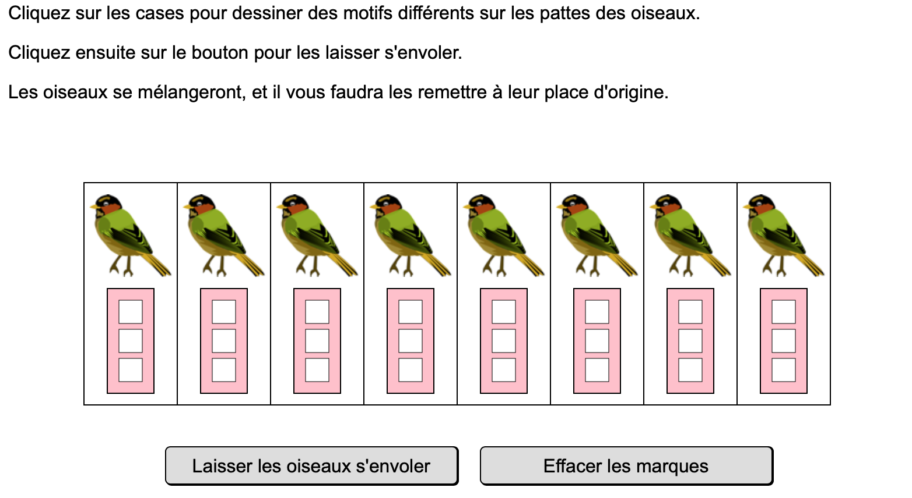
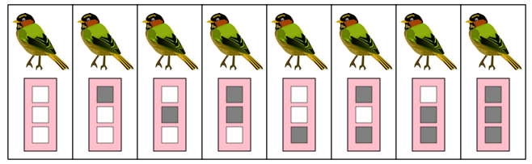
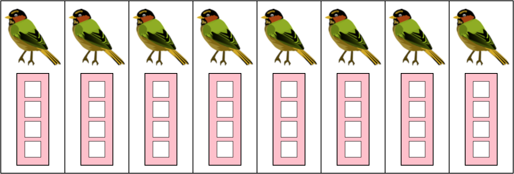

# Marquage d'oiseaux
!!! info "Énoncé initial"

    Le concours *Castor informatique* comportait en 2015 la question suivante (version $\star\star\star\; \star$   ) :

    

## Avec 3 cases
???+ exo "Avec 3 cases"
    - Chaque case est soit blanche soit noire, et un marquage est ici composé de 3 cases. Proposer un marquage pour chacun des huit oiseaux.
    - Tester [en ligne](http://castor-informatique.fr/questions/2015/2015-FR-03-mark-and-shuffle/index.html) sa proposition : choisir l'énoncé $\star\star\star\; \star$
    - Aurait-on pu marquer davantage d'oiseaux avec 3 cases ? Pourquoi ?
    - Comparer les différentes propositions dans la classe et discuter de leur efficacité.

## Avec 4 cases
??? exo "Avec 4 cases"
    - Voici une solution possible pour le marquage avec 3 cases :
    {width=70%}
    - Comprendre et expliciter la logique de ce marquage.
    - Combien d'oiseaux pourrait-on marquer avec 4 cases ?    
    Étendre la logique du marquage précédent à 4 cases et proposer le marquage ordonné d'un maximum d'oiseaux.  

    {width=50%}{width=50%}
