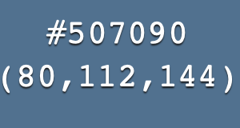
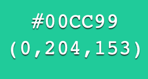
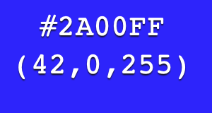

# Système RVB
!!! info "Énoncé"

    Le système RVB est un système de représentation des couleurs, utilisé notamment pour l'affichage des couleurs sur les écrans.
    Il consiste à associer à chacune des trois couleurs Rouge-Vert-Bleu une valeur numérique comprise entre 0 et 255. La [synthèse additive](https://fr.wikipedia.org/wiki/Synthèse_additive) des couleurs permet de combiner les trois niveaux pour afficher une couleur.

    Sur le web, on voit souvent une couleur désignée par un code de 6 caractères précédés du symbole `#`. Il est appelé *code hex*.
    Voici trois exemples où l'on affiche le code hex  ainsi que le triplet de valeurs RVB en décimal.

    {width=150px}
    {width=150px}
    {width=150px}

    Comment donner une signification au code hex et établir une correspondance entre le code hex et le triplet de valeurs RVB en décimal ?
