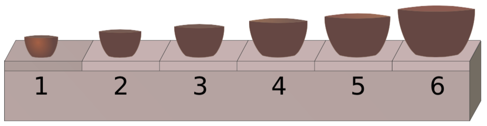
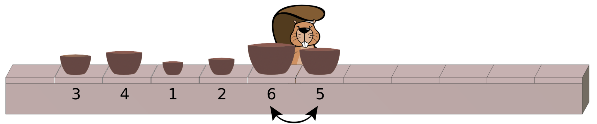
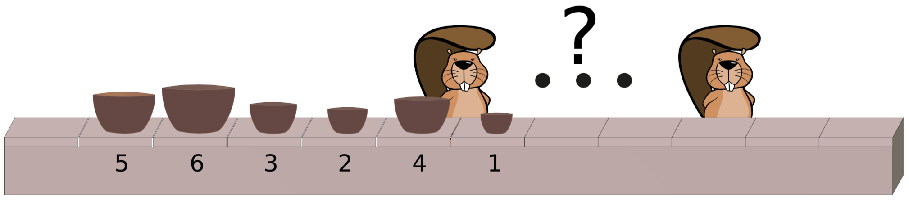

---
hide:
  - toc        # Hide table of contents
---
# Fabrique de bols

!!! Info "Énoncé"

    (d'après le concours castor informatique suisse 2015, CC BY-NC-SA)

    Dans une fabrique, on réalise des sets de bols composés de 6 bols de tailles différentes. La machine de production dépose les bols d'un set à la suite sur une chaîne de montage, toutefois dans un ordre aléatoire.

    Pour pouvoir être emballé, le set doit toutefois se trouver dans l'ordre suivant sur la chaîne de montage :

    {width=400}

    Des ouvriers se tiennent à côté de la chaîne pour trier les sets, à savoir mettre les bols dans le bon ordre. Un seul ouvrier intervertit deux bols côte à côte si leur ordre est erroné sur le tapis roulant.
    {width=600}

    Exemple : Cet ouvrier intervertit les bols des tailles 5 et 6. Plus tard, il intervertit encore 1 et 4 et ensuite 1 et 3.

    Après les échanges qu'il a réalisés, les bols sont disposés dans l'ordre suivant sur la chaîne : 1, 3, 4, 2, 5, 6.

!!! note "À réaliser :"

    Un set de bols se trouve dans l'ordre suivant sur la chaîne de montage : 5, 6, 3, 2, 4, 1.

    {width=600}

    Combien d'ouvriers faut-il au minimum sur la chaine pour trier le set ?   Et combien d'échanges de bols réalisent-ils au total ?

??? success "Réponse"
    La réponse correcte est 4.  
    Les bols sont posés dans l'ordre suivant sur la chaîne : 5, 6, 3, 2, 4, 1.  
    - Le premier ouvrier intervertit toujours le bol 1 avec les bols à côté pour le transférer tout à gauche : 1, 5, 6, 3, 2, 4.  
    - Le deuxième ouvrier va intervertir le bol 2, jusqu'au bol 1 : 1, 2, 5, 6, 3, 4.  
    - Le troisième ouvrier va intervertir le bol 3, jusqu'au bol 2 : 1, 2, 3, 5, 6, 4.  
    - Le quatrième ouvrier va intervertir le bol 4, jusqu'au bol 3 : 1, 2, 3, 4, 5, 6.  

    Il faut donc au moins quatre ouvriers pour trier le set.

??? note "Pour aller plus loin :"
    Avec une chaine comportant 6 bols disposés aléatoirement, combien d'ouvriers faut-il au maximum pour les ranger dans l'ordre ?   
    Et combien d'échanges de bols réalisent-ils au maximum ?  

    Et si la chaine comporte $n$ bols disposés aléatoirement, combien d'ouvriers faut-il au maximum pour les ranger dans l'ordre ?  
    Et combien d'échanges de bols réalisent-ils au maximum ?
