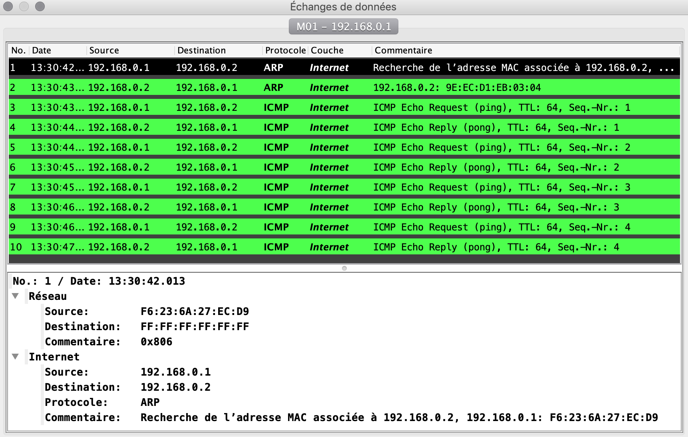
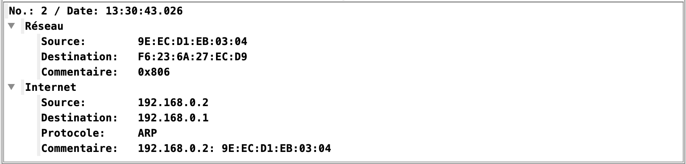
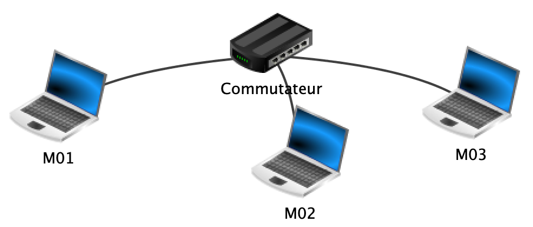
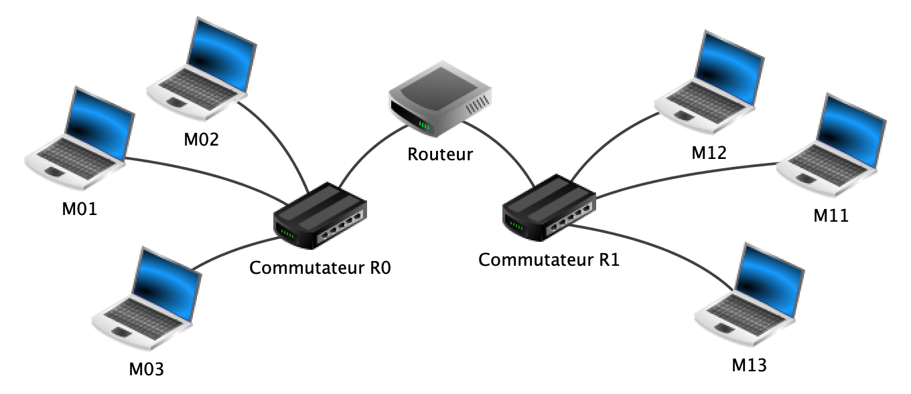
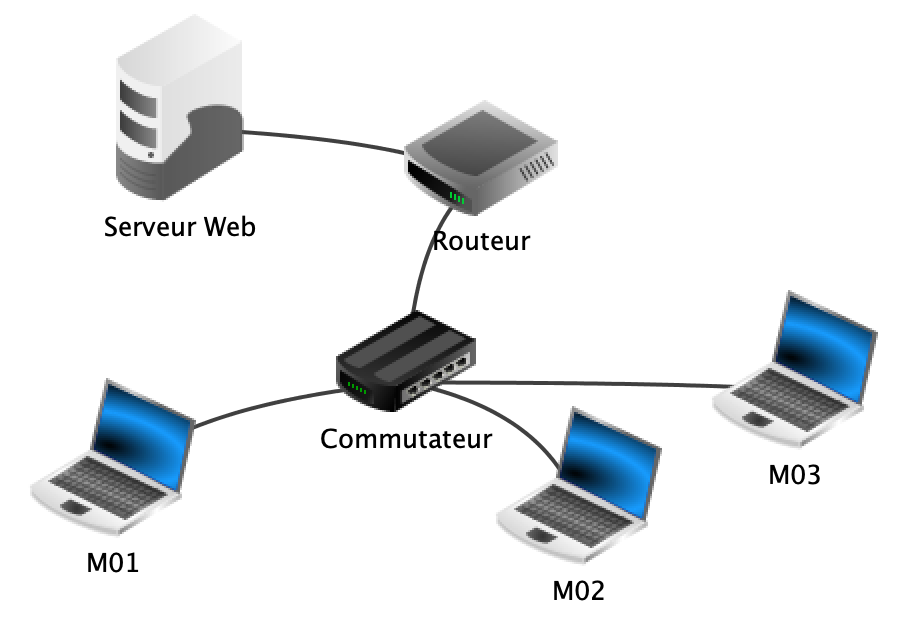

# Simulation de réseaux avec Filius

## Le logiciel Filius

??? config "Télécharger le logiciel Filius"

    Se rendre sur le site allemand du logiciel Filius https://www.lernsoftware-filius.de/Herunterladen.

    Chercher la version actuelle, par exemple "Filius 1.12 (Windows/Ubuntu/Zip) "  
    Cliquer sur son système d'exploitation : Windows ou Ubuntu  
    (Avec MacOS, cliquer sur Zip : après extraction de l'archive, le fichier à ouvrir est alors filius.jar)

    Si le texte apparaît en allemand lors de l’installation, accepter les choix par défaut. Lors du premier lancement du logiciel, choisir la langue “Français”.


??? Info "Aide sur le mode conception"

    **Construire le réseau**

    - Cliquer sur l'icône *Conception* : { width='24' }

    - À l’aide d’un cliquer-glisser à la souris, sélectionner des composants dans la marge de gauche et les disposer sur l’espace de travail.

    - Raccorder les composants à l’aide de câbles. Pour cela, sélectionner l’outil câble en cliquant sur l’icône câble dans la marge de gauche, puis cliquer successivement sur deux composants à raccorder.

    - Utiliser le menu contextuel d’un composant (clic droit) pour le supprimer ou supprimer ses connexions.

    **Paramétrer les composants du réseau**

    - Double-cliquer sur le composant à paramétrer. Un ensemble de paramètres apparait dans la partie inférieure de la fenêtre. Les noms des composants peuvent être choisis arbitrairement : ils n’ont aucune répercussion sur le fonctionnement de la simulation.

    - Ordinateur/portable : l’adressage IP peut être spécifié manuellement ou de façon automatique à l’aide d’un serveur DHCP.

    - Switch : un switch, ou commutateur, permet d’interconnecter plusieurs composants entre eux au sein d’un réseau local. Ce composant ne nécessite pas de configuration.

    - Routeur : un routeur dispose d’au moins deux interfaces réseau. Chaque interface doit être configurée manuellement. Il faut également paramétrer le routage, soit en activant le mode automatique, soit en définissant des règles manuellement.

??? Info "Aide sur le mode simulation"

    - Cliquer sur l'icône *Simulation* : { width='24' }

    Ce mode permet de simuler le fonctionnement du réseau virtuel.     

    - **Installer et utiliser des logiciels**  
    Chaque ordinateur et portable possède un bureau à partir duquel peuvent être installées puis lancées des applications. Un clic sur l’icône d’un ordinateur ou d’un portable fait apparaitre son bureau dans une fenêtre indépendante. Pour installer des logiciels, cliquer sur l’icône :  { width='24' }.  
    Les icônes des applications installées apparaissent alors sur le bureau. Un clic sur une icône permet de lancer l’application correspondante. Chaque application s’ouvre dans une fenêtre du bureau. Fermer la fenêtre d’une application, ou fermer la fenêtre du bureau ne ferme pas les applications. Pour fermer une application, il faut la désinstaller.

    - **Afficher l’état du réseau**  
    Lorsque le bureau d’un ordinateur ou d’un portable est affiché, en plaçant la souris au dessus de l’icône réseau située en bas à droite, l’adresse IP du poste apparait dans une infobulle.  
    Pour obtenir le paramétrage IP détaillé du poste, cliquer sur l’icône.

    - **Observer les échanges de données**  
    Un journal conserve une trace de tous les paquets de données envoyés ou reçus par un poste. Pour visualiser ce journal, cliquer droit sur l’icône du poste et choisir "Afficher les échanges de données".  
    Le journal est présenté sous la forme d’un tableau dont chaque ligne correspond à un échange de données. Un clic sur une ligne permet d’afficher le détail du paquet de données échangé.  
    Il est possible de ralentir la vitesse des échanges de données en déplaçant vers la gauche le curseur situé au centre de la partie supérieure de la fenêtre principale. Les câbles deviennent verts lorsqu’ils sont parcourus par des données.

    - **Afficher la table du switch**  
    Le switch (ou commutateur) enregistre les adresses MAC des paquets entrants avec le port d’arrivée. Ces deux informations sont stockées dans la table des adresses sources (SAT). Pour afficher cette table, cliquer sur le switch.


## Étape 1 : Réseau de 2 ordinateurs

???+ config "Mode conception"
    - En mode *conception*, placer deux machines sur l’espace de travail.  
    La première portera le nom **M01** avec l’adresse IP 192.168.0.1.  
    La deuxième portera le nom **M02** avec l’adresse IP 192.168.0.2.  
    Le masque est 255.255.255.0.

    !!! exo "Question 1"
        Justifier que ces deux clients font partie du même réseau local.

    - Relier les machines par un câble. Ces deux machines faisant partie du même réseau local, elles pourront communiquer.

    { width='300' }


???+ play "Mode simulation"
    Passer en mode *simulation*.

    - Accéder au bureau de la machine **M01** (en cliquant dessus) et installer un Terminal (Ligne de commande) avec l’outil d'installation des logiciels.

    - Ouvrir le terminal (Ligne de commande) sur le bureau de la machine **M01**.  
    - La commande `ipconfig` permet de connaître la *configuration réseau* d’une machine. Exécuter cette commande sur **M01**.
    !!! exo "Question 2"
        Quelle information trouve-t-on en dehors du nom de la machine et de son adresse IP ?
    - La commande `arp ` permet de connaître la *table de résolution d'adresses* connue de cette machine. Exécuter cette commande sur **M01**.
    !!! exo "Question 3"
        Quelle information est mise en correspondance de l'adresse IP ?  
        Quelle(s) correspondance(s) est(sont) établie(s) pour l'instant ?


    - La commande `ping` `adresse-cible` permet de tester si la communication est possible avec la machine d’adresse IP `adresse-cible`.
    Vérifier ainsi que **M01** peut communiquer avec **M02** en saisissant :
    ```
    root /> ping 192.168.0.2
    ```
    !!! exo "Question 4"
        Quelles informations apparaissent ? Comment les interpréter ?


    - En effectuant un clic droit sur **M01**, sélectionner "Afficher les échanges de données".
    On obtient un tableau comme ci-dessous. En cliquant sur l'une des lignes, des détails s'affichent :
    { width='650' }
    La première ligne est une requête du protocole ARP. Il s'agit d'un protocole qui s'interface entre la couche *Internet* et la couche *Liaison* (appelée *Réseau* dans la capture d'écran ). Cette requête consiste en un appel à tout le réseau : "Est-ce qu'une machine de ce réseau possède l'IP 192.168.0.2 ?"  
    Sa table de correspondance IP &ndash; MAC ne contenant que l'adresse de broadcast 255.255.255.255, la machine **M01** commence par envoyer un message à tout le réseau, par l'adresse MAC de broadcast `FF:FF:FF:FF:FF:FF`.  
    La machine **M02** d'IP 192.168.0.2 reconnaît son IP et répond à la machine **M01** d'IP 192.168.0.1. Elle lui envoie la correspondance entre son IP et son adresse MAC.
    
    La commande `arp` exécutée sur **M01** permet désormais de constater que cette machine a complété sa table de résolution d'adresses :
    ```
    root /> arp
    |    Adresse IP    |    Adresse MAC    |
    ----------------------------------------
    | 192.168.0.2      | 9E:EC:D1:EB:03:04 |
    | 255.255.255.255  | FF:FF:FF:FF:FF:FF |
    ```
    Les huit dernières lignes du tableau des échanges de données montrent les quatre séquences d'échanges dus à la commande `ping` entre les 2 machines **M01** et **M02**.
    Les `ping` (ICMP Echo request) sont émis par **M01** à destination de **M02** et en réponse, les `pong` (ICMP echo reply) sont émis par **M02**  à destination de  **M01**.

    - Saisir à nouveau la commande `ping 192.168.0.2` sur la machine **M01** et l'exécuter.
    !!! exo "Question 5"
        Quelle différence observe-t-on avec le résultat de la précédente exécution ? Comment l'expliquer ? (On pourra observer les échanges de données pour justifier sa réponse)

    - Enregistrer ce projet filius sous le nom `reseau1.fls`.

## Étape 2 : Réseau de 3 ordinateurs avec un commutateur

???+ config "Mode conception"
    - Reprendre le réseau précédent `reseau1.fls`.
    - Ajouter un 3ème ordinateur **M03** (IP 192.168.0.3).
    !!! exo "Question 1"
        **M01** est déjà relié par un câble à **M02**. Peut-on également relier **M03** à **M01** ?  
        Pourquoi ?
    - Supprimer le câble entre **M01** et **M02**.
    - Ajouter un commutateur (switch).
    - Relier chaque ordinateur au commutateur à l'aide de câbles.
    { width='400' }

???+ play "Mode simulation"
    !!! exo "Question 2"
        Quelle commande permet de vérifier que la machine **M01** peut communiquer avec **M03** ?
    - Exécuter cette commande.
    !!! exo "Question 3"
        À l'issue de l'exécution précédente, que contient la *table de résolution d'adresses* de la machine **M03** ?
    - En cliquant sur le commutateur on obtient sa table SAT : elle associe à chaque port du commutateur l'adresse MAC de la machine reliée sur ce port. Cette table se met à jour au fur et à mesure des communications.
    !!! exo "Question 4"
        Donner une commande permettant au commutateur de compléter sa table SAT.
    - Exécuter une commande et vérifier que la table est complète.
    - Enregistrer ce projet sous le nom `reseau2.fls`.


## Étape 3 : connexion de 2 réseaux avec un routeur

???+ config "Mode conception"
    - Reprendre le réseau précédent `reseau2.fls` : renommer son commutateur **R0**.
    - Créer un deuxième réseau de 3 ordinateurs **M11**, **M12** et **M13** (adresses IP : 192.168.1.1, 192.168.1.2 et 192.168.1.3, masque : 255.255.255.0) reliés via un nouveau commutateur **R1**.

    - Connecter les 2 réseaux au travers d’un routeur (choisir un nombre d'interfaces égal à 2).

    { width='600' }


???+ play "Mode simulation"
    !!! exo "Question 1"
        Quelle commande permet de constater que la machine **M01** du réseau **R0** ne peut pas communiquer directement avec la machine **M11** du réseau **R1** ? Pourquoi est-ce le cas ?

???+ config "Mode conception"
    - Il faut configurer le routeur pour mettre en relation logique les deux réseaux. Le routeur sert de passerelle de sortie (gateway) pour les machines d’un réseau vers l’extérieur. Il faut donc  :
        - d’une part modifier la configuration de chaque ordinateur pour lui indiquer une adresse IP passerelle de sortie (depuis le réseau **R0** : Passerelle 192.168.0.254 et depuis le réseau **R1** : Passerelle 192.168.1.254),
        - d’autre part configurer le routeur pour indiquer ses adresses passerelles (une pour chaque réseau). Cocher également "routage automatique" : la table de routage se mettra à jour automatiquement.

???+ play "Mode simulation"
    - Vérifier désormais que `ping` fonctionne bien de **M01** vers **M11**. 
    !!! exo "Question 2"
        Comparer la valeur "ttl" affichée lors d'un ping entre **M01** et **M03** avec celle affichée lors d'un ping entre **M01** et **M11**. Comment interpréter ces valeurs ?

    - La commande `traceroute adresse-cible`  permet de connaître le chemin suivi pour communiquer avec la machine d’adresse IP `adresse-cible`.
    !!! exo "Question 3"
        Chercher avec cette commande combien de « sauts » sont nécessaires pour passer de **M01** à **M11**.

    - Enregistrer ce projet sous le nom `reseau3.fls`.


## Étape 4 : Serveur Web

???+ config "Mode conception"
    - Reprendre le projet filius `reseau2.fls` comportant 3 ordinateurs reliés à un commutateur.
    - Ajouter un **routeur**, possédant 3 interfaces. Connecter l'une d'elles au **commutateur** du réseau actuel. (Passerelle pour cette interface 192.168.0.254)
    - Ajouter une nouvelle machine, qui sera le **serveur Web** (IP 172.16.0.1, masque 255.255.0.0).
    - Connecter ce **serveur Web** au **routeur**. (Passerelle pour cette interface 172.16.255.254).

    { width='400' }

???+ play "Mode simulation"
    - Sur **M01**, vérifier que "ligne de commande" est installé. Ajouter un "navigateur Web".
    - Sur le **serveur Web**, installer les logiciels : 
        - Ligne de commande
        - Explorateur de fichier
        - Editeur de texte
        - Serveur Web
    - Ouvrir le logiciel "serveur Web" et cliquer sur "activer le serveur".​
    - À l'aide de l'éditeur de texte, saisir une page html minimale, par exemple : 
    ```html
    <!DOCTYPE html>
    <html> 
        <head>
            <title> Page test </title>
        </head> 
        <body>
            <h1> Bienvenue sur cette page de test </h1>
       </body> 
    </html> 
    ```
    - Enregistrer cette page dans le répertoire Webserver, par exemple sour le nom `pagetest.html`.

    - Depuis le navigateur de la machine **M01**, indiquer dans la barre d'adresse l'adresse IP du **serveur Web** (172.16.0.1) et rajouter le chemin de la page créée, par exemple : `http://192.168.1.1/page1.html`
    - Observer les informations échangées entre **M01** et le serveur : quelles couches sont concernées ? Quels protocoles sont utilisés ?

    - Enregistrer ce projet sous `reseau4.fls`.

## Étape 5 :  Serveur DNS

???+ config "Mode conception"
    - Reprendre le projet `reseau4.fls` de l'étape précédente.
    - Ajouter une machine, qui sera le **serveur DNS** (IP 172.31.0.1, masque 255.255.0.0).  

    Le **serveur DNS** permet aux clients du serveur Web de saisir un nom de domaine plutôt qu'une adresse IP.
    Ce serveur sera contacté avant le **serveur Web** et fournira au client l'adresse IP du **serveur Web** associé au nom de domaine. 

    - Connecter le **serveur DNS** au routeur. (Passerelle pour cette interface 172.31.255.254)
    - Indiquer sur la configuration de la machine **M01** l'adresse IP du **serveur DNS**.

    { width='400' }

???+ play "Mode simulation"
    - Installer sur le **serveur DNS**, le logiciel "serveur DNS".
    - Ouvrir ce logiciel pour réaliser la configuration. Indiquer un nom de domaine, par exemple "www.nsi.fr"  et associer l'adresse IP de ce **serveur Web**, 172.16.0.1.
    - Ajouter cette association à la liste et cliquer sur Démarrer.
    - Sur la machine **M01**, depuis un navigateur web, saisir l'adresse du nom de domaine "www.nsi.fr" : la page d'accueil doit s'afficher. 
    - Observer les informations échangées entre **M01** et le **serveur DNS** : quels couches et protocoles sont utilisés ?
    - Enregistrer ce projet sous `reseau5.fls`.


??? Info "Aide et éléments de correction"
    https://multy.me/OWve6U
