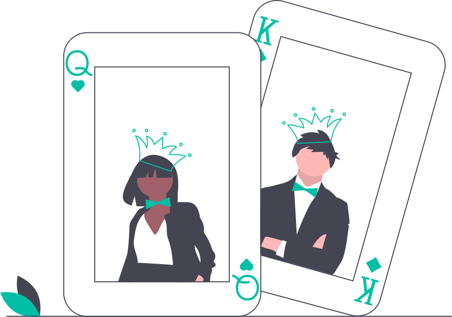
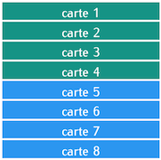
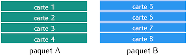
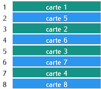
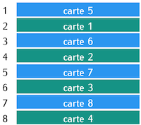

# Mélanges parfaits d'un jeu de 32 cartes
{ width='400' }

 Cette page présente les mélanges parfaits de type out-shuffle et in-shuffle d'un jeu de cartes et en explore quelques propriétés.

## 1. Mélange parfait

!!! Question "Question 1"

    Un jeu de 32 cartes peut être représenté par un tableau, où chaque carte est représentée par un entier.  
    Créer le tableau `jeu32`, contenant les 32 entiers entre 1 et 32.


    ```python
    jeu32 = [ … ] # à compléter
    ```

Pour réaliser un **mélange parfait** d'un jeu de cartes, on le sépare en 2 paquets de même taille avant de mélanger ensemble les 2 paquets créés.

Les fonctions ci-dessous permettent de récupérer la moitié du "dessus" et la moitié du "dessous" d'un jeu de cartes.

```python
def dessus(tab):
    return(tab[: len(tab) // 2])

def dessous(tab):
    return(tab[len(tab) // 2 :])
```

!!! Example "À réaliser"
    Exécuter les appels ```dessus(jeu32)``` et ```dessous(jeu32)``` et observer le résultat produit.

Lors du mélange **parfait** d'un jeu de cartes, on le sépare en 2 paquets de même taille : le paquet A désigne la moitié du dessus et le paquet B désigne la moitié du dessous. Puis on alterne les cartes d'un paquet et de l'autre.  
Le mélange peut se réaliser de 2 façons :  
- soit c'est la carte du dessus du paquet A qui sera au-dessus du paquet mélangé : ce mélange est appelé **out-shuffle** ;  
- soit c'est la carte du dessus du paquet B qui sera au-dessus du paquet mélangé : ce mélange est appelé **in-shuffle**.


Voici un exemple avec un jeu initial de 8 cartes : observer la position des cartes extrêmes (1 et 8) dans les manipulations suivantes.



On sépare le jeu en 2 paquets de même taille : le paquet A est constitué des cartes 1 à 4, le paquet B des cartes 5 à 8.



Voici le paquet obtenu après un mélange **out-shuffle** : les cartes du paquet A occupent les places 1, 3, 5 et 7.  
Les cartes extrêmes (1 et 8) ont conservé leur position initiale (à l'extérieur : *out*).



Voici le paquet obtenu après un mélange **in-shuffle** : les cartes du paquet A occupent les places 2, 4, 6 et 8.  
Les cartes extrêmes (1 et 8) sont désormais à l'intérieur du paquet mélangé (à l'intérieur : *in*).



## 2. Mélange Out-shuffle

### 2.1 Fonction  `outshuffle`
Afin de pouvoir simuler des mélanges répétés, on programme une fonction qui agit sur un jeu de carte comme un mélange *out-shuffle*.

!!! Question "Question 2"
    Compléter la fonction `outshuffle(tab)` qui prend en paramètre un tableau représentant un jeu de cartes et qui renvoie le contenu de ce tableau après un mélange de type out-shuffle.

    *On suppose que tab contient un nombre pair d'éléments*.


```python
def outshuffle(tab):
    # on sépare le paquet de cartes en 2
    tas_haut = … # à compléter
    tas_bas = … # à compléter

    # on crée un tableau de même longueur que tab
    tab2 = [0] * len(tab)

    # on copie dans tab2 les cartes de tas_haut et tas_bas en les alternant
    # dans le tri out-shuffle, la carte du dessus du paquet initial reste
    # au-dessus du paquet mélangé
    for i in range(len(tas_haut)):
        # rangs pairs
        tab2[2 * i] = …
        # rangs impairs
        tab2[2 * i + 1] = …
    return tab2
```

!!! Example "À réaliser"
    Vérifier qu'un mélange de `jeu32` avec la fonction `outshuffle` donne bien le résultat attendu.

    ```python
    assert(outshuffle(jeu32) == [1, 17, 2, 18, 3, 19, 4, 20, 5, 21, 6, 22, 7, 23, 8, 24, 9, 25, 10, 26, 11, 27, 12, 28, 13, 29, 14, 30, 15, 31, 16, 32])
    ```

### 2.2 Après plusieurs mélanges

!!! Question "Question 3"

    - Quelle est la position de la carte 2 du tableau `jeu32` après un mélange de type out-shuffle ?  
    - Et après 2 mélanges ? 3 mélanges ?


!!! Question "Question 4"

    En appliquant successivement plusieurs fois le mélange out-shuffle, peut-on revenir à l'ordre initial du jeu de 32 cartes ? Si oui, au bout de combien de mélanges au minimum ?


!!! Question "Question 5"

    - Que réalise la fonction `cycle_out(tab)` ci-dessous ?  
    - Quelle est la valeur de `cycle_out(jeu32)` ? Comment interpréter cette valeur ?


```python
def cycle_out(tab):
    tab2 = tab[:] #copie des valeurs contenues dans tab
    compteur = 1
    tab = outshuffle(tab)
    while tab2 != tab :
        compteur += 1
        tab = outshuffle(tab)
    return compteur
```

### 2.3 Trajectoire d'une carte fixée
On s'intéresse dans cette partie à toutes les positions occupées par la carte 2 du jeu `jeu32` au cours des mélanges successifs jusqu'à revenir à la configuration initiale du jeu.

!!! Info
    La **méthode** `tab.index(valeur)` permet de renvoyer l'indice de la première occurrence de `valeur` dans le tableau `tab`.

!!! Example "Exemple"
    Dans le tableau `jeu32`, la carte 2 apparaît en 2e position, c'est-à-dire avec l'indice 1.


    ```python
    jeu32.index(2)
    ```

        1

    Il peut être intéressant de constater que cette valeur est le nombre de cartes "au-dessus" de la carte 2 dans le paquet.

!!! Question "Question 6"

    Quels sont tous les indices de la carte 2 du tableau `jeu32` lorsqu'on effectue des mélanges out-shuffle jusqu'à revenir à la configuration de départ ?

|nombre de mélange(s) out-shuffle|indice de la carte 2|
|:------------------------------:|:------------------:|
|0|1|
|1| |
|2| |
|3| |
...
à compléter

!!! Question "Question 7"

    On réalise des mélanges out-shuffle à partir du tableau `jeu32`.  
    **Conjecturer** une formule permettant d'obtenir l'indice de la carte 2 dans le tableau `jeu32` à l'issue du prochain mélange out-shuffle, en fonction de son indice actuel.

!!! Example "À réaliser"
    Vérifier que la formule conjecturée permet de passer de chacun des indices du tableau de la question 6 à l'indice suivant, obtenu avec un nouveau mélange out-shuffle de `jeu32`.  
    En particulier, à partir de l'indice de la dernière ligne du tableau, la formule conjecturée doit donner 1, qui serait l'indice de la carte 2 après un nouveau mélange.


### 2.4 Trajectoire d'une carte quelconque

La fonction `orbite_out(tab, valeur)` ci-dessous permet d'obtenir le tableau de tous les indices de la carte `valeur` dans le tableau `tab` lorsqu'on effectue 5 mélanges out-shuffle successifs.

```python
def orbite_out(tab, valeur):
    orbite =[0]*5
    for i in range(5):
        orbite[i] = tab.index(valeur)
        tab = outshuffle(tab)
    return orbite
```

!!! Question "Question 8"
    Utiliser la fonction précédente pour explorer les indices de quelques cartes du tableau `jeu32` lorsqu'on effectue des mélanges out-shuffle jusqu'à revenir à la configuration de départ.  
    **Conjecturer** une formule permettant d'obtenir l'indice de la carte `valeur` dans le tableau `jeu32` à l'issue du prochain mélange out-shuffle, en fonction de son indice actuel.


!!! Question "Question 9"

    Créer une fonction `orbite_conjecture_out(valeur)` permettant d'obtenir le tableau de tous les indices de la carte `valeur` dans le tableau `jeu32`, au fur et à mesure des mélanges, selon la conjecture formulée à la question précédente.


    ```python
    def orbite_conjecture_out(valeur):
       # à compléter
    ```


!!! Question "Question 10"

    Créer une fonction `validation_conjecture_out()` qui vérifie si, pour **toutes** les valeurs des cartes de `jeu32`, les tableaux `orbite_out(jeu32, valeur)` et `orbite_conjecture_out(valeur)` sont identiques.

    ```python
    def validation_conjecture_out(tab):
        # à compléter
    ```

### 2.5 Synthèse

!!! Question "Question 11"
    Rédiger une synthèse des résultats établis concernant le mélange out-shuffle.


## 3. Mélange in-shuffle
### 3.1 Fonction `inshuffle`

!!! Question "Question 12"
    Écrire une fonction `inshuffle(tab)` qui prend en paramètre un tableau représentant un jeu de cartes et qui renvoie le contenu de ce tableau après un mélange de type in-shuffle.

    *On suppose que tab contient un nombre pair d'éléments*.

    ```python
    def inshuffle(tab):
       # à compléter
    ```
### 3.2 Après plusieurs mélanges

!!! Question "Question 13"

    En appliquant successivement plusieurs fois le mélange in-shuffle, peut-on revenir à l'ordre initial du jeu de 32 cartes ? Si oui, au bout de combien de mélanges au minimum ?

    *On utilisera une fonction pour déterminer cette valeur*.

### 3.3 Trajectoire d'une carte fixée

!!! Question "Question 14"

    Quels sont tous les indices de la carte 2 du tableau `jeu32` lorsqu'on effectue des mélanges in-shuffle jusqu'à revenir à la position de départ ?

|nombre de mélange(s) in-shuffle|indice de la carte 2|
|:------------------------------:|:------------------:|
|0|1|
|1| |
|2| |
|3| |
...
à compléter

!!! Question "Question 15"  

    On réalise des mélanges in-shuffle à partir du tableau `jeu32`. **Conjecturer** une formule permettant d'obtenir l'indice de la carte 2 dans le tableau `jeu32` à l'issue du prochain mélange in-shuffle, en fonction de son indice actuel.

### 3.4 Trajectoire d'une carte quelconque

La fonction `orbite_in(tab, valeur)` ci-dessous permet d'obtenir le tableau de tous les indices de la carte `valeur` dans le tableau `tab` lorsqu'on effectue 10 mélanges in-shuffle.

```python
def orbite_in(tab, valeur):
    orbite =[0]*10
    for i in range(10):
        orbite[i] = tab.index(valeur)
        tab = inshuffle(tab)
    return orbite
```

!!! Question "Question 16"

    Utiliser la fonction précédente pour explorer les indices de quelques cartes du tableau `jeu32` lorsqu'on effectue des mélanges in-shuffle jusqu'à revenir à la configuration de départ.  
    **Conjecturer** une formule permettant d'obtenir l'indice de la carte `valeur` dans le tableau `jeu32` à l'issue du prochain mélange in-shuffle, en fonction de son indice actuel.


!!! Question "Question 17"

    Créer une fonction `orbite_conjecture_in(valeur)` permettant d'obtenir le tableau de tous les indices de la carte `valeur` dans le tableau `jeu32`, au fur et à mesure des mélanges, selon la conjecture formulée à la question précédente.


    ```python
    def orbite_conjecture_in(valeur):
       # à compléter
    ```


!!! Question "Question 18"
    Créer une fonction `validation_conjecture_in()` qui vérifie si pour toutes les valeurs des cartes de `jeu32` les tableaux `orbite_in(jeu32, valeur)` et `orbite_conjecture_in(valeur)` sont identiques.


    ```python
    def validation_conjecture_in(tab):
        # à compléter
    ```

### 3.5 Synthèse

!!! Question "Question 19"  
    Rédiger une synthèse des résultats établis concernant le mélange in-shuffle.
