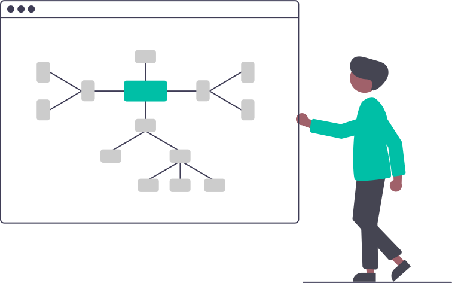

# Chercher : une sélection de problèmes

{ width='400' }

## Algorithmes gloutons
[Volvian, c'est mon eau](https://prologin.org/train/2020/semifinal/volvian) : Prologin 2020, épreuve régionale

## Binaire
[Tour de magie](tour_de_magie.md) (Prologin 2013)

[Tour de cartes](tour_de_cartes.md) (d'après un problème du Castor informatique suisse)

## Instructions conditionnelles
[Météorite, Vagues, Vent !](https://prologin.org/train/2020/semifinal/meteorite_vagues_vent) : Prologin 2020, épreuve régionale  

## Séquences
[Le problème des précipitations](rainfall_problem.md)
