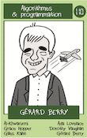
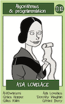
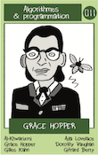
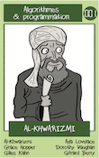
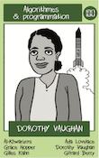
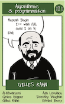

---
hide:
  - toc        # Hide table of contents
---

# Un tour de cartes

*D'après un exercice du concours Castor informatique suisse*

 Le *jeu de 7 familles de l'informatique* est un jeu de cartes composé de 42 cartes réparties en 7 familles, représentant des personnes célèbres dans l'histoire de l'informatique. Il a été publié par
 [interstices.info](https://interstices.info/jeu-de-7-familles-de-linformatique/).

 On aligne quelques cartes du jeu sur une seule rangée et on considère la règle suivante :

>Lors d’un tour, on examine les cartes en commençant par celle la plus à droite :

>— Si la carte est face vers le haut, on la retourne à l’envers et  s'il reste des cartes à sa gauche, on passe à la carte suivante.

>— Si la carte est face vers le bas, on la retourne à l’endroit et on ne fait rien sur les cartes à sa gauche.

Voici un exemple :

Situation de départ :

  
  

Situation après un tour :

  
  

---

Voici l'énoncé du problème :

On extrait la famille [Algorithmes & programmation](https://interstices.info/famille-algorithmes-programmation/) du jeu  (télécharger [les cartes à imprimer](../images/NSI_7_familles_Algo_prog.pdf))
et on range les 6 cartes, face vers le haut, dans l'ordre croissant, de droite à gauche (elles sont numérotées en binaire de 001 à 110).

  
  

Puis on les retourne toutes.

On applique alors la règle précédente pendant 16 tours.

!!! question
    Quelle(s) carte(s) est(sont) face vers le haut à l'issue des 16 tours ?
