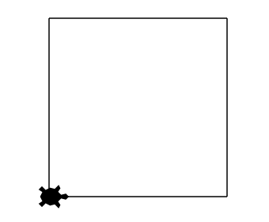
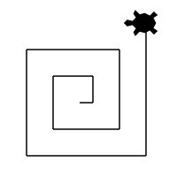

# Exemples : boucles bornées
Les exemples détaillés sur cette page ont pour but d'expliciter quelques situations usuelles d'utilisation des boucles bornées.

Les tracés suivants ont été réalisés à l'aide du module Turtle disponible dans [Basthon](https://basthon.fr).  
Pour exécuter ces programmes dans un notebook Jupyter de Basthon, le notebook doit contenir l'instruction   `from turtle import *` et chaque dessin doit se terminer avec l’instruction `done()`.

## 1. Répéter exactement les mêmes instructions
Un exemple classique est le tracé de polygones avec `Turtle`. Voici le cas du carré.
### 1.1 Tracé d'un carré de côté 100
{ align=right width=170 }

```python
for i in range(4):
    forward(100)
    left(90)
```
On utilise une boucle pour répéter un bloc de deux instructions :
`forward(100)` et `left(90)`  sont exécutées quatre fois de suite.

### 1.2 Calcul de la longueur du trajet parcouru
Pour calculer la longueur du trajet parcouru on peut initialiser une variable `parcouru` à 0 et lui ajouter la longueur de chaque segment parcouru :
```python
parcouru = 0                     # initialisation à 0
for i in range(4):
    parcouru = parcouru + 100    # parcouru est augmentée de 100
print(parcouru)
```
```python
400
```
On dit que `parcouru` est une *variable de cumul*. Évidemment dans le cas du périmètre d'un carré, on connait une opération plus efficace que quatre additions successives, mais ce n'est pas l'objectif ici.

On utilise une boucle pour répéter une instruction :
`parcouru = parcouru + 100`  est exécutée quatre fois de suite.

## 2. Répéter des instructions contenant des expressions dont la valeur est explicitement modifiée

### 2.1 Tracé d'une spirale

On souhaite réaliser une spirale composée de dix segments dont les longueurs sont successivement 10, 20, 30, ..., 100.  
On peut utiliser une variable `pas` contenant à chaque étape la longueur du tracé à réaliser. À la fin de chaque étape, la valeur de la variable `pas` sera augmentée de 10.

{ align=right width=170 }

```python
pas = 10              # initialisation à 10
for i in range(10):
    forward(pas)
    left(90)
    pas = pas + 10    # pas est augmenté de 10
```
On utilise une boucle pour répéter un bloc d'instructions
dix fois de suite. Comme l'instruction `forward(pas)` dépend du paramètre `pas` et que celui-ci est modifié à l'intérieur de la boucle, les dix tracés ne sont pas identiques.

### 2.2 Calcul de la longueur du trajet parcouru

Cette fois encore, pour calculer la longueur du trajet parcouru on peut initialiser une variable `parcouru` à 0 et lui ajouter la longueur de chaque segment parcouru, or cette longueur est la valeur de `pas`.


```python
parcouru = 0                     # initialisation à 0
pas = 10                         # initialisation à 10
for i in range(10):
    parcouru = parcouru + pas    # parcouru est augmentée de la valeur de pas
    pas = pas + 10               # pas est augmentée de 10
print(parcouru)
```
```python
550
```
Le programme ci-dessus est un procédé classique de calcul d'une somme à l'aide d'une boucle. La valeur 550 correspond à la somme 10 + 20 + 30 + ... + 100.

## 3. Répéter des instructions contenant l'indice de boucle

### 3.1 Tracé d'une spirale

Dans l'exemple précédent, introduire une variable `pas` contenant la longueur à tracer à chaque étape permettait de donner une interprétation à la valeur de cette variable. Pour modifier cette valeur entre deux étapes, il a fallu écrire une instruction spécifique dans la boucle :   
`#!py3 pas = pas + 10`   

Une autre variable était présente dans le code et n'a pas été exploitée.
Il s'agit de l'indice de boucle, qui était nommé `i` dans les exemples précédents.  
Dans l'instruction `#!py3 for i in range(10) ` l'indice `i`
 prend dix valeurs successives : les entiers de 0 à 9. On peut utiliser cette variable, qui est modifiée implicitement au cours de la boucle, pour réaliser le même tracé sans introduire de nouvelle variable.  
 Par exemple le programme suivant permet d'obtenir le même tracé qu'au paragraphe 2.1.

 { align=right width=170 }

```python
for i in range(10):
    forward(10 + 10 * i)
    left(90)
```
Lorsque `i` prend les valeurs entières de 0 à 9, l'expression `10 + 10 * i` prend les valeurs : 10, 20, ..., 100.

### 3.2 Calcul de la longueur du trajet parcouru

En s'appuyant sur le programme de tracé précédent, le calcul de la longueur devient :

```python
parcouru = 0  
for i in range(10):
    parcouru = parcouru + (10 + 10 * i)
print(parcouru)
```
```python
550
```
