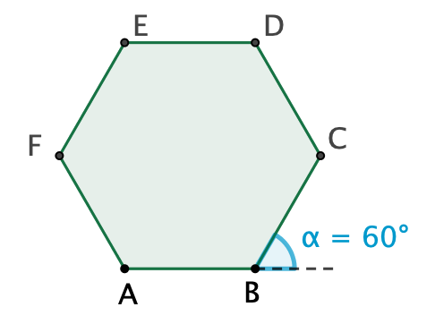

# Exercices : boucles bornées

!!! info "Module turtle"
    Certains exercices utilisent le module `turtle`. Ils sont précédés de l'icône :turtle:.  

    Pour exécuter dans un notebook Jupyter de Basthon un programme utilisant des instructions du module `turtle`, le notebook doit contenir l'instruction   `from turtle import *` et le programme doit se terminer avec l’instruction `done()`.

    Pour connaitre la liste des instructions disponibles, consulter le [Mémo Turtle :turtle:](https://notebook.basthon.fr/?from=https://raw.githubusercontent.com/nweibel/jupyter/master/memo_turtle.ipynb){ .md-button target='_blank'}

## 1. Tracés en boucle

### Exercice 1.1
On considère les trois figures suivantes :  

Fig.1
{ width=150 }
Fig.2
{ width=150 }
Fig.3
{ width=150 }


!!! exo "Question 1"

    :turtle: Associer à chaque figure le programme qui a permis de la réaliser :  

    **Programme A**
    ```python
    pas = 10
    for i in range(20) :
        forward(pas)
        left(45)
        pas = pas + 2
    ```
    **Programme B**
    ```python
    for i in range(8) :
        forward(50)
        left(45)
    ```
    **Programme C**
    ```python
    pas = 10
    for i in range(20) :
        forward(pas)
        left(90)
        pas = pas + 5
    ```

!!! exo "Question 2"
    Déterminer la longueur du tracé parcouru par la tortue pour réaliser chaque figure.


### Exercice 1.2

!!! exo "Question"

    :turtle: Écrire un programme permettant à la tortue de tracer :

    - un pentagone régulier
    - un hexagone régulier
    - un décagone régulier

??? info "Aide"

    Fig.1
    { width=150 }
    Fig.2
    { width=170 }
    Fig.3
    { width=170 }

## 2. Calculs en boucle

### Exercice 2.1  

!!! exo "Question"
    Quelle est la valeur de la variable `resultat` à l'issue de l'exécution de ces instructions ?
    ```python
    resultat = 0
    for i in range(50):
        resultat = resultat + 2
    ```

### Exercice 2.2

!!! exo "Question"
    Quelle est la valeur de la variable `resultat` à l'issue de l'exécution de ces instructions ?
    ```python
    resultat = 1
    for i in range(5):
        resultat = resultat * 2
    ```


### Exercice 2.3  

!!! exo "Question"
    Quelle est la valeur de la variable `resultat` à l'issue de l'exécution de ces instructions ?
    ```python
    resultat = 0
    for i in range(1, 5):
        resultat = resultat + i
    ```

### Exercice 2.4  

!!! exo "Question"
    Quelle est la valeur de la variable `resultat` à l'issue de l'exécution de ces instructions ?
    ```python
    resultat = 1
    for i in range(1, 5):
        resultat = resultat * i
    ```

## 3. Somme  

### Exercice 3.1

!!! exo "Question 1"
    Sélectionner, ordonner et indenter si nécessaire certaines des instructions suivantes afin que le programme permette d'afficher la somme des entiers de 1 à 100.

<iframe src=https://parsons.herokuapp.com/puzzle/938803931da84703b3771df84f8c50da  width=100% height=400 ></iframe>
<iframe src=https://www.codepuzzle.io/p/75QG  width=100% height=350 ></iframe>


!!! exo "Question 2"
    Saisir le programme et déterminer la somme des entiers de 1 à 100.


### Exercice 3.2  

!!! exo "Question"
    Écrire un programme qui permet d'afficher la somme des cubes des entiers de 1 à 100.  
    Comparer le résultat affiché au carré de la somme des entiers de 1 à 100 (exercice précédent). 


## 4. Affichage

!!! Info
    - L'instruction `print('a')` affiche le caractère `a` et passe à la ligne suivante.   
    - L'instruction `print('a', end = ' ')` affiche le caractère  'a' suivi d'un espace et *ne* passe *pas* à la ligne.  
    - L'instruction `print('a' * 5)` affiche la chaine de caractères  'aaaaa'.  

### Exercice 4.1  

!!! exo "Question"
    Écrire un programme qui permet d'afficher sur une ligne "la table de multiplication de 8", c'est à dire la valeur des produits : $1 \times 8, 2 \times 8, \ldots, 10 \times 8$.

### Exercice 4.2  


!!! exo "Question"
    Écrire un programme qui permet d'afficher le motif ci-dessous.
    ```
    *
    **
    ***
    ****
    *****    	
    ```
### Exercice 4.3  


!!! exo "Question"
    Écrire un programme qui permet d'afficher le motif ci-dessous.
    ```
    *****
    ****
    ***
    **
    *    	
    ```


## 5. Boucles imbriquées

### Exercice 5.1
!!! exo "Question"
    { width=150 align=right}
    :turtle: Ordonner (et indenter si nécessaire) les instructions suivantes afin que le programme permette de tracer le motif ci-contre.  


<iframe src=https://parsons.herokuapp.com/puzzle/902b76c18e45478dbc87fc914bf6a9f2  width=100% height=410 ></iframe>

### Exercice 5.2
!!! exo "Question"
    Écrire un programme qui permet d'afficher sur dix lignes les "tables de multiplication" des entiers de 1 à 10.


### Exercice 5.3
!!! exo "Question"
    :turtle: Écrire un programme qui permet de réaliser la figure suivante :

    { width=200 }

### Exercice 5.4

!!! exo "Question"
    :turtle: Écrire un programme qui permet de réaliser chacune des figures suivantes :  

    Fig.1
    { width=170 }
    Fig.2
    { width=170 }
    Fig.3
    { width=170 }

### Exercice 5.5

!!! exo "Question"
    :turtle: Écrire un programme qui permet de réaliser une grille de couleurs du type de celle ci-dessous :  

    { width=400 }
