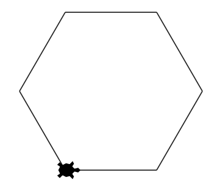
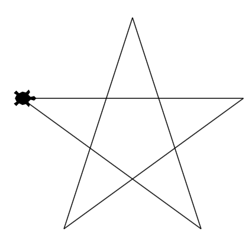
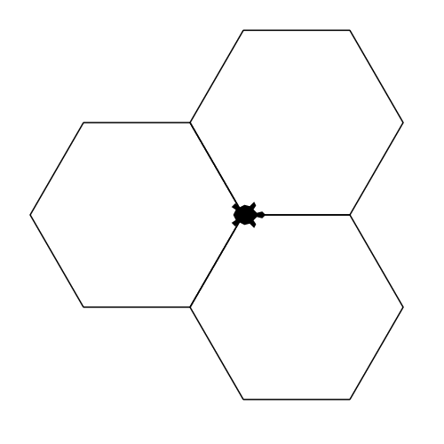

# Questions : boucles bornées

## 1. Affichage

!!! Info
     - L'instruction `print('a')` affiche le caractère `a` et passe à la ligne suivante.   
     - L'instruction `print('a', end = ' ')` affiche le caractère  'a' suivi d'un espace et *ne* passe *pas* à la ligne.  

### Question 1.1  

!!! exo "Question"
    Parmi les 4 boucles suivantes, lesquelles permettent d'afficher sur une seule ligne les entiers de 1 à 10, séparés par un espace et rangés dans l'ordre croissant  ?

    ```
    1 2 3 4 5 6 7 8 9 10
    ```

Boucle A :
```python
for i in range(10):
    print(i)
```

Boucle B :
```python
for i in range(10):
    print(i, end = ' ')
```

Boucle C :
```python
for i in range(1, 11):
    print(i, end = ' ')
```

Boucle D :
```python
for i in range(10):
    print(i + 1, end = ' ')
```

=== "Propositions de réponses"
    - [ ] A
    - [ ] B
    - [ ] C
    - [ ] D

=== "Solutions"
    - [ ] A
    - [ ] B
    - [x] C
    - [x] D

=== "Arguments"
    Parmi les propositions, celles qui conviennent consistent :   
    - soit à faire varier `i` de  1 à 10 (`range(1,11)`) et afficher `i`;  
    - soit à faire varier  `i` de  0 à 9 (`range(10)`) et afficher `i + 1`.

### Question 1.2  

!!! exo "Question"
    `#!python mots = ['système', 'systématique', 'systémique']  `

    Parmi les 4 boucles suivantes, lesquelles permettent d'afficher chaque mot de la liste `mots` ainsi que  son nombre de lettres ?

    ``` python
    système comporte 7 lettres
    systématique comporte 12 lettres
    systémique comporte 10 lettres
    ```

Boucle A :
```python
for i in range(len(mots)):
    print(mots[i], "comporte", i, "lettres")
```

Boucle B :
```python
for mot in mots:
    print(mot, "comporte", len(mot), "lettres")
```

Boucle C :
```python
for mot in mots:
    print(mots[i], "comporte", len(mots[i]), "lettres")
```

Boucle D :
```python
for i in range(len(mots)):
    print(mots[i], "comporte", len(mots[i]), "lettres")
```

=== "Propositions de réponses"
    - [ ] A
    - [ ] B
    - [ ] C
    - [ ] D

=== "Solutions"
    - [ ] A
    - [x] B
    - [ ] C
    - [x] D

=== "Arguments"

     La solution B parcourt directement les éléments de la liste `mots` et affiche leur valeur et leur nombre de lettres, à l'aide de la fonction `len()`.   
      La solution D parcourt la liste à l'aide des indices des éléments, et affiche leur valeur et leur nombre de lettres.

## 2. Somme  

### Question 2.1

!!! exo "Question"
    On donne la liste de nombres suivante :
    ```python
    nombres = [12, 34, 56, 78, 98, 76, 54, 32, 10]
    ```
    Parmi les 4 programmes suivants, lesquels permettent d'afficher la somme des valeurs de la liste `nombres` ?

Programme A :
```python
for i in range(len(nombres)):
    somme = 0
    somme =  somme + nombres[i]
print(somme)
```

Programme B :
```python
somme = 0
for i in range(len(nombres)):
    somme =  somme + nombres[i]
print(somme)
```

Programme C :
```python
somme = 0
for valeur in nombres:
    somme =  somme + valeur
    print(somme)   
```

Programme D :
```python
somme = 0
for valeur in nombres:
    somme =  somme + valeur
print(somme)   
```

=== "Propositions de réponses"
    - [ ] A
    - [ ] B
    - [ ] C
    - [ ] D

=== "Solutions"
    - [ ] A
    - [x] B
    - [ ] C
    - [x] D

=== "Arguments"  
     La valeur de la variable `somme` est à initialiser à `0` avant le parcours de la liste de nombres.  
     La solution B parcourt la liste à l'aide des indices des éléments, et ajoute chacun d'eux à la  variable `somme`.     
     La solution D parcourt directement les éléments de la liste  et ajoute chacun d'eux à la  variable `somme`.  
     Enfin, l'affichage de la somme n'est à réaliser qu'après le parcours complet de la liste de valeurs.   

### Question 2.2  

!!! exo "Question"
    Parmi les 4 programmes suivants, lequel permet d'afficher la somme des carrés des entiers de 1 à 10 ?

Programme A :
```python
for i in range(11):
    print(i**2)
```

Programme B :
```python
somme = 0
for i in range(1, 10):
    somme = somme + i**2
print(somme)
```

Programme C :
```python
somme = 0
for i in range(1, 11):
    somme = somme + i**2
print(somme)
```

Programme D :
```python
somme = 0
for i in range(11):
    somme = i**2
print(somme)
```

=== "Propositions de réponses"
    - [ ] A
    - [ ] B
    - [ ] C
    - [ ] D

=== "Solution"
    - [ ] A
    - [ ] B
    - [x] C
    - [ ] D

=== "Arguments"  
     La valeur de la variable `somme` est à initialiser à `0` avant le parcours de la liste de nombres.  
     La solution C parcourt la liste des entiers de 1 à 10 compris, et ajoute le carré de chacun d'eux à la  variable `somme`.    
     Enfin, l'affichage de la somme n'est à réaliser qu'après le parcours complet des dix entiers.


## 3. Calculs en boucle

### Question 3.1  

!!! exo "Question"
    Quelle serait la valeur de la variable `total` à l'issue de l'exécution de ces instructions ?

    ```python
    total =  0
    for i in range(4):
        total = total + 3
    ```

=== "Propositions de réponses"
    - [ ] 6
    - [ ] 12
    - [ ] 14
    - [ ] 30

=== "Solution"
    - [ ] 6
    - [x] 12
    - [ ] 14
    - [ ] 30

=== "Arguments"
    `i` prend les valeurs 0 à 3, soit 4 valeurs.   
    Pour chaque valeur de `i`, la variable `total` est augmentée de la quantité 3.  
    Finalement, `total` vaut 0 + 4*3 = 12  

### Question 3.2

!!! exo "Question"
    Quelle serait la valeur de la variable `total` à l'issue de l'exécution de ces instructions ?

    ```python
    total =  0
    for i in range(4):
        total = total + i   	
    ```

=== "Propositions de réponses"
    - [ ] 6
    - [ ] 12
    - [ ] 14
    - [ ] 30

=== "Solution"
    - [x] 6
    - [ ] 12
    - [ ] 14
    - [ ] 30

=== "Arguments"
    `i` prend les valeurs 0 à 3.
    Pour chaque valeur de `i`, la variable `total` est augmentée de la valeur de `i`.    
    Finalement, `total` vaut 0 + 0 + 1 + 2 + 3 = 6.

### Question 3.3  

!!! exo "Question"
    Quelle serait la valeur de la variable `total` à l'issue de l'exécution de ces instructions ?

    ```python
    total =  0
    for i in range(4):
    	total = total + i**2
    ```

=== "Propositions de réponses"
    - [ ] 6
    - [ ] 12
    - [ ] 14
    - [ ] 30

=== "Solution"
    - [ ] 6
    - [ ] 12
    - [x] 14
    - [ ] 30

=== "Arguments"
    `i` prend les valeurs 0 à 3.  
     Pour chaque valeur de `i`, la variable `total` est augmentée de la valeur de i^2^.    
     Finalement, `total` vaut 0 + 1 + 4 + 9 = 14

## 4. Boucle avec une condition

### Question 4.1  

!!! exo "Question"
    On donne la liste de nombres suivante :
    ```python
    nombres = [12, 34, 56, 78, 90, 12, 34, 56, 78]
    ```
    Quelle serait la valeur de la variable `reponse` à l'issue de l'exécution de ces instructions ?  

    ```python
    cible =  34
    reponse = -1
    for i in range(len(nombres)):
    	if nombres[i] == cible:
    	    reponse = i
    ```


=== "Propositions de réponses"
    - [ ] -1
    - [ ] 1
    - [ ] 2
    - [ ] 6

=== "Solution"
    - [ ] -1
    - [ ] 1
    - [ ] 2
    - [x] 6

=== "Arguments"
    La valeur cible `34` est présente deux fois dans le tableau, donc la condition `if nombres[i] == cible` est vérifiée deux fois. La variable `reponse` est donc affectée deux fois. En fin de boucle, la valeur de la variable est celle de la dernière affectation, donc l'indice de la dernière occurrence de `34` dans `nombres`.

### Question 4.2

!!! exo "Question"
    On donne la liste de nombres suivante :
    ```python
    nombres = [12, 34, 56, 78, 90, 12, 34, 56, 78]
    ```
    Quelle serait la valeur de la variable `reponse` à l'issue de l'exécution de ces instructions ?

    ```python
    cible =  34
    reponse = 0
    for nombre in nombres:
    	if nombre == cible:
    	    reponse = reponse + 1
    ```


=== "Propositions de réponses"
    - [ ] 0
    - [ ] 1
    - [ ] 2
    - [ ] 6

=== "Solution"
    - [ ] 0
    - [ ] 1
    - [x] 2
    - [ ] 6

=== "Arguments"
    La valeur cible `34` est présente deux fois dans le tableau, donc la condition `if nombres == cible` est vérifiée deux fois. La variable `reponse` est donc incrémentée deux fois. En fin de boucle, la valeur de la variable initialisée à 0 est donc `2`.

## 5. Tracés en boucle

 Les tracés suivants ont été réalisés dans un environnement Jupyter, à l'aide du module Turtle disponible dans [Basthon](https://basthon.fr).  

 Pour exécuter les programmes suivants dans un notebook Jupyter de Basthon, le notebook doit contenir l'instruction   `from turtle import *` et chaque dessin doit se terminer avec l’instruction `done()`.

### Question 5.1

!!! exo "Question"

    Parmi les boucles suivantes, laquelle permet de faire tracer à la tortue la figure ci-dessous ?        

    { width=200 }

Boucle A :
```python
for i in range(6) :
    forward(100)
    left(60)
```

Boucle B :
```python
for i in range(7) :
    forward(100)
    left(60)
```

Boucle C :
```python
for i in range(6) :
    forward(100)
    left(120)
```

Boucle D :
```python
for i in range(7) :
    forward(100)
    left(120)
```

=== "Propositions de réponses"
    - [ ] A
    - [ ] B
    - [ ] C
    - [ ] D

=== "Solution"
    - [x] A
    - [ ] B
    - [ ] C
    - [ ] D

=== "Arguments"

    La figure comporte 6 côtés et `range(6)` génèrera les entiers de 0 à 5, soit 6 entiers.
    Les angles "internes" de la figure sont de 120°, la tortue doit donc pivoter de 180 - 120 = 60° entre 2 tracés.  
    La proposition A correspond au tracé de l'hexagone. La B permet de le tracer également, mais en passant deux fois sur l'un des côtés.


### Question 5.2

!!! exo "Question"

    Parmi les boucles suivantes, laquelle permet de faire tracer à la tortue la figure ci-dessous ?        

    { width=250 }

Boucle A :
```python
for i in range(5) :
    forward(250)
    right(72)
```

Boucle B :
```python
for i in range(5) :
    forward(250)
    right(144)
```

Boucle C :
```python
for i in range(6) :
    forward(250)
    left(36)
```

Boucle D :
```python
for i in range(6) :
    forward(250)
    left(72)
```

=== "Propositions de réponses"
    - [ ] A
    - [ ] B
    - [ ] C
    - [ ] D

=== "Solution"
    - [ ] A
    - [x] B
    - [ ] C
    - [ ] D

=== "Arguments"

    La figure comporte 5 côtés et `range(5)` génèrera les entiers de 0 à 4, soit 5 entiers.
    Les angles "internes" des pointes de l'étoile sont de 36°, la tortue doit donc pivoter de 180 - 36 = 144° entre 2 tracés.

## 6. Boucles imbriquées

### Question 6.1
!!! exo "Question"
    Quelle serait la valeur de la variable `total` à l'issue de l'exécution de ces instructions ?

    ```python
    total =  0
    for i in range(4):
        for j in range(3):
        	total = total + 1
    ```

=== "Propositions de réponses"

    - [ ] 10
    - [ ] 12
    - [ ] 14
    - [ ] 20

=== "Solution"
    - [ ] 10
    - [x] 12
    - [ ] 14
    - [ ] 20

=== "Arguments"
    `i` prend les valeurs 0 à 3, soit 4 valeurs.   
    Pour chaque valeur de `i`:  
    	-  `j` prend les valeurs 0 à 2 soit 3 valeurs.  
        -  La variable `total` est augmentée 3 fois de la quantité 1   

    Finalement, `total` vaut 0 + 4*3 = 12


### Question 6.2

!!! exo "Question"
    Quelle sera la valeur de la variable `total` à l'issue de l'exécution de ces instructions ?

    ```python
    total =  0
    for i in range(4):
        for j in range(i):
        	total = total + i

    ```

=== "Propositions de réponses"
    - [ ] 10
    - [ ] 12
    - [ ] 14
    - [ ] 20

=== "Solution"
    - [ ] 10
    - [ ] 12
    - [x] 14
    - [ ] 20

=== "Arguments"
    `i` prend les valeurs 0 à 3.

    Quand `i = 0`, `j` ne prend aucune valeur et `total` n'est pas augmenté.      

    Quand `i = 1`, `j` prend la valeur 0 et `total` est augmenté la valeur de `i`, soit de 1.  

    Quand `i = 2`, `j` prend les valeurs 0 puis 1, et `total` est augmenté 2 fois de la valeur de `i`, soit de 2*2 = 4.

    Quand `i = 3`, `j` prend les valeurs 0, 1 et 2, et `total` est augmenté 3 fois de la valeur de `i`, soit de 3*3 = 9.  

    Finalement, `total` vaut 0 + 1 + 2*2 + 3*3 = 14.

     valeurs ajoutées à `total` | j = 0   | j = 1  | j = 2 |
    ---  | --- | --- | --- |
    i = 0 | X | X | X | 
    i = 1 | 1 | X | X |
    i = 2 | 2 | 2 |  X |
    i = 3 | 3 | 3 | 3 |


### Question 6.3  

!!! exo "Question"
    Quelle sera la valeur de la variable `total` à l'issue de l'exécution de ces instructions ?

    ```python
    total =  0
    for i in range(5):
        for j in range(i):
        	total = total + j

    ```

=== "Propositions de réponses"
    - [ ] 10
    - [ ] 12
    - [ ] 14
    - [ ] 20

=== "Solution"
    - [x] 10
    - [ ] 12
    - [ ] 14
    - [ ] 20

=== "Arguments"
    `i` prend les valeurs 0 à 4.  

    Quand `i = 0`, `j` ne prend aucune valeur et `total` n'est pas augmenté.    

    Quand `i = 1`, `j` prend la valeur 0 et `total` est augmenté de 0.

    Quand `i = 2`,  `j` prend les valeurs 0 puis 1, et `total` est augmenté à chaque fois de la valeur de `j`, soit de 0 + 1 = 1.


    Quand `i = 3`, `j` prend les valeurs 0, 1 et 2, et `total` est augmenté à chaque fois de la valeur de `j`, soit de 0 + 1 + 2 = 3.

    Quand `i = 4`,`j` prend les valeurs 0, 1, 2 et 3, et `total` est augmenté à chaque fois de la valeur de `j`, soit de 0 + 1 + 2 + 3 = 6   

    Finalement, `total` vaut 0 + 1 + 3 + 6 = 10

    valeurs ajoutées à `total` | j = 0   | j = 1  | j = 2 |j = 3|
    ---  | --- | --- | --- | ---|
    i = 0 | X | X | X | X |
    i = 1 | 0 | X | X | X |
    i = 2 | 0 | 1 | X | X |
    i = 3 | 0 | 1 | 2 | X |
    i = 4 | 0 | 1 | 2 | 3 |

### Question 6.4
!!! exo "Question"

    Parmi les programmes suivants, lequel permet de faire tracer à la tortue la figure ci-dessous ?  

    { width=200 }

Programme A :
```python
for nb_carre in range(4) :
    for nb_cote in range(3) :
        forward(100)
        left(90)
    right(120)
```

Programme B :
```python
for nb_carre in range(3) :
    for nb_cote in range(4) :
        forward(100)
        left(90)
    left(30)
```

Programme C :
```python
for nb_carre in range(3) :
    for nb_cote in range(4) :
        forward(100)
        left(90)
    left(120)
```

Programme D :
```python
for nb_carre in range(3) :
    for nb_cote in range(4) :
        forward(100)
        left(120)
    left(90)
```

=== "Propositions de réponses"
    - [ ] A
    - [ ] B
    - [ ] C
    - [ ] D

=== "Solution"
    - [ ] A
    - [ ] B
    - [x] C
    - [ ] D

=== "Arguments"
       Il y a 3 carrés à tracer (`range(3)`) et chaque carré possède 4 côtés (`range(4)`). Les angles du carré font 90° et chaque carré est l'image d'un autre par une rotation d'un tiers d'angle plein (360/3 = 120°). Le sens de cette rotation importe peu : `right(120)` aurait aussi convenu.

### Question 6.5

!!! exo "Question"

    Parmi les programmes suivants, lequel permet de faire tracer à la tortue la figure ci-dessous ?  

    { width=200 }

Programme A :
```python
for nb_poly in range(6) :
    for nb_cote in range(3) :
        forward(80)
        left(120)
    left(60)
```

Programme B :
```python
for nb_poly in range(3) :
    for nb_cote in range(6) :
        forward(80)
        left(120)
    left(60)
```

Programme C :
```python
for nb_poly in range(6) :
    for nb_cote in range(3) :
        forward(80)
        left(60)
    left(120)
```

Programme D :
```python
for nb_poly in range(3) :
    for nb_cote in range(6) :
        forward(80)
        left(60)
    left(120)
```

=== "Propositions de réponses"
    - [ ] A
    - [ ] B
    - [ ] C
    - [ ] D

=== "Solution"
    - [ ] A
    - [ ] B
    - [ ] C
    - [x] D

=== "Arguments"
       Il y a 3 hexagones réguliers à tracer (`range(3)`) et chaque hexagone possède 6 côtés (`range(6)`). Les angles de l'hexagone font 120° (donc la tortue doit pivoter de 180 - 120 = 60°) et chaque hexagone est l'image d'un autre par une rotation d'un tiers d'angle plein (360/3 = 120°). Le sens de cette rotation importe peu : `right(120)` aurait aussi convenu.
