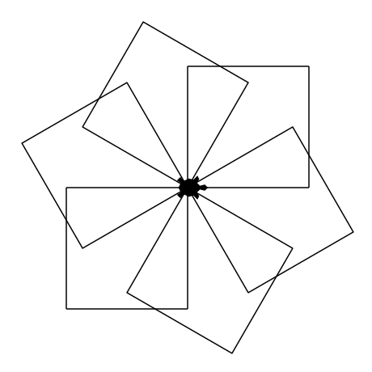
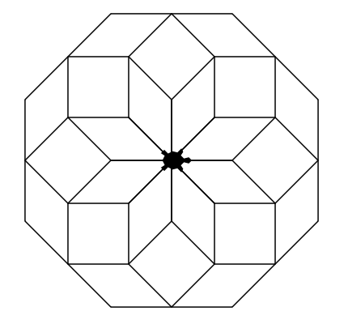

# Exercices : fonctions

!!! info "Module turtle"
    Certains exercices utilisent le module `turtle`. Ils sont précédés de l'icône :turtle:.  

    Pour exécuter dans un notebook Jupyter de Basthon un programme utilisant des instructions du module `turtle`, le notebook doit contenir l'instruction   `from turtle import *` et le programme doit se terminer avec l’instruction `done()`.

    Pour connaitre la liste des instructions disponibles, consulter le [Mémo Turtle :turtle:](https://notebook.basthon.fr/?from=https://raw.githubusercontent.com/nweibel/jupyter/master/memo_turtle.ipynb){ .md-button target='_blank'}


### Exercice 1

!!! exo "Question"
    Quelle est la valeur de la variable `prix_ttc` à l'issue de l'exécution de ces instructions ? Donner une interprétation de cette valeur.

    ```python
    def ajoute_tva(prix):
      return prix * 1.2

    prix_ht = 250
    prix_ttc = ajoute_tva(prix_ht)
    ```

### Exercice 2

!!! exo "Question"
    Quelle est la valeur de la variable `montant` à l'issue de l'exécution de ces instructions ? Donner une interprétation de cette valeur.

    ```python
    def ajoute_interets(valeur):
      return valeur * 1.02

    montant = 1000
    for i in range(4):
      montant = ajoute_interets(montant)
    ```

### Exercice 3

!!! exo "Question"

    :turtle: Écrire une fonction `polygone(n)` permettant à la tortue de tracer un polygone régulier à `n` côtés.

### Exercice 4

!!! exo "Question"
    :turtle: Ordonner et indenter si nécessaire les instructions suivantes afin que le programme permette de dessiner dix carrés possédant un sommet commun en utilisant une fonction.

<iframe src=https://parsons.herokuapp.com/puzzle/95950a1cb05241c8a0fb4c898fc89d47  width=100% height=450 ></iframe>


### Exercice 5

!!! exo "Question"
    :turtle: Ordonner et indenter si nécessaire les instructions suivantes afin que le programme permette de dessiner 6 pentagones en utilisant une fonction.

<iframe src=https://parsons.herokuapp.com/puzzle/63d871d34c354c4aa5cfb1a014e8af46  width=100% height=450 ></iframe>

### Exercice 6

!!! exo "Question"
    :turtle: Écrire une fonction `repete_polygones(nb_cotes_polygone, nb_polygones)` qui permet de tracer `nb_repetitions` polygones réguliers dont le nombre de côtés est `nb_cotes_polygone`, et ayant tous un sommet commun.

    Voici par exemple les figures tracées suite à quelques appels de cette fonction :  

    ```python
    repete_polygones(4, 6)
    ```
    { width=170 }

    ```python
    repete_polygones(8, 6)
    ```
    { width=170 }

    ```python
    repete_polygones(8, 8)
    ```
    { width=170 }
