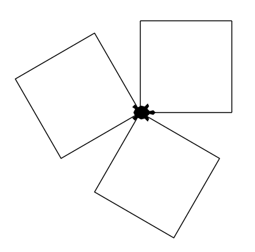

# Questions : fonctions

## 1. Fonctions et mathématiques

#### Question 1.1  

!!! exo "Question"
    Parmi les 4 fonctions suivantes, lesquelles permettent de renvoyer le maximum des 2 paramètres ?


Fonction A :
```python
def maximum(a,b):
    if a > b :
        resultat = a
    else :
        resultat = b
    return resultat
```

Fonction B :
```python
def maximum(a,b):
    if a >= b :
        resultat = a
    else :
        resultat = b
    return resultat
```

Fonction C :
```python
def maximum(a,b):
    if a > b :
        resultat = a
    if a < b :
        resultat = b
    return resultat
```

Fonction D :
```python
def maximum(a,b):
    return a if a > b else b
```

=== "Propositions de réponses"
    - [ ] A
    - [ ] B
    - [ ] C
    - [ ] D

=== "Solutions"
    - [x] A
    - [x] B
    - [ ] C
    - [x] D

=== "Arguments"
    Parmi les propositions, toutes conviennent sauf la C : lorsque les 2 paramètres sont égaux la C ne renvoie rien.
    La syntaxe de la D est particulière, mais usuelle en Python.


#### Question 1.2  

!!! exo "Question"

    Parmi les 4 fonctions suivantes, lesquelles permettent de renvoyer la liste des valeurs de la table de multiplication d'un entier (c'est à dire les produits de cet entier par les entiers de 1 à 10) ?

Fonction A :
```python
def table_multiplication(n):
    table = []
    for i in range(1,11):
        table.append(n*i)
    return table
```

Fonction B :
```python
def table_multiplication(n):
    table = []
    for i in range(1,11):
        table = table + n*i
    return table_multiplication
```

Fonction C :
```python
def table_multiplication(n):
    table = []
    for i in range(10):
        table.append(n*i)
    return table
```

Fonction D :
```python
def table_multiplication(n):
    table = []
    for i in range(1,11):
        table = table + [n*i]
    return table
```

=== "Propositions de réponses"
    - [ ] A
    - [ ] B
    - [ ] C
    - [ ] D

=== "Solutions"
    - [x] A
    - [ ] B
    - [ ] C
    - [x] D

=== "Arguments"
     La proposition B essaie d'utiliser le symbole `+` entre une liste et un entier, ce qui provoque une erreur. Par ailleurs elle renvoie la fonction plutôt que la liste, ce qui ne répond pas à la question posée.
     La fonction C n'utilise pas les bons entiers : `range(10)`engendre les entiers de 0 à 9, et non de 1 à 10.
     Les fonctions A et D sont correctes.


## 2. Avec l'opérateur `+`  

#### Question 2.1

!!! exo "Question"
    On donne la fonction suivante :
    ```python
    def plus(a, b)
        return a + b
    ```
    Quel serait l'affichage produit par l'exécution de l'instruction suivante ?
    ```python
    print(plus(5, 6))
    ```

=== "Propositions de réponses"
    - [ ] 11
    - [ ] 5 6
    - [ ] 56
    - [ ] Une erreur

=== "Solutions"
    - [x] 11
    - [ ] 5 6
    - [ ] 56
    - [ ] Une erreur


=== "Arguments"  
    Lorsque les paramètres sont des nombres, le symbole `+` est un opérateur d'addition.

#### Question 2.2  

!!! exo "Question"
    On donne la fonction suivante :
    ```python
    def plus(a, b)
        return a + b
    ```
    Quel serait l'affichage produit par l'exécution de l'instruction suivante ?
    ```python
    print(plus('5', '6'))
    ```

=== "Propositions de réponses"
    - [ ] 11
    - [ ] 5 6
    - [ ] 56
    - [ ] Une erreur    

=== "Solutions"
    - [ ] 11
    - [ ] 5 6
    - [x] 56
    - [ ] Une erreur


=== "Arguments"  
    Lorsque les paramètres sont des chaines de caractères, le symbole `+` est un opérateur de concaténation. L'affichage produit est la chaine de caractères '56' et non l'entier 56.


#### Question 2.3  

!!! exo "Question"
    On donne la fonction suivante :
    ```python
    def plus(a, b)
        return a + b
    ```
    Quel serait l'affichage produit par l'exécution de l'instruction suivante ?
    ```python
    print(plus('5', 6))
    ```

=== "Propositions de réponses"
    - [ ] 11
    - [ ] 5 6
    - [ ] 56
    - [ ] Une erreur    

=== "Solutions"
    - [ ] 11
    - [ ] 5 6
    - [ ] 56
    - [x] Une erreur


=== "Arguments"  
    Lorsque les paramètres sont un entier pour l'un et une chaine de caractères pour l'autre, le symbole `+` n'a pas de signification.
    L'affichage produit est le message d'erreur : `TypeError: cannot concatenate 'str' and 'int' objects`  


## 3. Tracés en boucle : des fonctions sans `return`

!!! info "Module turtle"
    Les exercices suivants utilisent le module `turtle`. Ils sont précédés de l'icône :turtle:.  

    Pour exécuter dans un notebook Jupyter de Basthon un programme utilisant des instructions du module `turtle`, le notebook doit contenir l'instruction   `from turtle import *` et le programme doit se terminer avec l’instruction `done()`.


#### Question 3.1

!!! exo "Question"

    :turtle: Parmi les programmes suivants, lequel permet de faire tracer à la tortue la figure ci-dessous ?  

    {width=250}

Programme A :
```python
def carre():
    for nb_cote in range(3):
        forward(100)
        left(90)

for nb_carre in range(4):
    carre()
    right(120)
```

Programme B :
```python
def carre():
    for nb_cote in range(4):
        forward(100)
        left(90)

for nb_carre in range(3):
    carre()
    left(30)
```

Programme C :
```python
def carre():
    for nb_cote in range(4):
        forward(100)
        left(90)

for nb_carre in range(3):
    carre()
    left(120)
```

Programme D :
```python
def carre():
    for nb_cote in range(3):
        forward(100)
        left(90)

for nb_carre in range(4):
    carre()
    left(120)
```

=== "Propositions de réponses"
    - [ ] A
    - [ ] B
    - [ ] C
    - [ ] D

=== "Solution"
    - [ ] A
    - [ ] B
    - [x] C
    - [ ] D

=== "Arguments"
       La fonction `carre` doit faire tracer 4 côtés (`range(4)`) et les angles d'un carré font 90°.  
       Chaque carré est l'image d'un autre par une rotation d'un tiers d'angle plein (360/3 = 120°). Le sens de cette rotation importe peu : `right(120)` aurait aussi convenu.

#### Question 3.2

!!! exo "Question"

    :turtle: Parmi les programmes suivants, lequel permet de faire tracer à la tortue la figure ci-dessous ?  

    {width=250}

Programme A :
```python
def hexagone():
    for nb_cote in range(3) :
        forward(80)
        left(120)

for nb_poly in range(6) :
    hexagone(t)
    left(60)
```

Programme B :
```python
def hexagone():
    for nb_cote in range(6) :
        forward(80)
        left(120)

for nb_poly in range(3) :
    hexagone()
    left(60)
```

Programme C :
```python
def hexagone():
    for nb_cote in range(6) :
        forward(80)
        left(60)

for nb_poly in range(6) :
    hexagone()
    left(120)
```

Programme D :
```python
def hexagone():
    for nb_cote in range(6) :
        forward(80)
        left(60)

for nb_poly in range(3) :
    hexagone()
    left(120)
```

=== "Propositions de réponses"
    - [ ] A
    - [ ] B
    - [ ] C
    - [ ] D

=== "Solution"
    - [ ] A
    - [ ] B
    - [ ] C
    - [x] D

=== "Arguments"
       Il y a 3 hexagones réguliers à tracer (`range(3)`).
       La fonction `hexagone` fait tracer 6 côtés (`range(6)`). Les angles internes de l'hexagone font 120° donc la tortue doit pivoter de 180 - 120 = 60°.
       Chaque hexagone est l'image d'un autre par une rotation d'un tiers d'angle plein (360/3 = 120°). Le sens de cette rotation importe peu : `right(120)` aurait aussi convenu.
