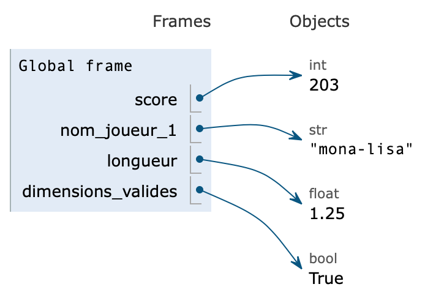

# Variables

Une variable est un emplacement doté d'un nom, utilisé pour stocker des données dans la mémoire. On peut considérer une variable comme un conteneur contenant des données pouvant être modifiées ultérieurement dans le programme.

## Affecter une valeur à une variable
On affecte une valeur à une variable en Python à l'aide d'une instruction dont la syntaxe est :   
```python
nom_variable = valeur_variable
```
Le nom d'une variable est appelé son **identifiant**. Les noms de variables peuvent contenir des lettres, le tiret bas ++underscore++ et, sauf pour le premier caractère, des chiffres.
Les identifiants doivent être aussi explicites que possible et il est conseillé de ne pas utiliser de lettres accentuées. L'usage en python veut que les identifiants de variables ne contiennent pas de lettres capitales (A-Z).
Par ailleurs les mots réservés[^a] en python sont des mots qui ne peuvent pas être utilisés comme identifiants.

[^a]: 'False', 'None', 'True', 'and', 'as', 'assert', 'async', 'await', 'break', 'class', 'continue', 'def', 'del', 'elif', 'else', 'except', 'finally', 'for', 'from', 'global', 'if', 'import', 'in', 'is', 'lambda', 'nonlocal', 'not', 'or', 'pass', 'raise', 'return', 'try', 'while', 'with', 'yield'

!!! abstract "Exemple"
    Voici des identifiants valides pour les variables suivantes :
    ```python
    score = 203
    nom_joueur_1 = "mona-lisa"
    longueur = 1.25
    dimensions_valides = True
    ```

    {width=350}

    Et voici des noms qui ne pourront pas être des identifiants de variables :  

    `2e_joueur` (commence par un chiffre),   
    `tom&jerry` (caractère `&` non autorisé),   
    `joueur-2` (caractère `-` non autorisé),  
    `taux tva` (espace non autorisé),  
    `global` (mot réservé)


La valeur référencée par une variable n'est pas systématiquement une valeur numérique : dans l'exemple précédent, on a référencé un entier (type `int`), un flottant (type `float`), une chaine de caractères (type `str`) et un booléen (type `bool`) : différents types usuels seront étudiés par la suite.

 Lors de l’exécution d’une instruction d’affectation, l’expression à droite du signe ++equal++ est d'abord  **évaluée** et la valeur obtenue est ensuite **référencée** par la variable, désignée par son identifiant à gauche du signe ++equal++.


!!! abstract "Exemple"
    On souhaite dans cet exemple calculer combien de minutes sont contenues dans $2456$ secondes.

    ```python
    secondes = 2456
    minutes = secondes // 60
    print(minutes)
    ```  
    ```
    40
    ```


On peut affecter en une ligne plusieurs valeurs à autant de variables. Ce type d'instruction est appelé *affectation multiple*.

!!! abstract "Exemple"
    ```python
    a, b, c = 21, 34, 55
    print(b)
    ```
    ```python
    34
    ```
On peut également affecter la même valeur à plusieurs variables.
!!! abstract "Exemple"
    ```python
    d = e = f = 42
    print(e)
    ```
    ```python
    42
    ```

## Modifier la valeur référencée par une variable

On peut modifier la valeur référencée par une variable en lui affectant une nouvelle valeur.
!!! abstract "Exemple"
    ```python
    # nouvelle valeur de secondes
    secondes =  1234
    # nouvelle valeur de minutes
    minutes = secondes // 60
    print(minutes)
    ```
    ```
    20
    ```
Une situation délicate à bien comprendre est la modification de la valeur d'une variable, réalisée en lui affectant la valeur d'une **expression qui contient la même variable** : on calcule une *nouvelle valeur* en tenant compte de la *valeur actuelle*.

!!! abstract "Exemple"
    On souhaite convertir $1234$ secondes en minutes et secondes :
    ```python linenums="1" hl_lines="4"
    secondes =  1234
    minutes = secondes // 60
    # modification de la valeur de secondes
    secondes = secondes % 60
    print(minutes, "min", secondes, "s")
    ```
    ```
    20 min 34 s
    ```
    Le membre droit de l'affectation (ligne 4)  :
    `#!py3 secondes % 60`
    est d'abord évalué en tenant compte de la valeur actuelle de la variable `secondes`,  soit $1234$.   
     On calcule $1234 \ \%\  60 = 34$ puis on affecte cette nouvelle valeur à la variable `secondes`. L'ancienne valeur est "oubliée" et la nouvelle valeur de `secondes` est désormais $34$.
