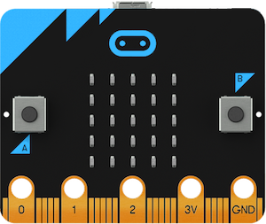

# Présentation de la carte programmable et de l'éditeur de code

## Qu'est-ce qu'une carte micro:bit ?
La carte BBC micro:bit est une carte micro-contrôleur de 5 cm sur 4 cm. Elle se programme à l'aide de différents langages et notamment Python.


")

### Description des composants

??? Info "Composants visibles à l'avant :"  

    * 25 LEDs rouges, programmables pour afficher du texte qui défile ou des images ; elles sont aussi des capteurs de lumière
    * deux boutons poussoirs A et B programmables,
    * des broches de connexion.

??? Info " Composants visibles à l'arrière : " 
    ")
    
    1. une antenne [radio](https://www.youtube.com/watch?v=rvymAr6WqrQ) et bluetooth,
    * un [micro-processeur](https://www.youtube.com/watch?v=Y9tk07CzTAA) et capteur de température, 
    * un [magnétomètre (boussole)](https://www.youtube.com/watch?v=a3P6LWwPBqM) permettant de mesurer des champs magnétiques,
    * un [accéléromètre](https://www.youtube.com/watch?v=UT35ODxvmS0) permettant de capter des mouvements en trois dimensions. Il détermine le tangage, le roulis et le lacet.
    * des [broches de connexion](https://www.youtube.com/watch?v=EDgdHb0R96I) pour contrôler des composants externes
    * un [port micro-USB](https://www.youtube.com/watch?v=ke04WnxxT5c) permettant d'alimenter la carte et de transférer des programmes,
    * une led qui sert de témoin lumineux pour l'alimentation de la carte ou le téléchargement de programme,
    * un bouton de réinitialisation,
    * un connecteur d'alimentation (2 piles AAA - 3V) : l'alimentation se fait par le port micro-USB lorsqu'il est connecté à un ordinateur ou à l'aide de piles,  
    * une puce d'interface USB.
    
  

## L'éditeur Mu

  

Ouvrir l'éditeur de code [Mu](https://codewith.mu/) disponible sur les ordinateurs du lycée. 
Cliquer sur { width='35' }
 et choisir micro:bit.  
Ce logiciel va permettre de saisir les programmes en python, de les vérifier et de les envoyer (flasher) sur la carte micro:bit.

Python possède de nombreuses bibliothèques spécialisées. Pour contrôler la carte micro:bit avec Python, il faut importer la bibliothèque `microbit` avec cette ligne au début de chaque programme :
```python
from microbit import *
```

