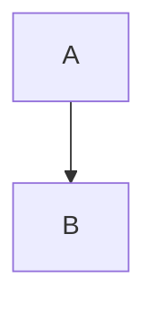
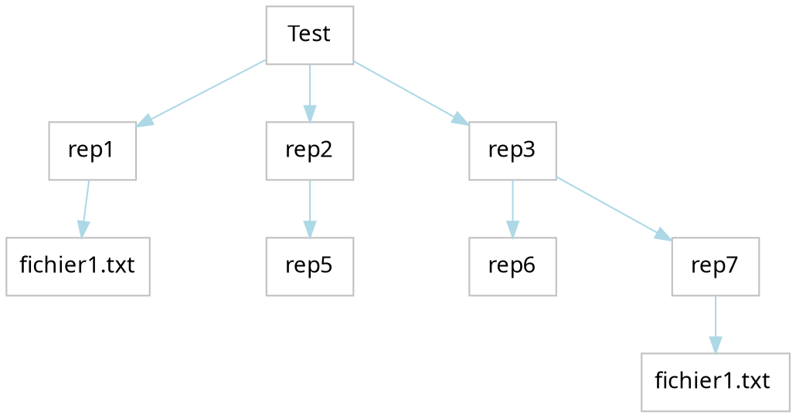

# essai
test


```mermaid

graph TD
A --> B
``` 

!!! Info
    ```dot
    digraph G {
        rankdir=LR
        Earth [peripheries=2]
        Mars
        Earth -> Mars
    }
    ```



```dot
digraph hierarchy {
  nodesep=1 // Increases the separation between nodes

  node [color=Grey,fontname=Optima,shape=box] // All nodes will this shape and colour
  edge [color=Lightblue] // All the lines look like this

  Test->{rep1 rep2 rep3};
  rep1->"fichier1.txt";
 
  rep2->rep5;
  rep3->{rep6 rep7};
   rep7->"fichier1.txt ";
  {rank=same;  } // Put them on the same level
}
```
