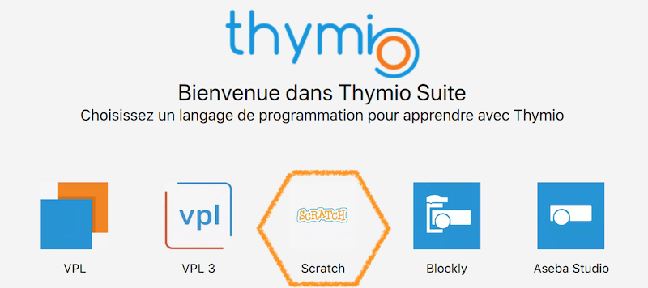
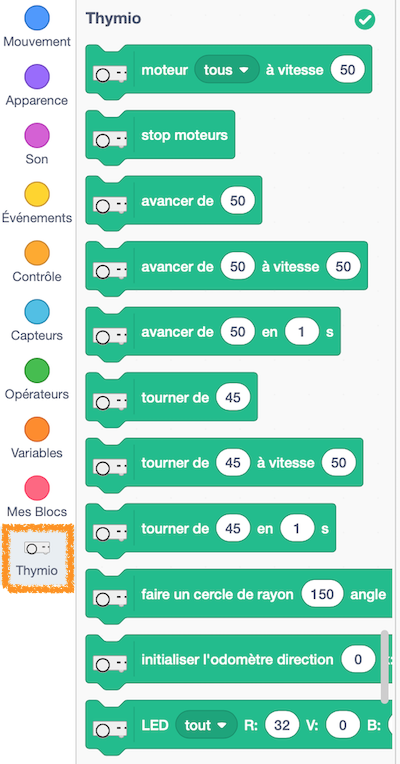

# Programmer Thymio avec Scratch 3 
[Thymio suite](https://www.thymio.org/fr/programmer/) propose de programmer Thymio avec une extension de Scratch 3. Cette extension ajoute une série de blocs pour programmer le robot.

Pour programmer Thymio avec Scratch : 

- Insérer le dongle USB de Thymio ou connecter Thymio par câble USB à un ordinateur  
- Allumer Thymio (appui sur le bouton central)  
- Lancer Thymio suite  
- Choisir Scratch parmi les applications proposées  

- Sélectionner le Thymio à utiliser 
- Cliquer sur *Programmer avec Scratch*

L'interface de Scratch s'ouvre dans un navigateur. Dans la liste des types de blocs sur la gauche, l'icône Thymio permet de disposer de nouveaux blocs d'instruction. Ces blocs n'agissent pas sur le lutin de Scratch mais sur le Thymio connecté !

 

Pour tester si tout fonctionne, double-cliquer sur une instruction, par exemple : 
  
ou  

Si Thymio change de couleur ou pivote légèrement, c'est que tout fonctionne correctement !
