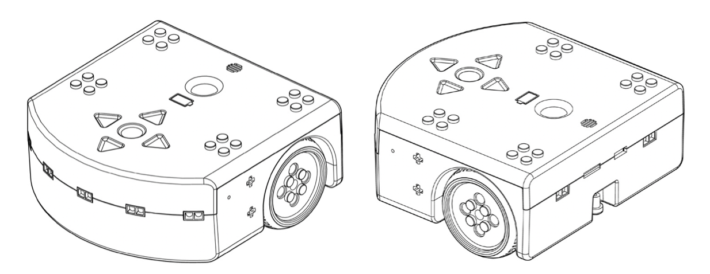
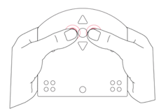
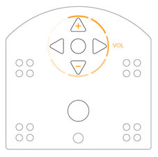

# Le robot Thymio

## Présentation
[Thymio](https://www.thymio.org/fr/) est un robot éducatif. Il a été développé en 2011 par l’École Polytechnique Fédérale de Lausanne.  

Thymio possède deux roues qui lui permettent de se déplacer. Il est doté de LEDS pour l'éclairer de toutes les couleurs. Il est équipé d'un micro et d'un haut-parleur, et de capteurs divers : capteurs de distance ou de luminosité, capteur de température, accéléromètre.
Il possède également des attaches  LEGO &#174; et un crochet pour ajouter des accessoires.

## Modes pré-programmés

Il possède [six comportements](https://www.thymio.org/fr/comportements-de-base/) pré-programmés accessibles dès l’ouverture de la boîte et sans programmation.

## Programmer Thymio

Thymio est fourni avec une suite logicielle, [Thymio suite](https://www.thymio.org/fr/programmer/) permettant de programmer le robot :  
- en VPL (langage de programmation visuel)  
- avec Blockly (langage de programmation par blocs)  
- avec Scratch (langage de programmation par blocs)  
- avec Aseba (langage de programmation textuel)  

Une autre interface de programmation est également disponible : [Blockly4Thymio](http://blockly4thymio.net).
Cette interface de programmation par blocs dispose d'instructions rédigées en français, faciles à appréhender, et en partie différentes du jeu d'instruction de Blockly. On trouvera par exemple des instructions permettant d'avancer d'une certaine longueur ou de tourner d'une certaine mesure d'angle. 

*À noter* : la version 13 du firmware du Thymio ne semble pas fonctionner avec Blockly4Thymio, mais il est possible de revenir à la version 12 qui assure la [compatibilité](http://wiki.thymio.org/fr:thymioupdate).

## Réglage / calibrage de Thymio

Les versions 9 et suivantes du firmware permettent de réaliser des réglages sur le Thymio.
Pour entrer dans le menu de configuration, appuyer 3 secondes sur les boutons gauche et droite d'un Thymio non connecté à un ordinateur (ni câble, ni dongle USB).

Trois nouvelles couleurs (orange, vert clair, mauve) indiquent les trois modes que l'on peut faire défiler avec les flèches gauche/droite et sélectionner avec le bouton central.

### Réglage du volume

!!! Warning ""
    - Choisir la couleur orange du Thymio et sélectionner ce mode en appuyant sur le bouton central.
    
    
    
    - Appuyer sur les boutons "avant" et "arrière" pour sélectionner le niveau sonore souhaité. 
    - Éteindre le Thymio pour sauvegarder le réglage.  

### Réglage des vitesses des 2 moteurs

!!! Question ""
    Ce réglage peut s'avérer nécessaire si Thymio n'avance pas "droit".
    
    - Choisir le mode vert clair dans le menu des modes de réglage.
    Les boutons "avant" et "arrière" font bouger le robot vers l'avant et vers l'arrière à différentes vitesses suivant le nombre de pressions. Essayer d'aller à des vitesses différentes (niveau 1 et 2) pour le calibrer.
    - Les boutons "gauche" et "droite" permettent d'augmenter ou de diminuer la correction. Si le robot va vers la droite, appuyer sur le bouton gauche pour corriger la direction jusqu'à ce qu'il aille droit, et inversement.
    - Appuyer sur le bouton central pour arrêter les moteurs et enregistrer les valeurs de correction dans le robot.
    - Éteindre le robot.

### Appairage Thymio-dongle USB 

!!! Example ""
    Ce réglage est à réaliser une fois lorsqu'on utilise plusieurs Thymio et que l'on souhaite que chaque Thymio communique avec un seul dongle USB.
    
    - Commencer avec un Thymio éteint, non connecté à l’ordinateur via le câble USB.
    - Brancher le dongle dans un port USB de l’ordinateur
    
    
    
    - Lancer *WirelessThymio Network Configurator* (téléchargé avec Aseba ou Thymio Suite)
    - Choisir un canal : 0, 1 ou 2
    - Choisir un identificateur de réseau (un identificateur différent pour chaque Thymio)
    - Ne pas modifier l'identificateur de nœud du dongle
    - Allumer le Thymio
    - Sur l’ordinateur, cliquer sur **activer le pairage**
    - Appuyer sur les flèches droite et gauche du Thymio  pendant 3 s (menu réglages) puis appuyer sur touche droite jusqu’à trouver le mode Mauve, valider avec le bouton central
    - Le dongle USB et le Thymio doivent clignoter à la même fréquence : si c'est le cas : 
        - Éteindre le Thymio
        - Sur l’ordinateur, cliquer sur **enregistrer dans le dongle USB**
    - Fermer *WirelessThymio Network Configurator*, même s’il y a un autre Thymio à configurer.

